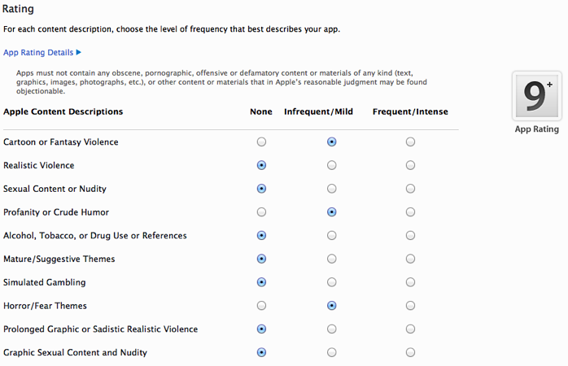
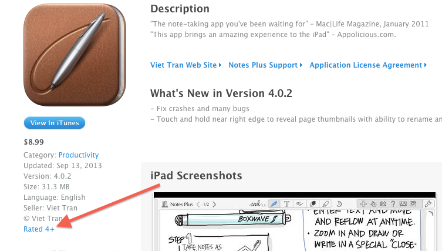
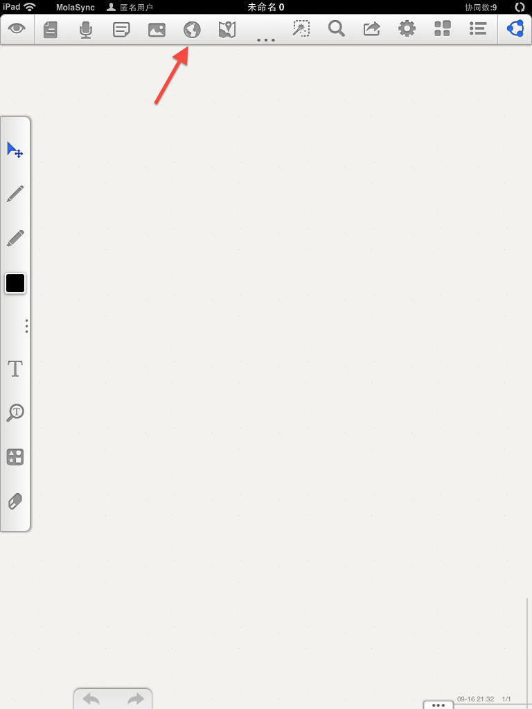
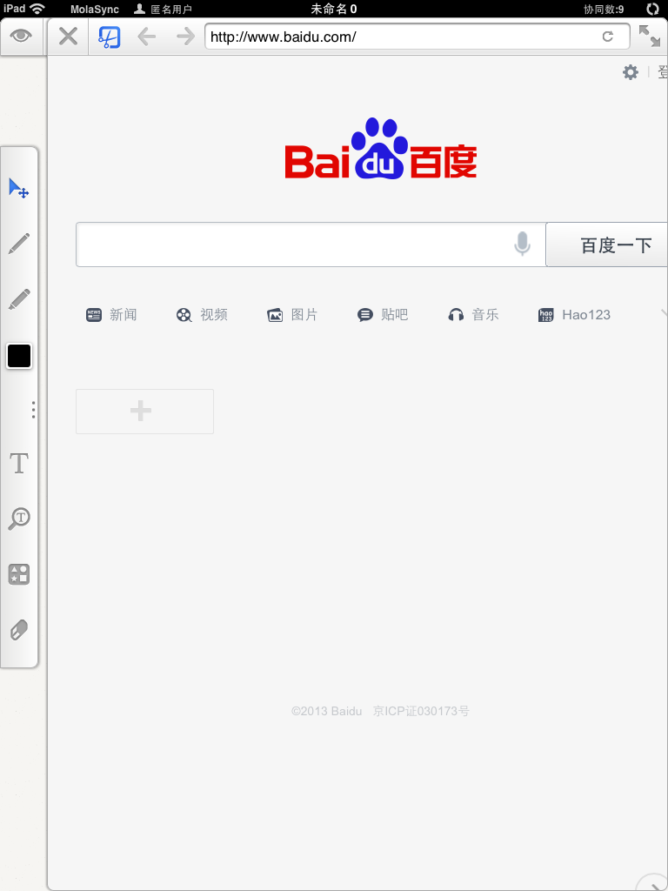
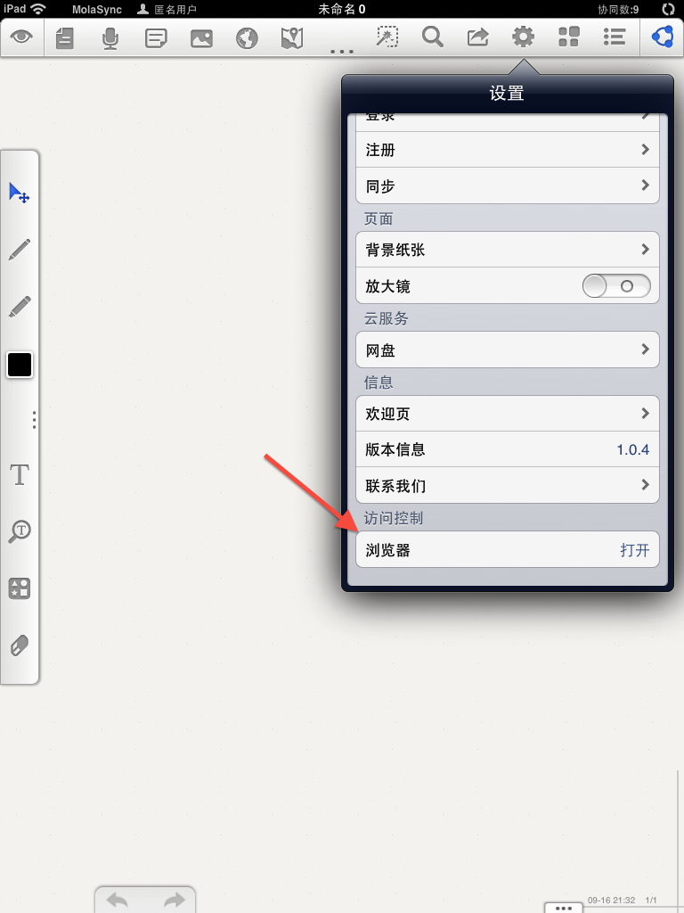
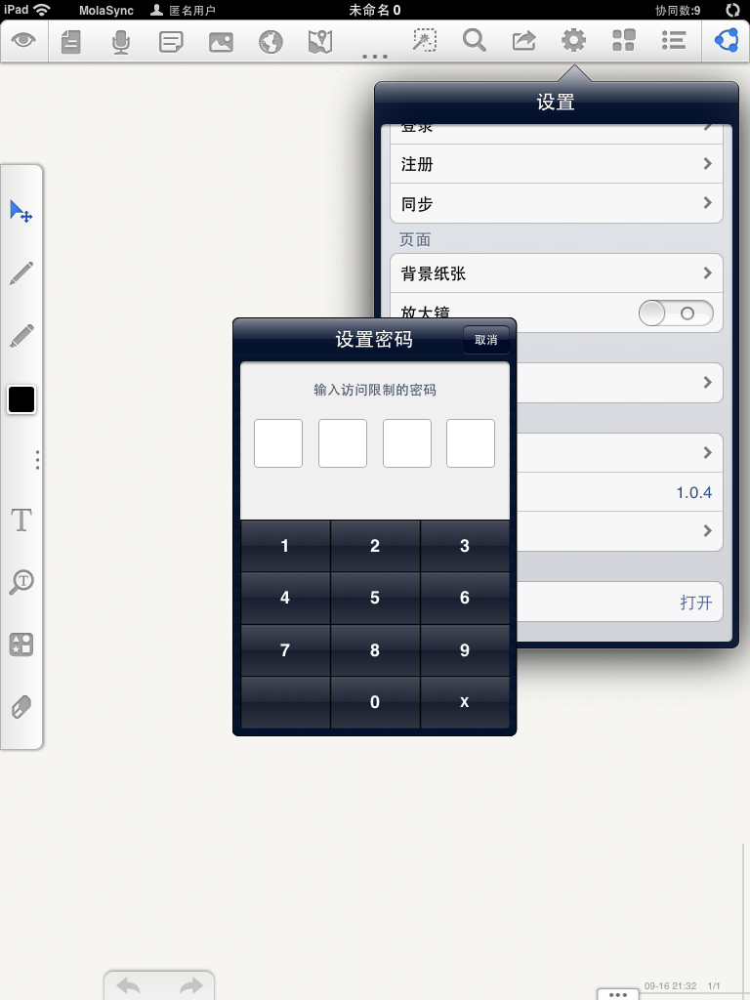
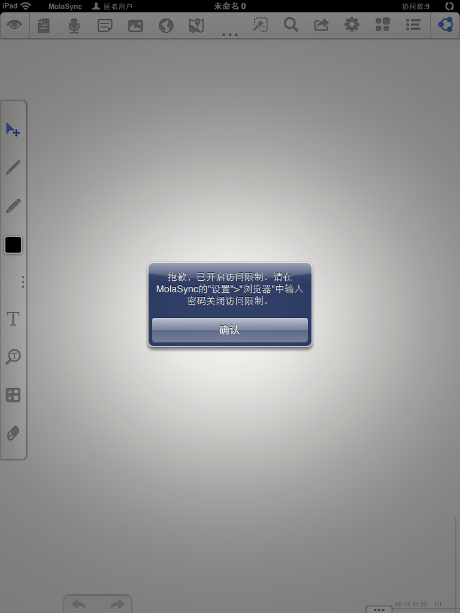
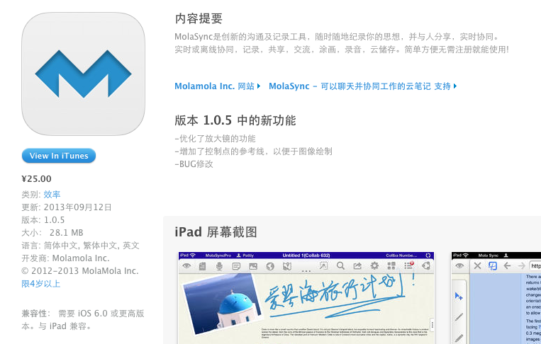

####4+级IOS App内嵌UIWebView模拟浏览器被拒的解决办法

#####UIWebView模拟浏览器

在IOS的UiKit中，UIWebView作为可以在程序内嵌入web内容的UI组件，被多数应用程序和开发者所使用。使用UIWebView可以方便的在程序中加入web内容。UIWebView提供了方法和属性来对web内容的使用和状态进行提示和控制，如用于

+ 加载内容的方法:
	
		– loadData:MIMEType:textEncodingName:baseURL:
		– loadHTMLString:baseURL:
		– loadRequest:
		- stopLoading
		- reload
	
+ 状态提示的属性
	
		loading
	
+ 前进与后退的方法
	
		- goBack
		- goForward

+ 判断能否前进与后台的属性

		canGoBack
		canGoForward
	
如果再加上一个文本输入框来提供URL输入的功能，也就是模拟下地址栏，那么所有这些方法和属性组合起来正好可以在程序内部模拟一个简单的“浏览器”。这个功能之前已有程序在使用，如[Notability](https://itunes.apple.com/cn/app/notability/id360593530?mt=8) , [Note Plus](https://itunes.apple.com/cn/app/notes-plus/id374211477?mt=8)。

#####因17+问题App提交被拒

[MolaSync](https://itunes.apple.com/app/molasync-cloud-notes-by-which/id660018160?ign-mpt=uo%3D5)是一款已上线的iPad App，本人负责界面开发，鉴于功能的需要MolaSync也需要在程序内部模拟一个“浏览器”，原理就是以上提到的这些功能和UI组件的结合，允许用户在的程序内部输入url来浏览任意网页内容，当然在这个基础功能之上，程序内部还有一些定制化的要求，那就是允许用户任意截取当前浏览页面的某部分以生成图片。1.0版本正式发布于2013年7月23号，和许多程序一样，程序的提交和审核也不是一帆风顺的，在6月份下旬程序提交不久后就被Apple的审核人员所拒，给出的理由如下：

>Since your app includes a browser which allows unfiltered access to the internet, it should be rated 17+. Applications must be rated accordingly for the highest level of content that the user is able to access.

中文大义为：

>由于你的应用程序包含了浏览器，并允许在未过滤状态下访问网络，程序评级应该设定为17+。应用必须依据用户可以访问内容的最高级别来设置评级。

#####关于App分级

因为应用是因为分级被拒的，所以要搞清IOS App的分级策略和要求。通过iTunes Connect提交新的IOS应用程序时，应用本身需要提供一些重要信息，其中第一项便是：

>应用程序的元数据,包括分级信息

这里的 **分级信息** 对应着提交App会操作的一个 **“分级页面”** ，关于**“分级页面”**苹果iTunes Connect给出的解释如下：

>分级页面允许您在初始创建的时候设定您的程序级别以便于App Store中的父母控制。所有的程序都必须分级。
>
>**重要**:程序不能包含任何淫秽的,色情的,攻击性的或者诽谤的内容,包括带有这些内容的文字,图 片,照片等,以及其他Apple认为会引起别人抗议的内容。
>
>**设定程序分级: **
>
>针对每个内容描述,选择适合您的程序的级别。
>
>
>每当您做出选择,右边就会显示程序的级别。下面给出了程序级别的介绍。
>**程序级别定义**
>
>+ 4岁以上
>
>	此类别中的程序不包含受限制内容。
>	
>+ 9岁以上
>	
>	此类别中的程序可能包含以下内容：轻微或偶尔出现的卡通、幻想或现实暴力；偶尔出现或轻微的成人、性暗示或恐怖内>容。可能不适合未满9周岁的儿童。
>	
>+ 12岁以上
>
>	此类别的程序可能包含以下内容：偶尔出现的轻微不雅语言；频繁或强烈的卡通、幻想或现实暴力；轻微或偶尔出现的成>人或性暗示主题；模拟赌博。可能不适合未满12周岁的儿童。
>	
>+ 17岁以上
>
>	您必须至少17岁才可以购买此App。
>	
>	此类别的应用软件还可能包含频繁和激烈的攻击性语言；频繁和激烈的卡通、幻想或现实暴力；频繁和激烈的成人、恐怖>和暗示性主题；以及性内容、裸体、酒精、烟草、毒品以及性内容、裸体、酒精、烟草、毒品等不适于17岁以下儿童的内容。

**程序分级**主要用来增加用户对程序内容的提前认知度，尤其是对家长，这可以让他们很方便的提前知道一款程序是否适合自己孩子使用，以达到一种过滤功能，避免那些“儿童不宜”的程序对未成年人造成坏的影响。成功发布后的应用程序说明都会有一个分级说明标签，以Note Plus的截图为例

  
  
    
因为转到IOS开发的时间还比较短，这是发布的第一个IOS应用，因经验欠缺对于IOS的许多规则注意事项和历史版本变迁，不是特别了解。“分级”标签的添加时间大约是13年的4月5号之后。此外iTunes Connect关于**分级**这块还提到了两个缩写名词**ESRB**和**Pegi**，上网查了下，这两个名词代表了两个组织的名称，**ESRB**的全称为**[Entertainment Software Rating Board](http://zh.wikipedia.org/wiki/%E5%A8%9B%E6%A8%82%E8%BB%9F%E4%BB%B6%E5%88%86%E7%B4%9A%E5%A7%94%E5%93%A1%E6%9C%83)**;**Pegi**全称为**[Pan European Game Information](http://zh.wikipedia.org/wiki/%E6%B3%9B%E6%AD%90%E9%81%8A%E6%88%B2%E8%B3%87%E8%A8%8A%E7%B5%84%E7%B9%94)**。两者都是用来对“电脑游戏”进行评级指导的组织机构，前者来自美国和加拿大，后者来自欧洲。

#####寻找解决问题的办法

程序审核不通过就要想办法解决问题。首先是向苹果的审核人员进行反馈和交涉。

第一封反馈中向苹果的审核人员解释应用本身的功能（笔记）以及“浏览器”的作用和对于应用必要性。仍被拒绝。

第二封反馈询问是否可以在程序内部对“浏览器”采取一定的“加密方式”，苹果的审核人员回复说，这是技术问题，不归他们审核人员管，对于代码级别的帮助需要找苹果的[DTS](https://developer.apple.com/support/technical/)部门。而且要提供详细的屏幕截图，程序崩溃报告，以及问题的重现步骤。另外的选择是在苹果的开发者网站上发帖询问。

几次的反馈下来应用还是没有通过苹果的审核。尝试在网上搜寻有没有相关的类似问题及解决办法，但结果并不理想。最后不得不去苹果的开发者论坛发帖求教，标题也很简单：

>[App use UIWebView as a "Broswer" is rejected](https://devforums.apple.com/message/836583#836583)

开始帖子中提出了3个问题，中文大义如下：

>1. **UIWebView是IOS提供的UI组件与Safari用的是同一个浏览器内核(Webkit),是否组件本身已经提供了“过滤”行为?**

>2. **如果1中的假设不存在，是否有某种在不删除“浏览器”的前提下，提供过滤网络的办法？**

>3. **像[Note plus](https://itunes.apple.com/cn/app/notes-plus/id374211477?mt=8)和[Notability](https://itunes.apple.com/cn/app/notability/id360593530?mt=8)这些应用是否提供了过滤网络的行为，它们有时如何在4+的前提下成功通过审核发布了自己的程序？**

帖子发出后陆续有国外的开发者给予了回复，而且还引发了我第四个疑问是：

> **17+的应用程序评级是否会影响到程序的搜索和下载？**

最终陆陆续续的得到了关于四个问题的回复和解决方案，总结如下：

1. 在iTunes Connect的分级页面中评级区域中并没有关于要过滤网络的选项（"unfiltered internet access" option），国外的开发者认为这是App信息填写和苹果审核流程中的一些不完整的漏洞或bug。

2. 之前的IOS版本中，可以检测到**家长访问限制**中是否屏蔽了Safari，这可以用来作为屏蔽自己内部“浏览器”的事件基础。但在IOS6之后则无法检测到该事件，苹果也未做出任何声明。

3. 某个开发者的的程序内部也添加了“浏览器”，并且以17+的评级发布，销量并未收到影响，但也许这和程序的类别有关系（该开发者并未透露自己的程序）。

4. 可以建立“白名单”机制，只允许用户浏览某些特定的健康的内容。

5. 苹果的[DTS](https://developer.apple.com/support/technical/)无法处理这个问题，因为这不属于严格意义的代码错误，而是审核规则的问题。
		
6. App的审核具有历史性、未知性、随机性，有可能是早期的苹果审核机制和原则的不完善造成了诸如[Notability](https://itunes.apple.com/cn/app/notability/id360593530?mt=8) , [Note Plus](https://itunes.apple.com/cn/app/notes-plus/id374211477?mt=8)这样的4+应用。也有可能是开发这些App的公司与苹果有合作关系（这个猜测虽然有点邪恶）。

经过一番尝试和总结，最终的可选的解决办法如下：

1. 应用程序评级按审核人员的要求改为17+（保证通过）
2. 去掉“浏览器”功能，保持4+的程序评级（保证通过）
3. 建立“白名单”机制，只允许用户访问固定的网站(有点不现实)
4. 保证程序的4+，保留程序的重要功能。提供类似于IOS内置的[访问限制](http://support.apple.com/kb/HT4213?viewlocale=zh_CN)功能，对“浏览器”进行访问限制限制（可能还会被拒）。

衡量再三，第三种首先否定，因为应用的特征和用户习惯决定“白名单”机制不现实。第一、二两种，虽然能够保证程序通过，但一个是强迫为自己的应用贴上“少儿不宜”的标签，一个是去除重要的功能，都不爽。那么只有尝试第四种了，虽然“鱼和熊掌不能兼得“，但总的试试。

#####尝试最终的解决方案

在选定的最终解决方案中提到了[访问限制](http://support.apple.com/kb/HT4213?viewlocale=zh_CN)。[访问限制](http://support.apple.com/kb/HT4213?viewlocale=zh_CN)也称家长控制，可以在iPhone,iPad,iPod touch上开启访问限制，来阻止访问设备上的特定功能或内容。

开启[访问限制](http://support.apple.com/kb/HT4213?viewlocale=zh_CN)的流程是，点击开启IOS内置的**"设置"**应用，在程序内依次点击 **"通用"** > **"访问限制"**，并输入密码。我们关注的是Safari的访问限制方式。

其实很简单，在打开**访问限制**面板后，可以看到在**Allow**一栏中的所有选项后都有一个switch开关组件用来控制是否对当前项执行访问控制，点击Safari后的switch开启访问限制后，当我们退出**设置**来到设备的主屏中，发现Safari已从上面消失。看来这种所谓的访问限制是有点暴力性的将程序直接在设备上隐藏。

在我们程序的内部，未做改动前的交互形式是用户点击工具条上的一个触发“浏览器”的Button后，程序会直接从右侧滑入一个“浏览器“面板

下面是按照类似于**访问限制**所做的进一步的改动:

1. 在程序的**“设置”**列表项中增加**"访问控制"**一栏，子项目只有一个**“浏览器选项”**用来对浏览器的访问进行加密处理。
	
	
2. 用户点击触发“浏览器”Button，初次访问“浏览器”功能时会首先向用户弹出Alert框并提示以下信息(信息的文字内容要进行国际化处理):

	>在MolaSync的"设置">"浏览器"里你可以对浏览器设置密码保护,开启访问限制。

	用户在确定之后则程序自动打开“浏览器”面板。这是条一次性的提示信息，用户之后的操作不会再次出现该提示。这样做的目的是:

	1. 告知用户 **程序内部内嵌了“浏览器”功能，并且设置访问限制，以及设置访问限制的操作流程。**
	2. 告诉苹果的审核人员，**我们程序的内部的“浏览器”也有访问控制功能。**
	
	
3. 在App内部模拟并制作类似于苹果的**设置**应用在开启**访问控制**时弹出的密码输入框，操作逻辑也大致相同。当用户在程序的内部依次点击**"设置"**>**"访问控制"**>**"浏览器"**,弹出该模拟密码提示框允许用户对“浏览器”设置访问控制密码。

	
	
	“浏览器”访问限制开启之后，当用户再次点击“浏览器”button时，首先告知用户**“访问限制已开启，需要在访问控制中输入密码”**。
	
	
	
	密码输入的错误处理策略类似于苹果内置的访问限制的密码错误提示策略。
	
	
	
	成功输入密码之后，用户则可以再次使用“浏览器”。
	
在上述流程全部完成并测试后，MolaSync再次提交，最后在同时保留程序4+评级和“浏览器”功能的前提下，应用成功通过了审核。附上截图一张：

