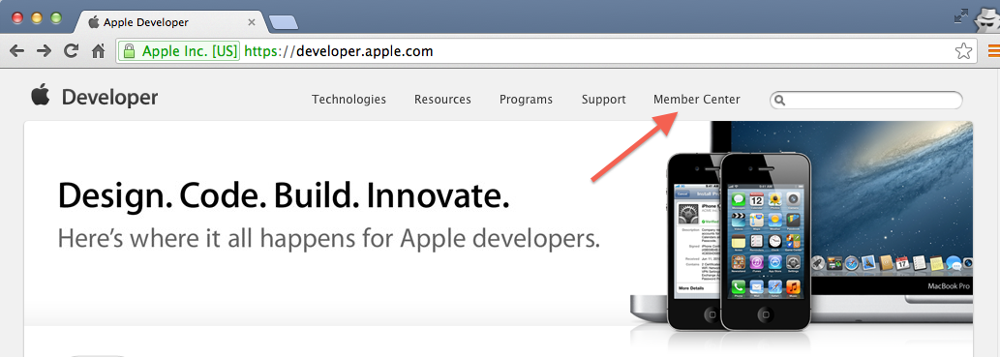
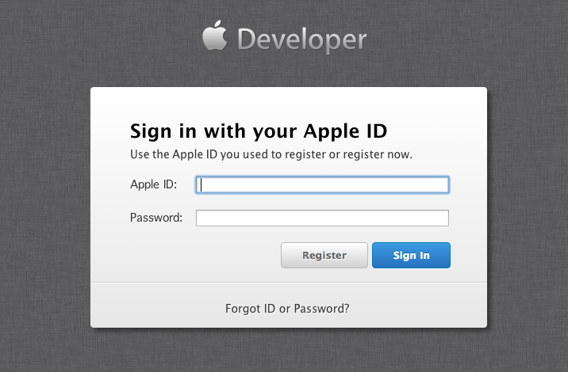
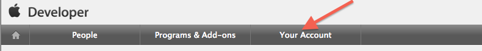
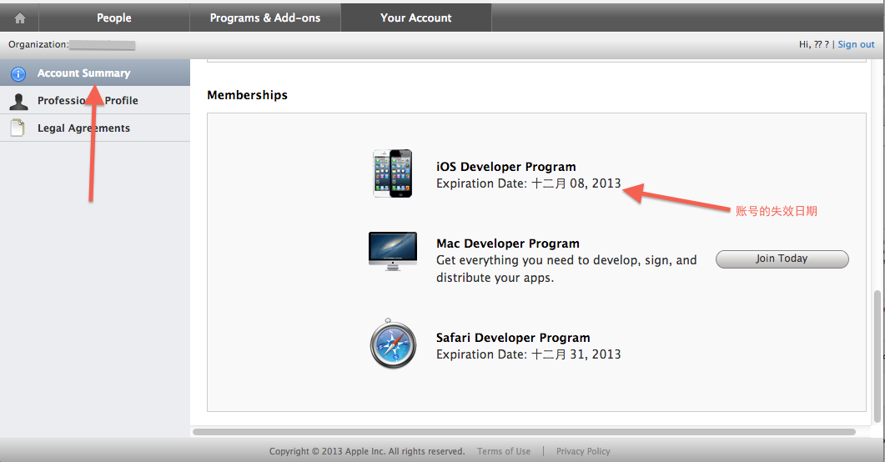
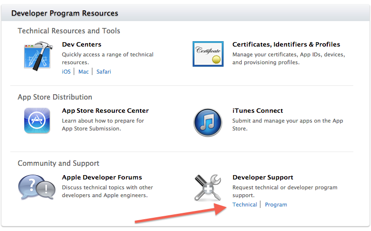
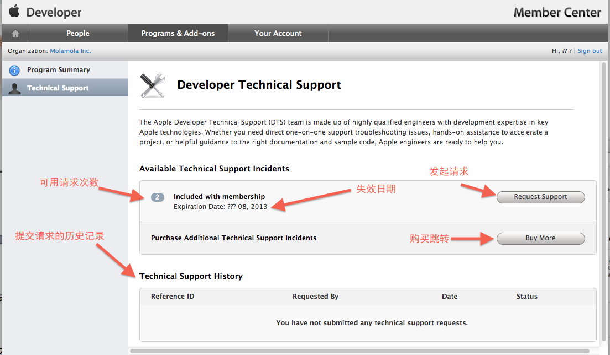
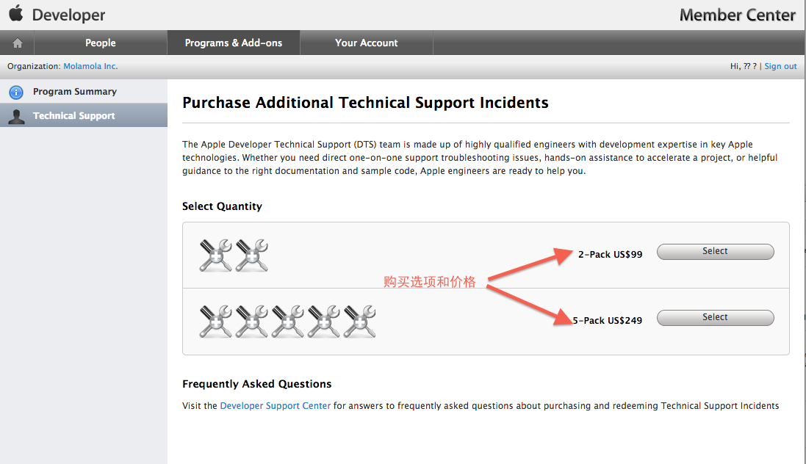

#####Apple DTS

上篇提到苹果的[DTS](https://developer.apple.com/support/technical/)，这里作下简单的介绍，因为自己也未曾正式使用过该功能，所以对其具体的使用过程也没有实际的经验，此处只是依据苹果官网的技术文档，介绍下其概念和几个[DTS](https://developer.apple.com/support/technical/)相关的管理界面。

#####什么是DTS

[DTS](https://developer.apple.com/support/technical/)全称[Developer Technical Support](https://developer.apple.com/support/technical/),亦即[开发者技术支持](https://developer.apple.com/support/technical/)。这是苹果内部的一个团队名称（或者是服务名称），是由一些在苹果的关键技术领域富有经验的高素质的工程师组成，针对苹果的框架(frameworks)、APIs、以及工具的使用提供代码级别的帮助，并且只面向苹果开发者计划会员（Apple Developer Program members）。

在开发者提出DTS请求后，苹果会将问题指派给其内部的开发者技术支持工程师，他/她负责帮助解决代码问题，告知如何获得更多的技术资源，或者提出其它可用的替代解决方案，从而解决问题，加快开发者的开发进度。

#####DTS的服务对象

上面提到，DTS服务面向:

+ 苹果开发者计划会员（Apple Developer Program members）。这其中包括:
	+ IOS个人开发者会员(iOS Developer Program members)
	+ IOS企业开发者会员(iOS Developer Enterprise Program members)
	+ Mac开发者会员(Mac Developer Program members)
	+ Safari开发者会员(Safari Developer Program members)
+ [MFi Program会员](https://developer.apple.com/cn/programs/mfi/)

#####DTS的使用情景

在开发应用程序时，有时我们会遇到比较棘手的难于解决的问题，如果我们自己无法修复某些错误，或是卡在某个关键技术问题，或有代码级别的问题难以解决时，我们都可以请求DTS服务，当然前提是我们必须确保这些问题是与苹果开发相关的问题，包括IOS app,Mac app, Safari Extension，或MFI配件相关。而且在确定提交请求前最好保证是仔细的查看了相关的技术文档或是在Apple的开发者论坛上发帖进行求助和讨论，分类如下：

+ **查看技术说明**

	查看关于[iOS](https://developer.apple.com/library/ios/navigation/#section=Resource%20Types&topic=Technical%20Notes)、[OS X](https://developer.apple.com/library/mac/navigation/#section=Resource%20Types&topic=Technical%20Notes) 和 [Safari](https://developer.apple.com/library/safari/navigation/#section=Resource%20Types&topic=Technical%20Notes) 的特定技术问题的说明。
	
+ 查看技术问答

	获取关于 [iOS](https://developer.apple.com/library/ios/navigation/#section=Resource%20Types&topic=Technical%20Q%26amp%3BAs)、[OS X](https://developer.apple.com/library/mac/navigation/#section=Resource%20Types&topic=Technical%20Q%26amp%3BAs) 和 [Safari](https://developer.apple.com/library/safari/navigation/#section=Resource%20Types&topic=Technical%20Q%26amp%3BAs) 常见编码问题的答案。

+ 在Apple Developer Forums发起话题并讨论

	在 [Apple Developer Forums](https://developer.apple.com/devforums/) 上发布问题，并与其他开发者和 Apple 工程师讨论各种话题。

#####准备工作和提交原则

**提交请求前期的准备包括:**

+ 请在 Xcode 中运行 Build 和 Analyze 命令。如有可能，请解决分析程序结果中的待解决问题。
+ 请附上与问题相关的崩溃日志，并在其中加以标记。（您可以从技术说明 2151：[理解和分析 iOS app 崩溃报告](https://developer.apple.com/library/ios/#technotes/tn2151/_index.html)中了解如何获取并标识崩溃日志。）
+ 在链编及运行 app 过程中，控制台会输出一些含有错误与异常的信息，请将这些内容一并附上。
+ 如有可能，请将问题抽取成一个示例 Xcode 项目。即，对抽取出的类和资源进行组建，使其组成一个示例 Xcode 项目。
+ 若情况合适，请提供明确简练的问题重现步骤。
+ 阅读以下 DTS 提交准则。

**提交准则包括:**

1. 在提交技术支持申请时，请务必遵循这些准则。

	+ 每次申请都只提交一个待支持问题（单个具体问题）。
	+ 请确保描述尽可能的清晰，包括为解决问题已采取的措施及其他需要考虑的条件（例如，只有在某些特定的硬件		上才会出现问题，或是产品只面向教育市场等）。

2. 从开发者技术支持获取跟进编号后，请根据情况按以下条目进行回复。

	+ 标示出的崩溃日志（针对崩溃/错误）了解更多
	+ App 审核拒绝信（及任何相关附件）（若适用）
	+ 屏幕快照（显示错误信息）
	+ 示例 Xcode 项目或源代码
	+ 控制台输出（包含错误或异常）。
	+ 配置/系统概述文件

苹果DTS的开发者技术支持工程师的代码级别支持会以英文电子邮件进行提供，并且通常会在**三(3)个工作日**回复申请。

####DTS的免费使用次数和失效日期

苹果的每个会员账户会获得2次免费DTS服务机会，说明如下：

+ **iOS Developer Program**、**iOS Developer Enterprise Program** 和 **Mac Developer Program**
	
	每个会员帐户年度包含两 (2) 次 服务，可以购买额外的。

+ **Safari Developer Program**

	现有 99$ 2次及 249$ 5次两种DTS购买方式。Safari Developer Program 的会员可以从 []Member Center](https://developer.apple.com/membercenter/index.action#techSupport)下面的“Programs & Add-ons”（程序和附加组件）标签购买 DTS服务。
	
+ **MFi Program**

	每次注册均可获得每个会员帐户年度八 (8) 次 DTS服务。

需要注意的是免费的DTS服务是有失效日期的。这里的失效日期等同于作为苹果开发者的**会员资格**的失效日期。查看**会员资格**的失效日期如下：
    
1. 在苹果[开发者官网](https://developer.apple.com/)页面的顶部右侧导航中点击[Member Center](https://developer.apple.com/membercenter/),登陆到自己的苹果开发者管理界面。
  
	
  
  
2. 输入Apple ID和密码。
   
	

3. 在管理界面的顶部导航中中点击**Your Account**,进入到账号信息页面。

	
	
4. 在**Account Summary**导航对应的右侧页面中，滚动值**Memberships**区域查看自己账号的失效日期信息,DTS的失效日期等同于账号绑定的会员资格失效日期。

	

#####DTS的购买

在免费的DTS服务用完之后，之后的服务是需要付费的，购买方式包括两种，

+ 同时购买**2**次需要**99$**
+ 同时购买**5**次需要**249$**

可以在Member Center的“Programs & Add-ons”（程序和附加组件）标签购买。截图如下

1. 登陆开发者账号，在管理界面的左侧面板的右下角**Developer Support**中点击**Technical**
		
		
2. DTS详情页面
		
		
3. 服务的购买和价格页面
		
		
		
#####参考

英文:[Apple Developer Technical Support](https://developer.apple.com/support/technical/)

中文:[开发者技术支持](https://developer.apple.com/cn/support/technical/)

需要注意的是在实际的苹果开发者技术支持的文档说明中，上述的一些描述和规则的对象是TSI（Technical Support Incident），个人认为这和DTS是等同的概念，或者DTS是TSI的一个较大的子集，所以在进行叙述时并未作区分。