##安装及使用Cocoapods管理工具

###Cocoapods的概念

[Cocoapods][1]是Objective-C工程的第三方库的依赖管理工具，目前已经有许多Objective-C的第三方开源库可以通过Cocoapods来安装并导入到工程内。当项目工程过多依赖第三方库时，原始的做法是需要将第三方开源库的代码手工下载到本地，之后再import进我们的Xcode工程，有时还需要根据开源库所依赖的Objective-C的语言版本和语言规则，以及编译器的版本来进行代码级别的编译选项的配置。最常见的是在一个ARC工程中，使用一个非ARC的老的第三方开源库时，我们首先要导入其代码到我们的Xcode中后，之后需要逐条将每个oc文件在编译选项中进行设置。而且当多个第三方库导入后，也会增加我们项目工程的目录管理结构的复杂性。与此同时，一个第三方开源库总是在进行各种bug的修复以功能的完善，之后会有更多新的版本不断更新和对外发布，如果以依赖代码的形式来使用第三方库的话，那么当需要更新第三方库时，将会是一件十分痛苦的事情，我们需要重新替换文件，并重复各种配置。因此Cocoapods管理工具的出现就是为了解决这些问题。

Cocoapods是基于ruby构建，Mac OS X系统下默认已经安装好了ruby的运行时，**gem**是ruby的开发工具包的一个标准，Cocoapods相当于一个ruby的开发工具包，当前存在一个流行的ruby开发包的托管服务工具叫做[RubyGems][2]，可以用其来托管和安装各种存在的ruby的开发工具包，当然也可以用来安装Cocoapods。默认高版本的ruby(1.9版本以后)下已经内建安装了[RubyGems][2]，因此我们可以直接使用。

###安装Cocoapods

安装Cocoapods，只要打开命令行工具，输入并运行以下命令即可

	$ sudo gem install cocoapods	
	$ sudo pod setup
	
第一行命令的作用是使用[RubyGems](2)来安装Cocoapods管理工具，运行成功后，Cocoapods即安装到了你的本地机器上。

第二行命令的作用是在你的当前用户主目录下，创建名为`~/.cocoapods/repos`的隐藏目录，并将`https://github.com/CocoaPods/Specs`链接指向所有 `public master spec-repo`clone到本地，用来存储所有**spec-repos**的版本配置。**spec**的全称是**Specification**，一个**Specification**文件的扩展名为`.podspec.json`,描述了Cocoapods托管的Pod库的某一个版本，包括了其代码的存放位置，要用到的配置，以及其它常用的元信息，如，_名称_，_版本号_以及_简介_。以名为[**A2DynamicDelegate**](https://github.com/CocoaPods/Specs/blob/master/Specs/A2DynamicDelegate/1.0.1/A2DynamicDelegate.podspec.json)的_1.0.1_版本的**Specification**配置文件为例来说，其内容如下

	{
		"name": "A2DynamicDelegate",
		"version": "1.0.1",
		"license": "BSD",
		"summary": "Blocks are to functions as A2DynamicDelegate is to delegates.",
		"homepage": "https://github.com/pandamonia/A2DynamicDelegate",
		"authors": {
		"Alexsander Akers": "a2@pandamonia.us",
		"Zachary Waldowski": "zwaldowski@gmail.com"
		},
		"source": {
		"git": "https://github.com/pandamonia/A2DynamicDelegate.git",
		"tag": "v1.0.1"
		},
		"source_files": [
		"A2DynamicDelegate.{h,m}",
		"A2BlockDelegate.{h,m}"
		],
		"requires_arc": false
		}
更多关于**Specification**的介绍，参见[Podspec Syntax Reference][13].

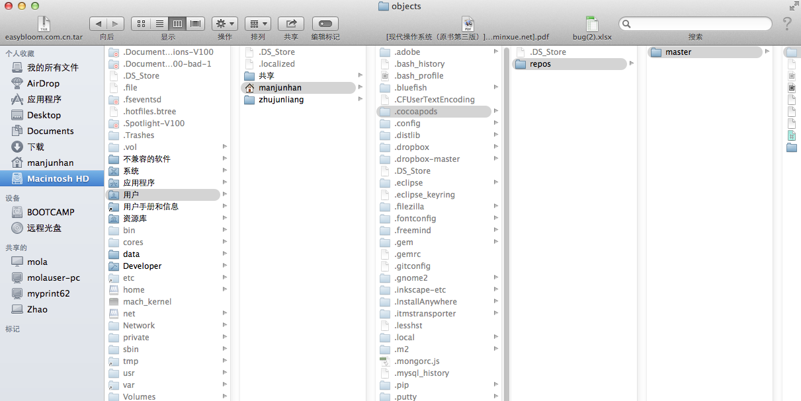

###使用Cocoapods

Cocoapods依赖于一个名为`Podfile`的配置文件来管理我们Xcode工程所依赖的第三方库。更多关于`Podfile`文件的参数以及配置格式说明，参见官网[描述][9]。现在以名为`PlainPro`的空白工程为例，说明如何使用Cocoapods来安装并管理第三方库。

1. 使用Xcode新建PlainPro工程

	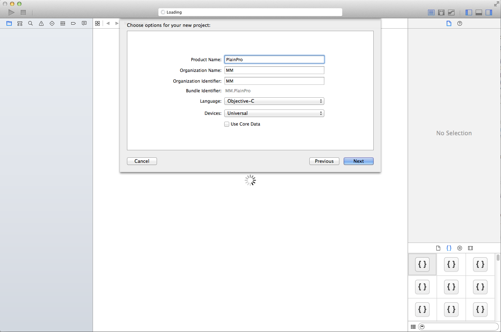

2. 打开`PlainPro`的根目录，在根目录中新建`Podfile`的空文件,这里我使用sublime text来新建文件

	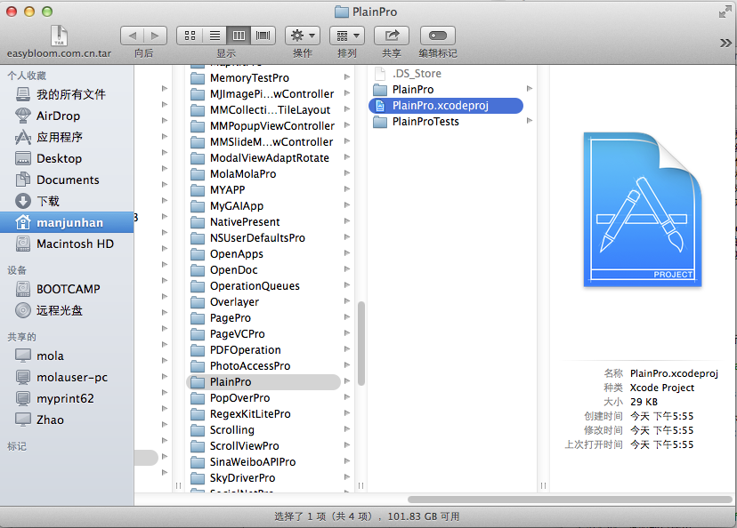
	
	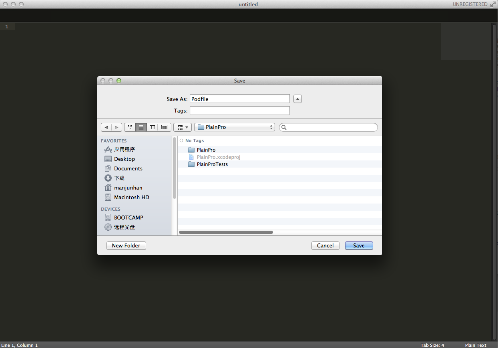
	
	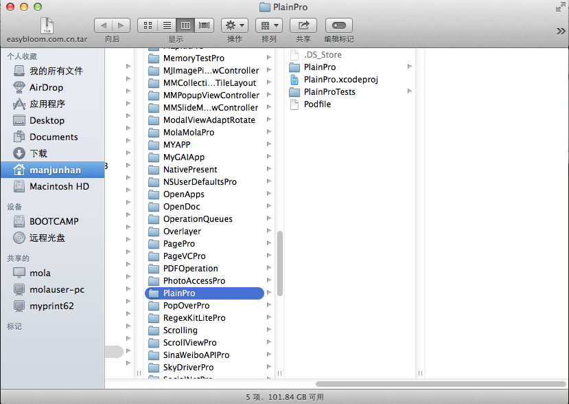
	
3. 打开命令行工具，使用`cd`命令切换到`PlainPro`项目的根目录

	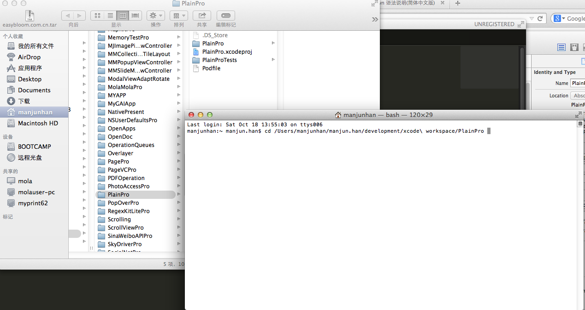
	
4. 在当前目录下运行以下命令,开始添加Cocoapods管理
	
		$ pod install
		
	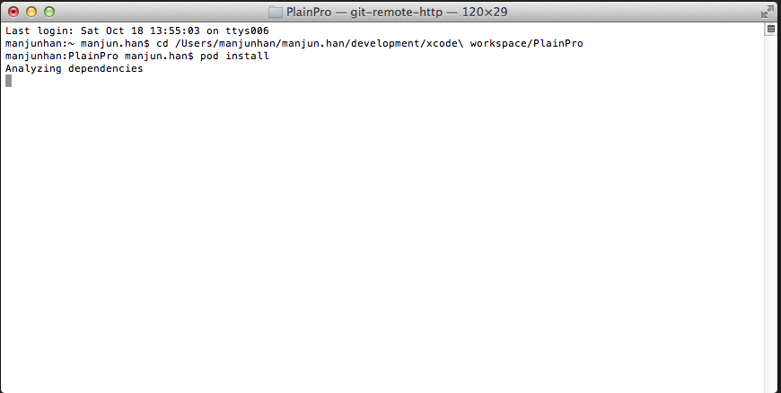
	
	安装成功后，命令行工具显示如下
	
	
	
	成功安装后PlainPro的目录如下
	
	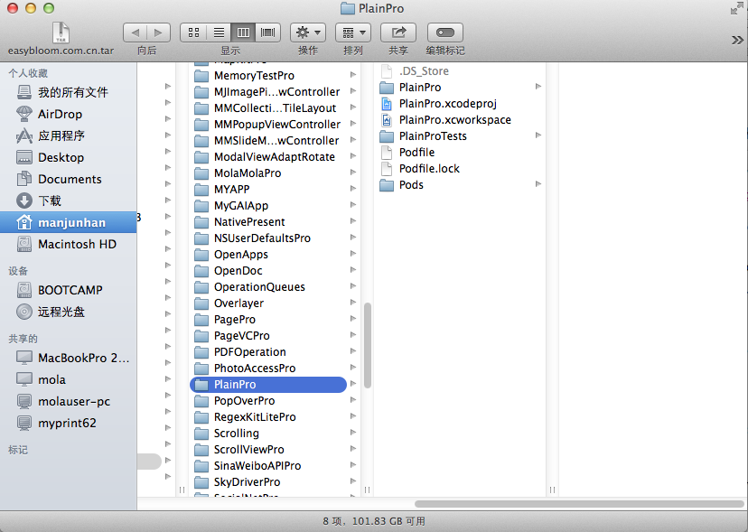
	
	目录下会安装新的文件和目录，之后需要使用`PlainPro.xcworkspace`来再次打开我们的工程
	
	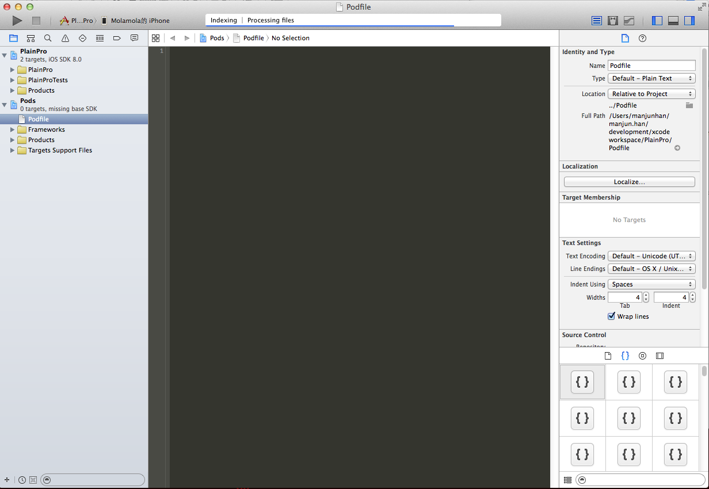
	
	在Xcode中打开`Podfile`文件，这样就可以在该文件中添加我们当前`PlainPro`工程所依赖的第三方开源库依赖配置信息。
	
###安装AFNetworking

以安装当前流行的[AFNetworking][11]框架为例，简单说明Cocoapods的依赖管理的使用。

在Xcode中，打开`Podfile`文件，在文件中添加以下配置,并保存

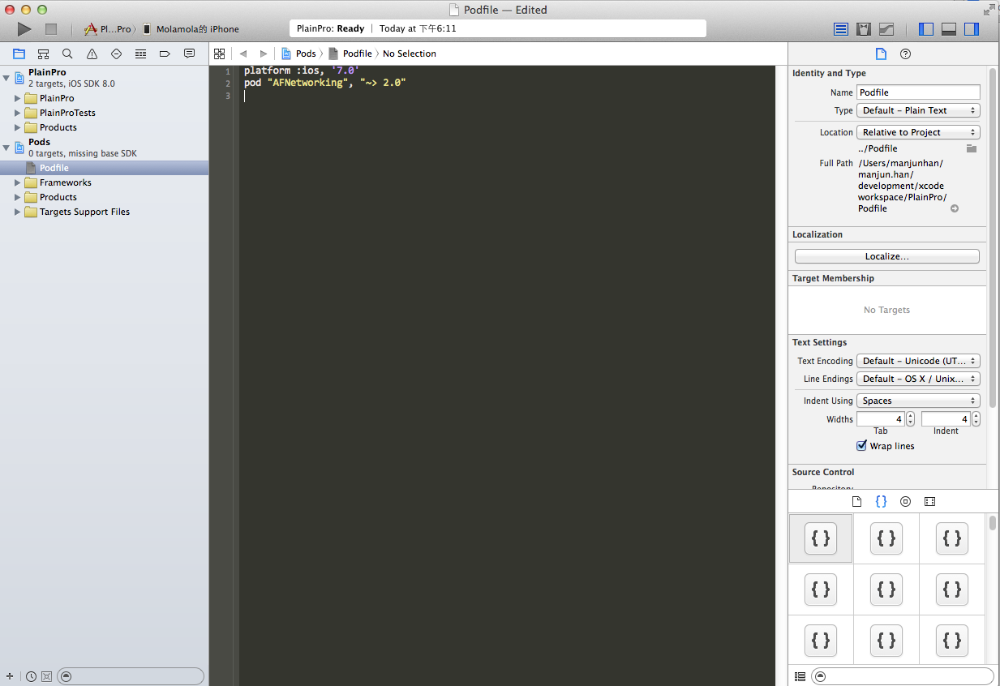

重新回到之前的命令行工具，并再次运行`pod install`命令

	$ pod install
	
	
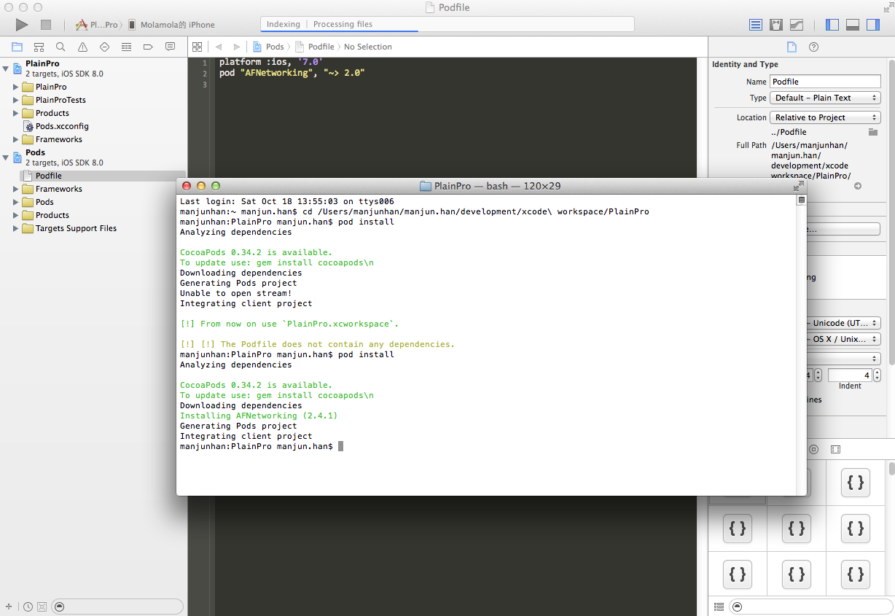	

这样AFNetworking即已经安装成功，在我们的代码中便可使用该框架提供的功能。

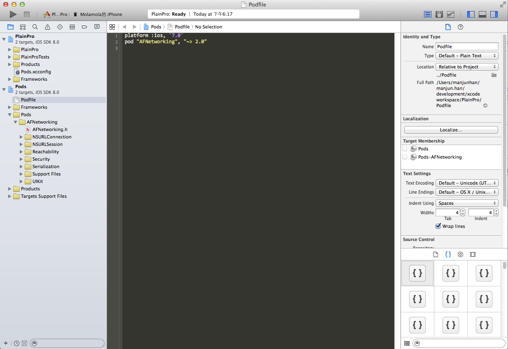	

以后类似的第三方库的添加过程参见AFnetworking的安装步骤即可。可以在[Cocoapods][1]的首页搜索框中来查看其支持的开源库。

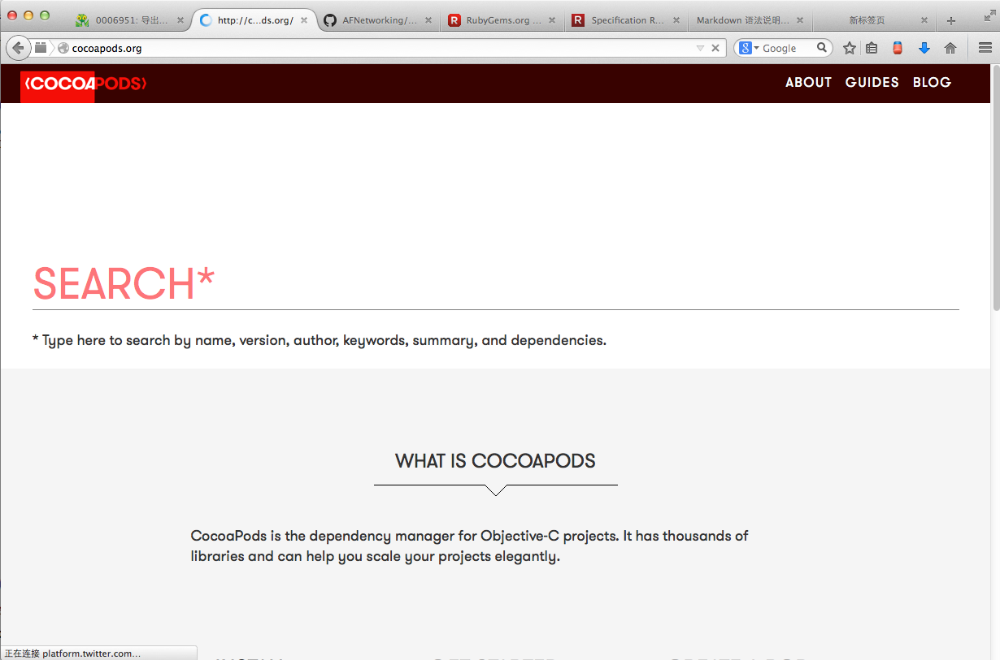	

或者，在命令行工具下，使用`pod search`命令来搜索并查看是否支持第三方库，如

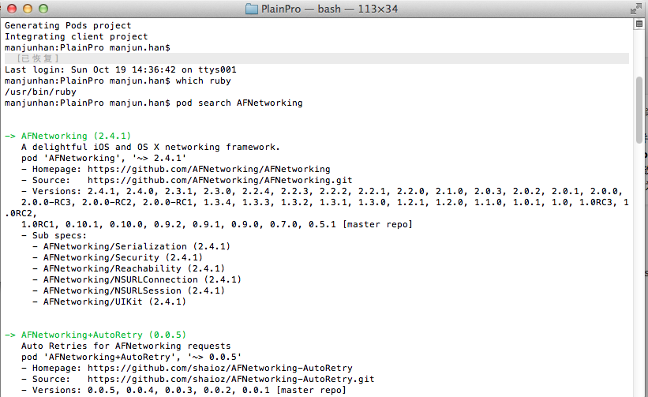

以上。

###更新Cocoapods

	
###卸载Cocoapods	
	
###参考

+ [CocoaPods][1]
+ [Install CocoaPods on your computer][7]
+ [Adding Pods to an Xcode project][8]
+ [Podfile][9]
+ [Cocoapods Command-line Reference][10]
+ [Ruby Programmers Reference Guide][3]
+ [BSD General Commands Manual][4]
+ [About RubyGems][5]
+ [Where is ruby stored on mac?][6]
+ [AFNetworking][11]
+ [RubyGems Guides][12]
+ [Podspec Syntax Reference][13]

[1]: http://cocoapods.org/
[2]: http://rubygems.org/
[3]: https://developer.apple.com/library/mac/documentation/Darwin/Reference/ManPages/man1/ruby.1.html
[4]: https://developer.apple.com/library/mac/documentation/Darwin/Reference/ManPages/man1/gem.1.html#//apple_ref/doc/man/1/gem
[5]: http://rubygems.org/pages/about
[6]: http://stackoverflow.com/questions/25313033/where-is-ruby-stored-on-mac
[7]: http://guides.cocoapods.org/using/getting-started.html#toc_3
[8]: http://guides.cocoapods.org/using/using-cocoapods.html
[9]: http://guides.cocoapods.org/syntax/podfile.html#podfile
[10]: http://guides.cocoapods.org/terminal/commands.html 
[11]: https://github.com/AFNetworking/AFNetworking
[12]: http://guides.rubygems.org/	
[13]: http://guides.cocoapods.org/syntax/podspec.html#group_root_specification