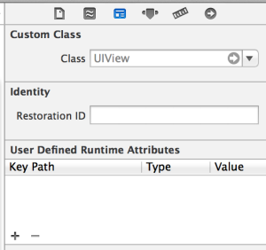
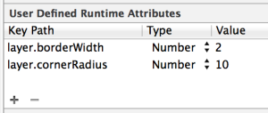
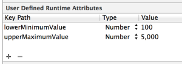
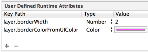
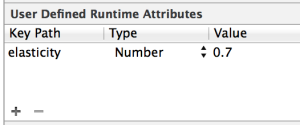

###User Defined Runtime Attributes

User defined runtime attributes是Xcode的Interface Builder工具中一直以来被忽视的最佳特性。
自Xcode4和IOS5以来，通过该特性可以配置视图的一些属性，而它们是无法在Interface Buidler中设置的。

作为一个关注解耦的倡导者，我相信我们应该尽可能多的在Interface Builder中完成配置。尽管runtime attributes特性常常被
忽视，但是它们更加能保证视图控制器的代码的整洁性，这是我们最想要的。

###用法

User defined runtime attributes 可以在Interface builder工具集中的 _Identity Inspector_ 标签中进行设置，如下图所示：

它们被定义成为一个key path/value的集合，在每个给定的key paths上，视图必须满足key value Coding规则。

###属性类型

以下是一个可选属性(attribute)类型列表，和对应的属性(property)类型

Boolean – `BOOL`

Number – `NSNumber *`或任意数字类型, 如， `NSInteger`

String – `NSString *`

Point – `CGPoint`

Size – `CGSize`

Rect – `CGRect`

Range – `NSRange`

Color – `UIColor *` 

以及以下一些特殊类型：

Nil - 该类型不会为属性设置实际值，仅仅是规定属性(property)应该设置为nil

Localized String - 这里的值是一个键值(key),用来查询当前区域设置下的字符串，其对应的属性(property)会设置为对应的本地化字符串。

###示例

在Interface builder的 _Attributes Inspector_ 面板中是无法配置一个view所包含的CALayer对象的。但是通过使用
run time attributes，我们可以很方便的设置给定视图的边框(border)和圆角(rounded corners),只要设置`layer.borderWidth`
和`layer.cornerRadius`的key paths就可以了，如下图所示:

配置一个自定义控件已经成为小菜一碟的事儿了!例如，如果你创建了你自己的范围滑块（像UISlider，但拥有两个滑块儿来指定一个范围的最大值和最小值），
并将其添加到Interface builder中的一个视图上，那么你可以如下对其进行配置，来避免因添加不必要的配置代码而污染了视图控制器。

###转换自其它类型

任何属性类型(attribute type)都可以用来配置其它类型的属性(property),只要类型是以同一种方式表示的。例如 _Point_ 和 _Size_ 可以互换使用，但他们也可以用来代表`CGVector`
类型的属性(property),因为它们底层结构是一致的（例如，都是由两个浮点数组成）。

但是你可以通过使用其它的小窍门来设置Interface builder中不支持的属性(property)类型。例如继续配置视图对象所包含的
CALayer对象，你可能希望设置边框颜色和阴影颜色。这无法通过runtime attributes来直接进行设置，因为这些属性(properties)是
`CGColorRef`类型。但尝试以下示例：

为了让CALayer的`borderColorFromUIColor`属性满足KVC-compliant，只要实现该属性的setter方法即可。这可是通过在CALayer的分类中
实现，如下

	@implementation CALayer (Additions)

	- (void)setBorderColorFromUIColor:(UIColor *)color
	{
	  self.borderColor = color.CGColor;
	}

	@end

###转换自字符串

通常将字符串转换为其它类型是很有用的。例如，runtime attributes无法直接支持配置`UIEdgeInsets`类型的属性，但考虑以下的分类：

	@implementation UIScrollView (Additions)

	- (void)setContentInsetFromString:(NSString *)contentInsetString
	{
	  self.contentInset = UIEdgeInsetsFromString(contentInsetString);
	}

	@end	
将一个字符串转换为`UIEdgeInsets`类型显得尤其简单，因为UIKit提供了`UIEdgeInsetsFromString`这一棒极了的方法。但是你可以定义你
自己的方法，将字符串转换为其它你可以想到的任何类型。尽情发挥创意吧！

###更加高级的用法

通常情况下，能够设置视图上的属性(atteibute)，而这些属性(attribute)在视图上没有对应的属性(property)，是非常有用的。

想象一个场景，你的视图控制器包含多个UIView类型的视图对象。你希望使用UIKit Dynamics来设置每个视图对象跌落到屏幕底部并弹起。但
你想在Interface builder中定义它们弹跳的高度，因为毕竟你是在构建界面！

考虑以下在一个UIView对象上设置runtime attribute。

对于`elasticity`key path，UIView无法满足KVC-compliant。现在运行app会引发一个异常。但你可以在UIView上为`elasticity`属性定义一个分类
来改变这一现状（参见:[category properties](http://ios-blog.co.uk/tutorials/cleaner-properties-implementation-in-categories/)）。

在你的视图控制器上配置了UIDynamicItemBehavior后，现在你可以使用这个属性了。这棒极了，因为这意味着你不必在你的视图控制上为每个单独的
视图对象添加逻辑代码。你的视图控制器只需要知道视图的集合(如，IBOutletCollection)。每个视图对象的这个特殊的配置可以在其所属的Interface builder
中完成。

	for (UILabel *label in self.labels) {

	  UIDynamicItemBehavior *itemBehavior = [[UIDynamicItemBehavior alloc] initWithItems:@[label]];

	  [self.animator addBehavior:itemBehavior];

	  itemBehavior.elasticity = label.elasticity;

	}

###注意事项

我想这是正确配置用户界面的方法。鉴于我们使用了Interface builder，我们应该挖掘它的潜力加以利用。但是...这总有一个"但是",不是吗？

多数人不会查看Interface builder中的user defined runtime attributes面板，所以如果他们之后来维护你的代码时，会感到困惑不堪。
他们会花费数小时尝试搞清楚为什么一个视图有边框，并采取在视图控制器中覆盖视图对象来移除边框。

所以像任何类似性质的情况一样 —— 我是指使用一种编程语言或开发环境的更加高级的用法 —— 我们应该加以小心。只有在必要时或者可以简化编码逻辑时使用。

在视图控制中设置视图对象也没那么凌乱。使用user-defined runtime attributes属性的最合理的原因是要在iPhone或iPad下对Interface buidler进行
不同的配置。因为每个设备下你都已有特定的nib或storyboard文件了，这些地方需要针对设备进行特殊配置。

runtime attributes还有其它诸多用法。我期待倾听其它你能想到的富有创造力的示例，我希望深入的探讨其优略，所以请不吝评论。

[原文链接](http://ios-blog.co.uk/tutorials/user-defined-runtime-attributes/)
###参考
[Expanding User-Defined Runtime Attributes in Xcode with Objective-C](http://spin.atomicobject.com/2014/05/30/xcode-runtime-attributes/)

