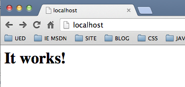
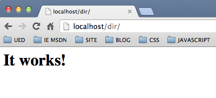
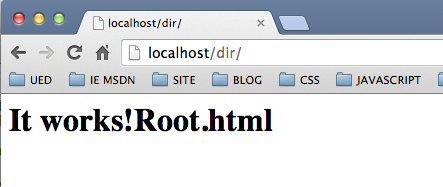

#####Apache服务器指定访问目录时返回的资源

####Apache目录访问的默认处理

默认情况下当我们访问Apache服务器某个目录URL时，Apache服务器会返回该目录下名为`index.html`的页面文件内容。如访问`http://localhost`时，Apache服务器会返回`DocumentRoot`下存在的用来测试的`index.html`页面。如我本机Mac OS自带的Apache，默认的`DocumentRoot`位置为:

	DocumentRoot "/Library/WebServer/Documents"
	
该目录下存在默认的`index.html`文件，启动Apache服务器

	shell> sudo apachectl start

并在地址栏中输入`http://localhost`(Apache服务器默认端口80),可以看到返回的是`index.html`页面。

在`DocumentRoot`新建一个名为`dir`的空目录并将`index.html`复制一份到该目录下。之后访问目录`http://localhost/dir/`,可以看到同样会把dir目录下拷贝过去的`index.html`内容返回回去。

####DirectoryIndex指令

Apache服务器下访问目录时返回的资源是通过`DirectoryIndex`指令进行配置的。`DirectoryIndex`指令的作用是:**指定当客户端在请求目录索引时，服务器所要访问的资源列表**。默认值为`DirectoryIndex index.html`，如设置：

	DirectoryIndex index.html

那么当请求`http://server.com/docs/`时会返回`http://server.com/docs/index.html`。

也可以为`DirectoryIndex`设置由多个文件名称组成的列表，如:

	DirectoryIndex index.html index.php root.html root.php
	
那么当请求`http://server.com/docs/`时,服务器会在`docs`目录下依次查看是否存在文件`index.html` `index.php` `root.html` `root.php`，并优先返回第一个查找到的文件。

在之前的`dir`目录下复制index.html文件并重命名为root.html，再将root.html文件内容改为
	
	It works!Root.html
	
以示区分，之后在`httpd.conf`配置文件中的`<Directory "/Library/WebServer/Documents">…</Directory>`中添加如下配置

	DirectoryIndex root.html index.html
	
之后保存文件，重启Apache服务器

	shell> sudo apachectl restart
	
并访问`http://localhost/dir/`，以下是访问结果

可以看到优先返回的是root.html页面的内容，并验证了`DirectoryIndex`指令的索引顺序。

####DirectoryIndex的路径

`DirectoryIndex`指定后的文件路径，既可以是相对路径也可以是绝对路径,如：

	DirectoryIndex /index.html index.html
	
`/index.html`是绝对路径下的文件，`index.html`是相对于当前目录下的文件。

####同一上下文下多个DirectoryIndex的配置

在同一个上下中，可以添加多个DirectoryIndex指令，相互之间依旧是按顺序索引关系，非替代关系，如：

	<Directory /site>
	    DirectoryIndex index.html
    	DirectoryIndex index.php
	</Directory>
	
等同于
	
	<Directory /site>
	    DirectoryIndex index.html index.php
	</Directory>
	
####参考

+ [DirectoryIndex Directive](1)

[1]: http://httpd.apache.org/docs/2.2/mod/mod_dir.html#directoryindex

