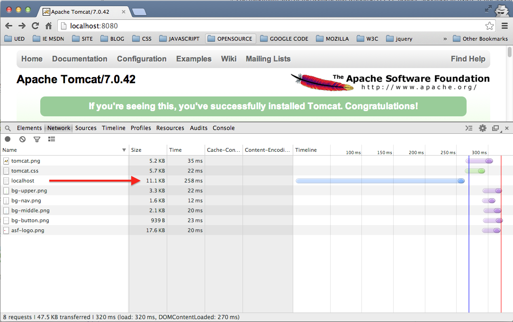
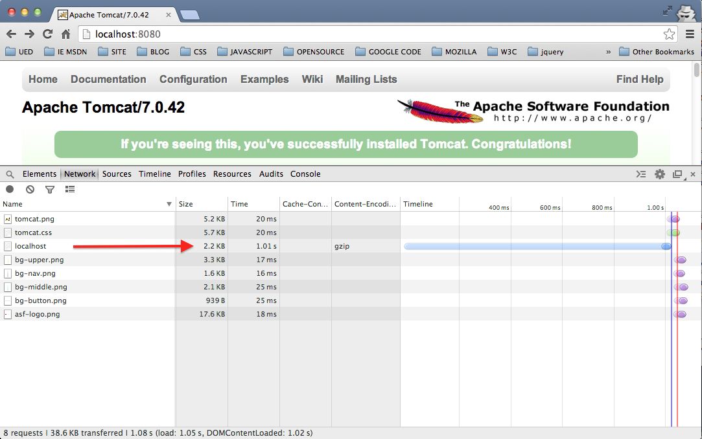
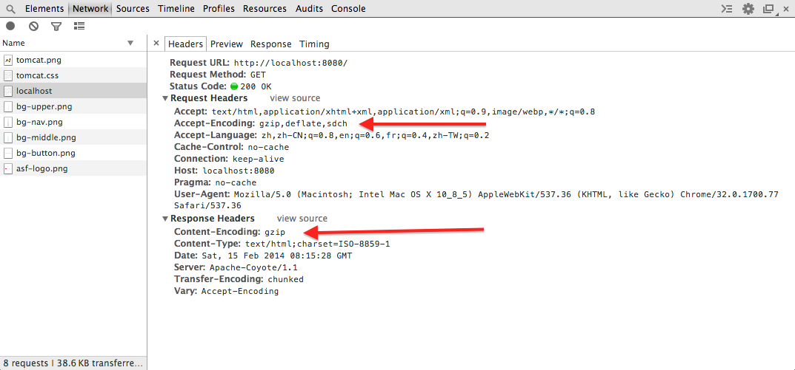
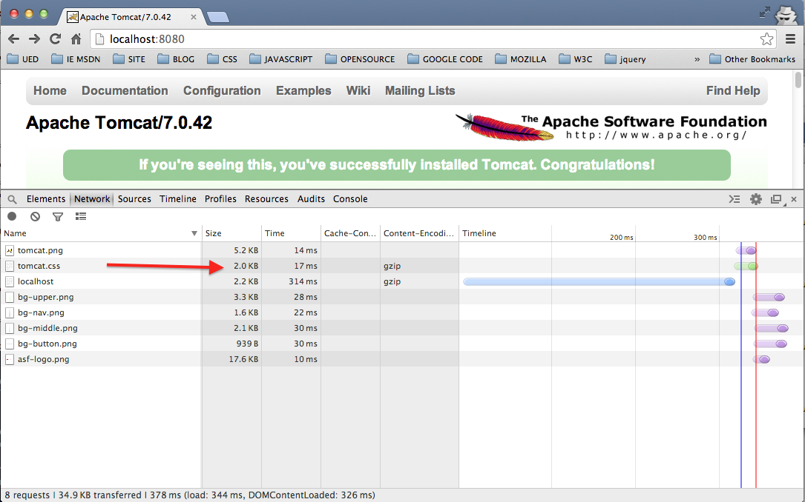
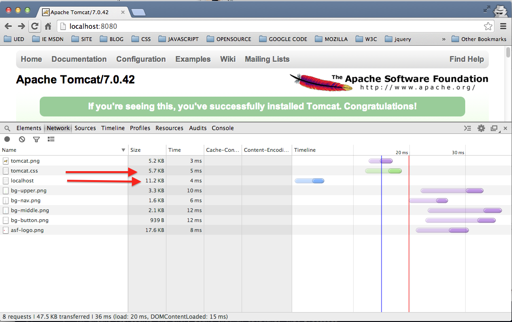
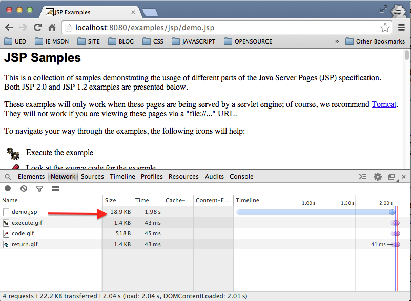
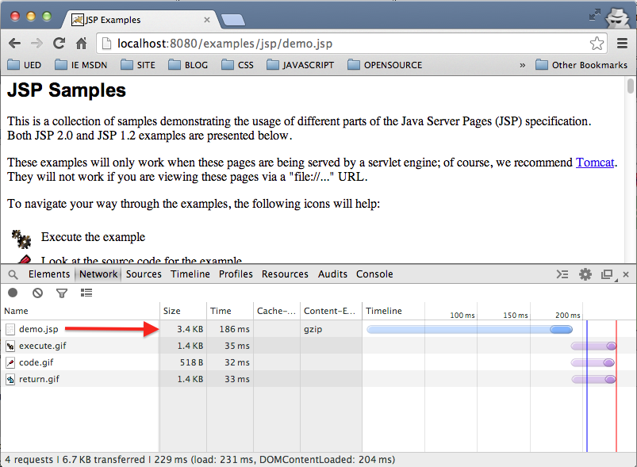
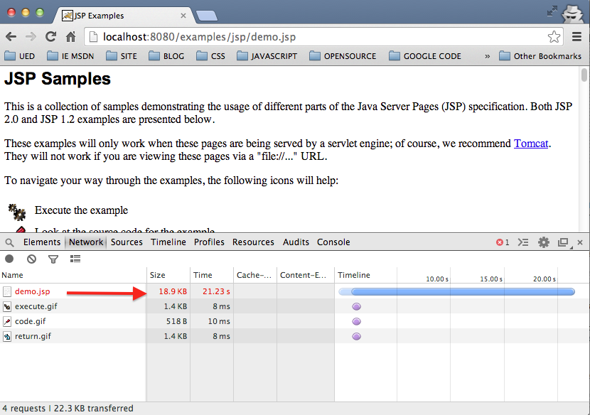

###介绍Tomcat下GZip文件压缩

压缩网络传输的文件，通过减小文件大小，可以节省带宽，提高站点的响应速度，优化前端的页面展示体验。Tomcat中支持[GZip](4)压缩。本篇以Tomcat7.0为例，介绍Tomcat如何开启[GZip](4)功能。

####配置属性及说明

通过浏览器请求服务器资源，使用的是HTTP协议，Tomcat中server.xml配置文件中的HTTP Connector组件用来支持HTTP/1.1协议，负责处理所有的HTTP请求和响应，默认配置如下：

	  <Connector port="8080" protocol="HTTP/1.1"
               connectionTimeout="20000"
               redirectPort="8443" />
               
 需要在该配置上添加与Gzip相关的属性来开启[GZip](4)压缩，配置如下：
 	
 	  <Connector port="8080" protocol="HTTP/1.1"
               connectionTimeout="20000"
               redirectPort="8443" 
               compression="on"
               compressionMinSize="2048"
               compressableMimeType="text/html,text/xml,text/plain"
               noCompressionUserAgents="Chrome"/> 
               
新增的四个属性都是与GZip相关的配置，其中

+ `comprress` - 控制是否开启HTTP/1.1 Gzip压缩，设置为
	
	+ `on`，开启GZip；
	+ `off`，关闭GZip；
	+ `force`，强制所有文件都进行压缩；
	+ `正整数数值`，等同于	设置为`on`并指定被压缩的数据量的最小阀值；
	
	默认设置为`off`关闭。如果compress设置为`on`或数值，并且响应消息头中没有添加`content-length`消息头，数据同样会被压缩。

+ `compressableMimeType` - 指定允许压缩的文件的MIME类型，可以以`,`分隔符指定一个类型列表，默认为`text/html,text/xml,text/plain`。
+ `noCompressionUserAgents` - 指定一个字符串，过滤HTTP请求中的`user-agent`消息头，忽略来自匹配的HTTP客户端的[GZip](4)压缩请求,支持正则表达式，默认为空字符串。
+ `compressionMinSize` - `compression`设置为`on`后，该属性用以指定可以被压缩的数据量的最小阀值，小于该值的数据将不会被压缩，默认为**2048KB**。

####基于浏览器的示例

下面围绕这几个属性介绍几个简单的示例作为解释。本机Mac OS系统，7.0.42版本的Tomcat，使用Chrome浏览器请求页面并查看测试效果。此处省略环境的配置过程，直接跳到测试环节，通过对比来查看配置的效果。

1. **开启GZip压缩**

	默认情况下Tomcat关闭了[GZip](4)，我们启动Tomcat，Chrome地址栏中输入`http://localhost:8080`请求Tomcat的默认页面，并打开控制台，查看默认页面的交互情况，页面如下：
	
	

	可以看到页面(localhost)当前的大小为**11.1KB**，之后开启[GZip](4)配置，

		<Connector connectionTimeout="20000" 
      		port="8080" 
      		protocol="HTTP/1.1" 
      		redirectPort="8443"
      		compression="on"
      		/>

	重启Tomcat再次刷新页面，查看结果，如下

	

	`localhost`页面被压缩到了**2.2KB**
	
	打开`localhost`页面的请求详情
	
	
	
	可以看到请求消息中的消息头
	
		Accept-Encoding:gzip,deflate,sdch
		
	响应消息的消息头
	
		Content-Encoding:gzip
		
	正式这两个消息头协调浏览器和服务器完成压缩的协商过程。

2. **添加对其它类型文件压缩的支持**

	默认情况下Tomcat的[GZip](4)压缩配置为支持`text/html,text/xml,text/plain`三种文件的类型，下面添加`text/css`类型来支持CSS文件的压缩，如下：

		<Connector connectionTimeout="20000" 
    	  port="8080" 
    	  protocol="HTTP/1.1" 
    	  redirectPort="8443"
    	  compression="on"
     	  compressableMimeType="text/html,text/xml,text/plain,text/css"
      	/>
	压缩前tomcat.css的大小为**5.7KB**,重启Tomcat，刷新页面

	
      
	tomcat.css压缩到**2.0KB**。要压缩其它的文件，只要将其MIME类型字符串依次添加进去即可。   
 
3. **屏蔽来自Chrome浏览器**

	在Chrome的控制台打开locahost页面的请求详情，查看请求`User-Agent`的字符串描述

	

		User-Agent:Mozilla/5.0 (Macintosh; Intel Mac OS X 10_8_5) AppleWebKit/537.36 (KHTML, like Gecko) Chrome/32.0.1700.77 Safari/537.36
	
	配置Tomcat，添加正则表达式`.*Chrome.*`来匹配Chrome浏览器，如下

		<Connector connectionTimeout="20000" 
      		port="8080" 
      		protocol="HTTP/1.1" 
      		redirectPort="8443"
      		compression="on"
      		compressableMimeType="text/html,text/xml,text/plain,text/css"
      		noCompressionUserAgents=".*Chrome.*"
      		/>
      
 	重启Tomcat，刷新页面  
 	      
      
      
	可以看到页面和CSS文件都未被压缩！类似的情况我们可以根据请求消息中的`User-Agent`消息头来屏蔽来自不同的浏览器或其它类型的客户端的[GZip](4)请求。

4. 限定可被压缩数据的最小值

	设置`compression='on'`之后，可以使用`compressionMinSize`属性来设置可以被压缩数据的最小值，如果HTTP的响应返回的数据或文件小于`compressionMinSize`指定的值则不会被压缩，但这有一个前提是**HTTP响应中必须以`content-length`消息头返回数据的总长度**，否则`compressionMinSize`设置不会起作用，返回的数据或文件照样会被Tomcat压缩。
	
	由于要控制响应中`content-length`消息的设置，我们需要一个动态的JSP页面为例进行验证。Tomcat的`webapps`目录默认安装了几个web应用，其中`examples`应用中包含了一些学习jsp/servlet的实例代码，地址栏中输入`http://localhost:8080/examples/jsp/index.html`，该页面列出了所有示例代码，我们现在拷贝`index.html`页面中的HTML代码，在同级目录下新建名为`demo.jsp`的页面并将代码拷贝到其中，该页面其实还是一个纯静态的页面，现在我们关闭[GZip](4)压缩，请求页面来查看该文件的大小，配置如下：

		<Connector connectionTimeout="20000" 
    	  port="8080" 
    	  protocol="HTTP/1.1" 
    	  redirectPort="8443"
    	  compression="off"
      	/>
	地址栏中输入`http://localhost:8080/examples/jsp/demo.jsp`,请求该页面：

	

	可以看到页面大小为**18.9KB**,这是页面未经压缩的原始大小。之后我们将`compressionMinSize`限定在**100KB**,配置如下:

		<Connector connectionTimeout="20000" 
    		  port="8080" 
	    	  protocol="HTTP/1.1" 
    		  redirectPort="8443"
    		  compression="on"
	    	  compressionMinSize="102400"
    	  	/>
      	
	如上配置，想象中，当返回数据或文件小于**100KB**时将不会被压缩，但实际上我们重启服务器再次请求页面查看结果便知：
	
	
	
	可以看到`demo.jsp`文件被压缩到了**3.4KB**。下面我们在`demo.jsp`页面中加入设置`content-length`响应头的代码。
	
		<%@ page language="java" contentType="text/html; charset=UTF-8" pageEncoding="UTF-8"%>
		<%
			response.addHeader("content-length", "19353");//设置大小为18.9KB
		%>
	
	再次刷新页面
	
	
	
	可以看到`demo.jsp`页面没有再被压缩，`content-length`属性的设置确实发生作用。

>注:`compressionMinSize`属性是在Tomcai7.0版本中新增的属性，Tomcat6.0中不存在该属性。

####参考

+ [compressionMinSize does not work on Tomcat 6](1)
+ [The HTTP Connector - Tomcat6](2)
+ [The HTTP Connector - Tomcat7](3)
+ [GZip](4)
+ [互联网媒体类型](5)
+ [多用途互聯網郵件擴展](6)
+ [Tomcat 7 GZIP compression not working](7)

[1]: http://stackoverflow.com/questions/19024382/compressionminsize-does-not-work-on-tomcat-6 
[2]: http://tomcat.apache.org/tomcat-6.0-doc/config/http.html
[3]: http://tomcat.apache.org/tomcat-7.0-doc/config/http.html#Standard_Implementation
[4]: http://zh.wikipedia.org/wiki/Gzip
[5]: http://zh.wikipedia.org/wiki/%E4%BA%92%E8%81%94%E7%BD%91%E5%AA%92%E4%BD%93%E7%B1%BB%E5%9E%8B
[6]: http://zh.wikipedia.org/wiki/%E5%A4%9A%E7%94%A8%E9%80%94%E4%BA%92%E8%81%AF%E7%B6%B2%E9%83%B5%E4%BB%B6%E6%93%B4%E5%B1%95
[7]: http://stackoverflow.com/questions/16653642/tomcat-7-gzip-compression-not-working