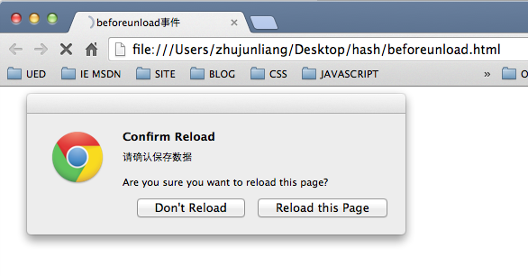
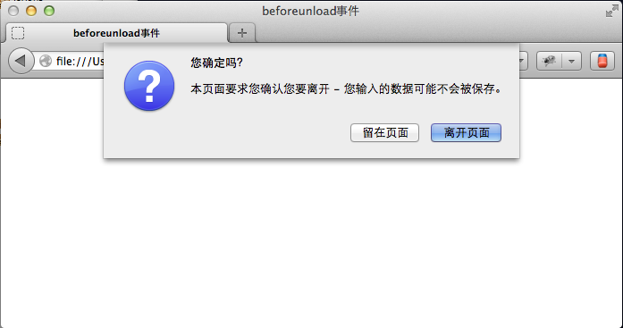
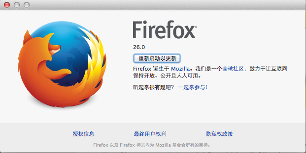

###window的beforeunload事件处理

在网页浏览中，有时我们需要在用户刷新或退出当前页面之前做些特殊处理，如提示用户保存数据，或者防止用户在无意识状态下关闭当前打开的页面，导致重要数据的丢失。这可以通过为window对象添加`beforeunload`事件得以实现,该事件触发时，浏览器会弹出显示自定义信息的确认对话框来提示用户，是选择留在当前页面还是要继续之后的退出操作。

####监听处理

下面是为window添加`beforeunload`事件的方式:

	window.onbeforeunload = eventHandlerFun;

也可以使用`addEventListener`方法添加事件处理，如:

	window.addEventListener("beforeunload",eventHandlerFun);

`eventHandlerFun`指定的是事件处理的函数，例如我们需要在用户刷新或关闭页面时提示用户保存数据，示例代码如下：

	<!doctype html>
	<html>
		<head>
			<title>beforeunload事件</title>
		</head>
		<body>
			
		</body>
	</html>
	
页面加载完毕后，点击浏览器的刷新按钮，在Chrome下的执行结果如图：

`beforeunload`事件处理函数的返回值是添加自定义提示信息的地方，可以返回一个字符串来对用户做出提示，只要返回值不为空，**多数**浏览器都会将该信息显示在提示对话框上，但也有例外，如在我本机的火狐中执行以上代码，虽然也弹出了确认对话框，但未将提示信息显示在上面，如图：

本机系统为Mac OS，火狐版本为FF26.0

来自火狐MDN的注释说明在Firefox4及以后版本，`beforeunload`处理函数返回的字符串不会显示给用户
> Note that in Firefox 4 and later the returned string is not displayed to the user. See [bug 588292](https://bugzilla.mozilla.org/show_bug.cgi?id=588292).

如果`beforeunload`的处理函数的没有添加返回值，那么浏览器不会弹出确认对话框，如以下示例不会确认对话框

	<!doctype html>
	<html>
		<head>
			<title>beforeunload事件</title>
		</head>
		<body>
			
		</body>
	</html>

需要注意的是`beforeunload`事件触发时，当前页面的文档仍处于显示状态，我们可以在处理函数中进行任何页面操作，并且该事件也是可以[取消的](https://developer.mozilla.org/en-US/docs/Web/API/event.preventDefault)。

####标准和兼容性

`beforeunload`最早是由微软在IE4中引入的，早期并没有一个浏览器间的统一标准，但HTML5中已经添加了对该事件的[标准化定义](http://dev.w3.org/html5/spec-LC/history.html#unloading-documents)。PC版浏览器下该事件的兼容性如下:

<table class="compat-table">
    <tbody>
      <tr>
        <th>Feature</th>
        <th>Chrome</th>
        <th>Firefox(Gecko)</th>
        <th>IE</th>
        <th>Opera</th>
        <th>Safari</th>
      </tr>
      <tr>
        <td>Basic support</td>
        <td>1</td>
        <td>1</td>
        <td>4</td>
        <td>12</td>
        <td>3</td>
      </tr>
    </tbody>
  </table>

####触发时机

以下是来自MSDN中关于`beforeunload`事件的触发时机的描述：

+ 关闭当前窗口
+ 在地址栏中输入新的地址并导航到新的位置
+ 点击链接到其它文档的链接([anchor](http://msdn.microsoft.com/en-us/library/ie/ms535173\(v=vs.85\).aspx))
+ 调用[anchor.click](http://msdn.microsoft.com/en-us/library/ie/ms535173\(v=vs.85\).aspx)方法
+ 调用[document.write](http://msdn.microsoft.com/en-us/library/ie/ms536782\(v=vs.85\).aspx)方法
+ 调用[document.close](http://msdn.microsoft.com/en-us/library/ie/ms536369\(v=vs.85\).aspx)方法
+ 调用[window.close](http://msdn.microsoft.com/en-us/library/ie/ms536367(\v=vs.85\).aspx)方法
+ 调用[window.navigate](http://msdn.microsoft.com/en-us/library/ie/ms536638\(v=vs.85\).aspx)或[NavigateAndFind](http://msdn.microsoft.com/en-us/library/ie/ms536641\(v=vs.85\).aspx)方法
+ 调用[location.replace](http://msdn.microsoft.com/en-us/library/ie/ms536712\(v=vs.85\).aspx)方法
+ 调用[location.reload](http://msdn.microsoft.com/en-us/library/ie/ms536691\(v=vs.85\).aspx)方法
+ 为[location.href](http://msdn.microsoft.com/en-us/library/ie/ms533867\(v=vs.85\).aspx)赋新值
+ 通过[input type=submit](http://msdn.microsoft.com/en-us/library/ie/ms535840\(v=vs.85\).aspx)空间提交有action属性指定地址的表单，或调用[form.submit](http://msdn.microsoft.com/en-us/library/ie/ms536771\(v=vs.85\).aspx)方法
+ 调用[window.open](http://msdn.microsoft.com/en-us/library/ie/ms536651\(v=vs.85\).aspx)方法
+ 调用[document.open](http://msdn.microsoft.com/en-us/library/ie/ms536652\(v=vs.85\).aspx)方法
+ 点击浏览器的回退，刷新或主页按钮

对于其它浏览器的触发情况参见[各浏览器对 onbeforeunload 事件的支持与触发条件实现有差异](3)中的描述。

####参考

+ [Window.onbeforeunload](1)
+ [beforeunload | onbeforeunload event](2)
+ [各浏览器对 onbeforeunload 事件的支持与触发条件实现有差异](3)

[1]: https://developer.mozilla.org/en-US/docs/Web/API/Window.onbeforeunload
[2]: http://msdn.microsoft.com/en-us/library/ie/ms536907(v=vs.85).aspx
[3]: http://www.w3help.org/zh-cn/causes/BX2047
