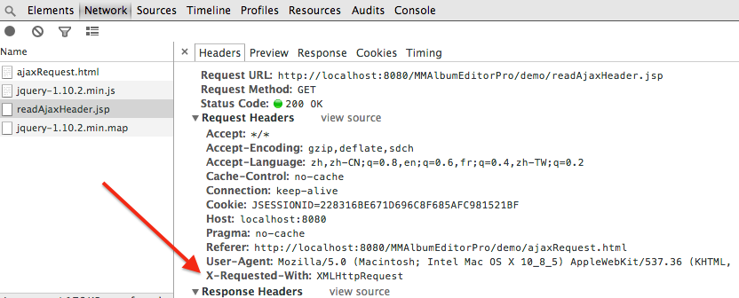

######使用X-Requested-With消息头来识别Ajax请求

Web页面中我们可以使用Ajax向后台服务器异步发送请求，从而完成页面无刷新状态下的数据交互，优化了前端的交互体验。对于同一个后台的数据接口有时需要根据请求的来源来做出不同的处理流程，例如对于一个请求的错误处理方式来说，来自于网页端的同步请求，我们可以以重定向的方式做出回应；对于Ajax发出异步的请求，可能会以返回JSON错误提示的方式在网页端给出指导性的错误提示而非跳转。

那么该如何区分请求的来源呢？一种实现方式是使用`X-Requested-With`请求头作为区分标记。

####非标准的X-Requested-With

`X-Requested-With`属于HTTP的请求消息头中的一种，但并未标准化，它的主要作用就是用来标识网页端的Ajax请求。格式如下:

	X-Requested-With: XMLHttpRequest
	
使用Ajax原生代码示例如下:

	var httpRequest;	
	
	if (window.XMLHttpRequest) { // standard
      
    	httpRequest = new XMLHttpRequest();
      
    }else if (window.ActiveXObject) { // IE
	    try {
        	httpRequest = new ActiveXObject("Msxml2.XMLHTTP");
    	}catch (e) {
	        try {
	        	httpRequest = new ActiveXObject("Microsoft.XMLHTTP");
        	}catch (e) {}
    	}
    }
    
    httpRequest.onreadystatechange = function(){
    
    };
    
    
    httpRequest.open('GET', "server.action",true);
    
    // set http request header
    httpRequest.setRequestHeader("X-Requested-With","XMLHttpRequest");
    
    httpRequest.send();

####前端框架中的支持示例

当前多数的Javascript框架在自己的Ajax模块实现中都加入了对该消息头的支持，在发送Ajax请求时，这些框架都会自动为请求添加`X-Requested-With`消息头。

jQuery中[jQuery.ajax( [settings ] )](http://api.jquery.com/jQuery.ajax/#jQuery-ajax-settings)参数部分中关于**`headers`**的描述如下:
>headers (default: {})

>Type: PlainObject

>An object of additional header key/value pairs to send along with requests using 
>the XMLHttpRequest transport. The header X-Requested-With: XMLHttpRequest is 
>always added, but its default XMLHttpRequest value can be changed here. Values 
>in the headers setting can also be overwritten from within the beforeSend 
>function. **(version added: 1.5)**

Ajax模块中的代码实现如下
	
	// X-Requested-With header
	// For cross-domain requests, seeing as conditions for a preflight are
	// akin to a jigsaw puzzle, we simply never set it to be sure.
	// (it can always be set on a per-request basis or even using ajaxSetup)
	// For same-domain requests, won't change header if already provided.
	if ( !s.crossDomain && !headers["X-Requested-With"] ) {
		headers["X-Requested-With"] = "XMLHttpRequest";
	}

	// Need an extra try/catch for cross domain requests in Firefox 3
	try {
		for ( i in headers ) {
			xhr.setRequestHeader( i, headers[ i ] );
		}
	} catch( err ) {}
Prototype文档中[Ajax Section](http://api.prototypejs.org/ajax/)部分关于请求头的描述如下

>**Request headers**

>The following headers are sent with all Ajax requests (and can be overridden with the 
>`requestHeaders` option described below):

>+ `X-Requested-With` is set to `XMLHttpRequest`.
>+ `X-Prototype-Version` is set to Prototype's current version (e.g.,` <%= PROTOTYPE_VERSION %>`).
>+ `Accept` is set to `text/javascript, text/html, application/xml, text/xml, * / *`
>+ `Content-type` is automatically determined based on the `contentType` and `encoding` options.

代码部分

	var headers = {
      'X-Requested-With': 'XMLHttpRequest',
      'X-Prototype-Version': Prototype.Version,
      'Accept': 'text/javascript, text/html, application/xml, text/xml, */*'
    };
   	// 省略多余部分
    for (var name in headers)
      if (headers[name] != null)
        this.transport.setRequestHeader(name, headers[name]);
	  },
	  
其它框架中，[zepto](https://github.com/madrobby/zepto/blob/master/src/ajax.js),[YUI 3](https://github.com/yui/yui3/blob/master/src/io/js/io-base.js)中，Ajax请求中都有添加`X-Requested-With`消息头。

####简单示例

以jQuery为基础，服务器端使用jsp，来简单实现`X-Requested-With`的判断流程。

前台页面**ajaxRequest.html**

	<!DOCTYPE html>
	<html>
		<head>
			<meta charset="UTF-8">
			<title>X-Requested-With测试</title>	
			
			
		</head>
		<body>
		</body>
	</html>

服务器端**readAjaxHeader.jsp**

	<%@ page language="java" contentType="text/html; charset=UTF-8" pageEncoding="UTF-8"%>
	<%
		String xhrHeader = request.getHeader("X-Requested-With");
	
		if("XMLHttpRequest".equalsIgnoreCase(xhrHeader)){
			System.out.println("From Ajax Request");	
		}else{
			System.out.println("From Normal Request");
		}
	%>
	
部署完毕后，我使用的是Chrome浏览器，打开控制台并在浏览器中访问**ajaxRequest.html**页面，控制台输出信息如图示：

以上显示了jQuery的Ajax请求自动添加了`X-Requested-With`消息头。此时后台控制台log显示为

	From Ajax Request
	
这样在后台便完成了对Ajax请求的区分。

####参考

+ [MDN XMLHttpRequest](https://developer.mozilla.org/en-US/docs/Web/API/XMLHttpRequest)
+ [List of HTTP header fields](1)
+ [Cross-domain AJAX using XMLHttpRequest](2)
+ [jQuery.ajax()](http://api.jquery.com/jQuery.ajax/)

[1]: http://en.wikipedia.org/wiki/List_of_HTTP_header_fields
[2]: http://www.codeotaku.com/journal/2011-05/cross-domain-ajax/index
