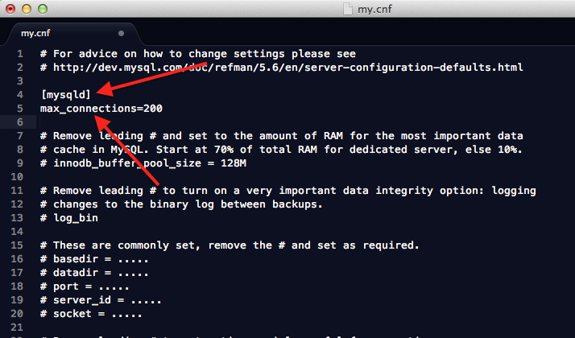

###MySQL数据库最大连接数的查看与修改

####简介

当连接到MySQL服务器的并发连接数超过上限时，之后的连接会失败并会收到MySQL服务器返回的Too many connections错误。在服务器硬件负载支持的话，可以设置更大的并发连接数来避免这个错误的发生的几率。

MySQL服务器中使用[max_connections](1)系统变量来设置服务器的最大连接数。发生连接被服务器拒绝的时候，服务器会将[Connection_errors_max_connections](2)状态变量进行累加，以此来作为记录服务器的连接状况的指标之一。

####查看最大连接数

本机Mac OS安装的MySQL5.6版数据库，连接到MySQL服务器，使用`show variables like 'max_connections'`语句查看，MySQL5.6默认的并发连接数为**151**，之前的默认值为**100**

示例：

	192:support-files manjun.han$ mysql -u root -p;
	Enter password: 
	Welcome to the MySQL monitor.  Commands end with ; or \g.
	Your MySQL connection id is 1
	Server version: 5.6.15 MySQL Community Server (GPL)

	Copyright (c) 2000, 2013, Oracle and/or its affiliates. All rights reserved.

	Oracle is a registered trademark of Oracle Corporation and/or its
	affiliates. Other names may be trademarks of their respective
	owners.

	Type 'help;' or '\h' for help. Type '\c' to clear the current input 	statement.

	mysql> show variables like 'max_connections';
	+-----------------+-------+
	| Variable_name   | Value |
	+-----------------+-------+
	| max_connections | 151   |
	+-----------------+-------+
	1 row in set (0.00 sec)

	mysql> 
	
####修改最大连接数

1. 使用`set global`语句，如设置最大连接数量为**200**，操作如下

		mysql> set global max_connections=200;
		Query OK, 0 rows affected (0.00 sec)

		mysql> show variables like 'max_connections';
		+-----------------+-------+
		| Variable_name   | Value |
		+-----------------+-------+
		| max_connections | 200   |
		+-----------------+-------+
		1 row in set (0.00 sec)

		mysql> 
>`max_connections`为系统变量(System variables),所以需要在set后添加global关键字

	此设置的有效范围仅限于当前数据库此次的运行周期，MySQL服务器重启后，此设置将失效，	`max_connections`的值将重新设置为默认值，或设置为选项文件中的配置的值。

2. 修改**my.cnf**配置文件

	在mysql的安装目录下放置了其选项配置文件**my.cnf**（MySQL选择默认安装的话，安装目录在`/usr/lib/local/mysql`下,不同平台下MySQL的安装路径和选项文件的命名有差异，具体参考官网的安装说明）,该文件用来设置MySQL启动时要读取和加载的启动选项。

	首先关闭MySQL服务器
		
		192:bin manjun.han$ sudo ./mysqladmin -u root -p shutdown 
		Password:
		Enter password: 
		192:bin manjun.han$ 
		
	打开my.cnf配置文件，在`[mysqld]`选项组下面添加如下`max_connections`选项设置
		
		max_connections=200
		
	如图示：

	
	
	
	重启MySQL服务器，重新查看`max_connections`的当前值
	
		192:bin manjun.han$ sudo ./mysqladmin -u root -pnewpass shutdown
		Warning: Using a password on the command line interface can be insecure.
		192:bin manjun.han$ cd ../support-files/
		192:support-files manjun.han$ sudo ./mysql.server start
		Starting MySQL
		. SUCCESS! 
		192:support-files manjun.han$ mysql -u root -p
		Enter password: 
		Welcome to the MySQL monitor.  Commands end with ; or \g.
		Your MySQL connection id is 1
		Server version: 5.6.15 MySQL Community Server (GPL)

		Copyright (c) 2000, 2013, Oracle and/or its affiliates. All rights reserved.

		Oracle is a registered trademark of Oracle Corporation and/or its
		affiliates. Other names may be trademarks of their respective
		owners.

		Type 'help;' or '\h' for help. Type '\c' to clear the current input 	statement.

		mysql> show variables like 'max_connections';
		+-----------------+-------+
		| Variable_name   | Value |
		+-----------------+-------+
		| max_connections | 200   |
		+-----------------+-------+
		1 row in set (0.00 sec)

		mysql> 

	可见，选项配置文件的设置已经生效。
	
####参考

+ [max_connections](1)
+ [Connection_errors_max_connections](2)
+ [Set syntax](http://dev.mysql.com/doc/refman/5.6/en/set-statement.html)

[1]: http://dev.mysql.com/doc/refman/5.6/en/server-system-variables.html#sysvar_max_connections
[2]: http://dev.mysql.com/doc/refman/5.6/en/server-status-variables.html#statvar_Connection_errors_max_connections