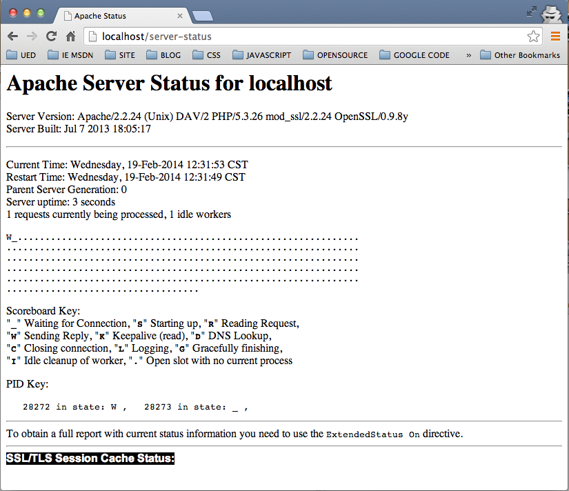
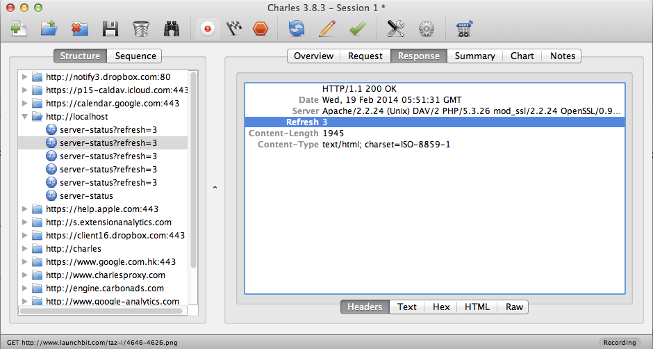

###查看Apache的当前运行状态信息

[mod_status](1)模块在Apache中用于**生成描述当前服务器运行状态的Web页面**，通过访问这个Web页面提供的输出信息，服务器的管理人员可以了解到服务器当前的运行状态。本篇以本机Mac OS系统自带的Apache服务器为基础，介绍[mod_status](1)模块的一些配置。

####输出信息概述
[mod_status](1)模块返回的服务器运行信息包括：

+ 请求的工作者(线程或进程)数量
+ 空闲的工作者数量
+ 服务器自启动/重启以来经过的时间，服务器已经运行的时间。
+ 每个工作者的状态：已完成的请求数、已发送的字节数。(*)
+ 总访问数和已发送的字节总数(*)
+ 平均每秒请求数，平均每秒发送的字节数，平均每个请求发送的字节数。(*)
+ 每个工作者的当前CPU使用百分率，以及Apache的当前总计CPU使用百分率。(*)
+ 当前正在被处理的主机和请求(*)

`*`标注的信息需要进行编译选项配置，默认Apache并不存在该配置，关于如何配置，超出本篇介绍范围，所谓未进行说明。

####mod_status模块的加载

默认情况下Apache服务器自动加载了[mod_status](1)模块，打开httpd.conf文件中，搜索`status`关键字,可以看到[mod_status](1)模块的加载，如：

	LoadModule status_module libexec/apache2/mod_status.so
	
关闭该模块，只要用`#`将其注释掉即可，如：

	#LoadModule status_module libexec/apache2/mod_status.so
	
####配置并访问信息页面

在httpd.conf配置文件中，添加如下配置,并保存

	<Location /server-status>
	    SetHandler server-status
    	Order Deny,Allow
	    Deny from all
    	Allow from all
	</Location>

打开终端，启动Apache服务器

	shell>	sudo apachectl start

访问页面，浏览器中输入`http://localhost/server-status`,信息页面如下：

介绍下页面中几个比较重要的信息，

+ `Scoreboard Key`,列出了Apache运行中的工作者work的各种状态说明。
	+ "-",等待连接
	+ "s",正在启动中
	+ "R",请求读取中
	+ "W",响应应答中
	+ "K",Keepalive
	+ "D",DNS查询中
	+ "C",正在关闭连接
	+ "L",日志记录中
	+ "G",优雅的关闭中
	+ “I”，闲置的worker
	+ ".",Open slot with no current process(没有搞明白)
	
+ `PID Key:`,显示了当前Apache服务器运行的httpd	进程的pid以及以上列出的运行状态

		PID Key: 
		   28272 in state: W ,   28273 in state: _ ,
		   
`28272`和`28273`是对应进程的pid,`W`和`_`分别表示其对应状态，我们可以在终端中通过命令进一步查看下Apache服务器的进程，运行以下命令

	shell> ps aux|grep httpd		  
	
在我本机的输出如下：

	192:bin manjun.han$ ps aux|grep httpd
	zhujunliang    28287   0.0  0.0  2433436    320 s000  U+   12:35pm   0:00.00 grep httpd
	_www           28273   0.0  0.0  2452900    836   ??  S    12:31pm   0:00.00 /usr/sbin/httpd -D 	FOREGROUND
	_www           28272   0.0  0.0  2452900   2052   ??  S    12:31pm   0:00.00 /usr/sbin/httpd -D 	FOREGROUND
	root           28271   0.0  0.3  2452900  10864   ??  Ss   12:31pm   0:00.23 /usr/sbin/httpd -D 	FOREGROUND

####自动刷新

如果浏览器支持自动刷新机制，那么可以实现信息页面的周期自动刷新，只要以下格式访问信息页面即可

	http://localhost/server-status?refresh=3
	
通过额外的`refresh=n`查询参数,可以实现浏览器以`n`（单位:秒）指定的时间定期刷新页面。

好奇这里提到的**浏览器自动刷新机制**，由于页面是定期刷新，不能在浏览器的控制台中查看完整的页面信息，所以用抓包工具分析了下请求`http://localhost/server-status?refresh=3`页面所产生的HTTP包，抓包工具使用的是试用版的[Charles](http://www.charlesproxy.com/),截屏如下

可以看到在HTTP的响应中使用了`Refresh`消息头来告诉浏览器要按照消息头指定的周期刷新页面,但貌似并不是所有浏览器都支持`Refresh`消息头。

####参考
+ ['Refresh' HTTP header](http://stackoverflow.com/questions/283752/refresh-http-header)
+ [Apache 的处理器](https://httpd.apache.org/docs/2.2/zh-cn/handler.html)
+ [Apache Module mod_status](https://httpd.apache.org/docs/2.2/zh-cn/mod/mod_status.html)
+ [What is the meaning of response.setHeader(“Refresh”, “300”)?](http://stackoverflow.com/questions/7879512/what-is-the-meaning-of-response-setheaderrefresh-300)
+ [List of HTTP header fields](http://en.wikipedia.org/wiki/List_of_HTTP_header_fields)
		
[1]: https://httpd.apache.org/docs/2.2/zh-cn/mod/mod_status.html