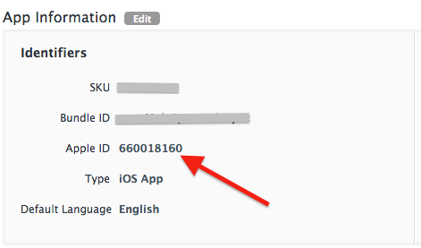
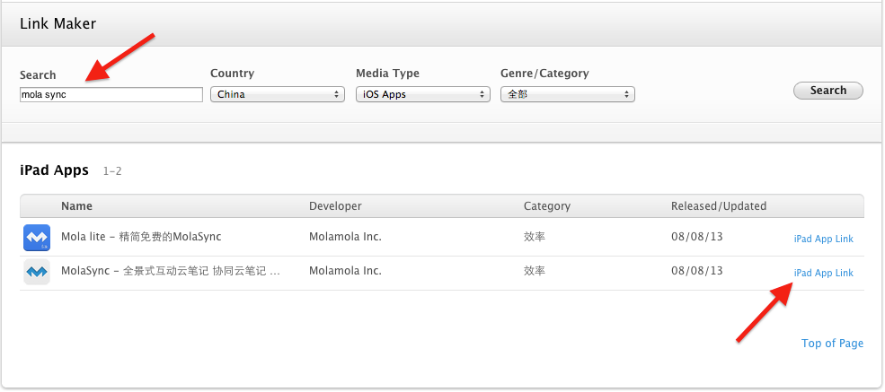

### IOS中使用Safari的Smart App Banners

#### Smart App Banners简介

IOS6下的Safari添加了项新功能,称作**Smart App Banners**,该功能是针对那些有Web站点的IOS应用的，通过在应用所属Web站点的页面进行一些设置，用户在iPad,iPhone上的Safari打开应用所在的Web站点时，Safari会在页面的顶部显示一个App Banner，来说明App的信息，并提示用户可以通过点击这个Banner来跳转到设备上的App Store，从而快捷的下载该应用，或者打开设备上已经安装好的该应用（Smart App Banner会自动检测当前用户设备上是否已经安装了该应用），之后用户重新在打开站点页面时，Banner会自动消失。

因为**Smart App Banner**是苹果自动帮助应用的站点页面加上去的，并提供了一致性的外观和内容项，用户会更加信赖这种展现形式，在提供用户便捷的同时促进了浏览应用站点用户下载该应用的量级，达到一种转换和推广的效果。

#### 实现Smart App Banners

在应用站点上实现支持**Smart App Banners**的方式十分简单，只要将以下形式**meta**标记添加到站点页面的**head**下即可：

	<meta name="apple-itunes-app" content="app-id=myAppStoreID, affiliate-data=myAffiliateData, app-argument=myURL">

+ **app-id(必须)**，此处指的是IOS应用的唯一标示符，在iTunes Connect中创建应用时会自动为该应用分配一个表示符号，也就是**App ID**,可以登陆iTunes Connect并在App的管理页面查看应用的**App ID**,如：

	

	也可以在[iTunes Link Maker](2)指定的页面中输入应用的名称进行查询，如
	
	
	在link最末端的**id**和**?mt**之间的就是**App ID(660018160)**。
	这样一个简单的**meta**如下,

		<meta name="apple-itunes-app" content="app-id=660018160>

	只要添加到站点页面即可。

+ **affiliate-data（可选）**，此处做不介绍，请参考Apple的文档说明。
+ **app-argument（可选）**，打开App时传递的参数，此出指定的参数会添加至调用[application:openURL:sourceApplication:annotation:](3)方法中的**openURL**指定的参数。

#### 参考
+ [Promoting Apps with Smart App Banners](1)
+ [Smart App Banners wordpress plugin](http://wordpress.org/plugins/smart-app-banners/)

[1]: https://developer.apple.com/library/ios/documentation/AppleApplications/Reference/SafariWebContent/PromotingAppswithAppBanners/PromotingAppswithAppBanners.html
[2]: https://linkmaker.itunes.apple.com/us/?urlDesc=
[3]: https://developer.apple.com/library/ios/documentation/UIKit/Reference/UIApplicationDelegate_Protocol/Reference/Reference.html#//apple_ref/occ/intfm/UIApplicationDelegate/application:openURL:sourceApplication:annotation:
