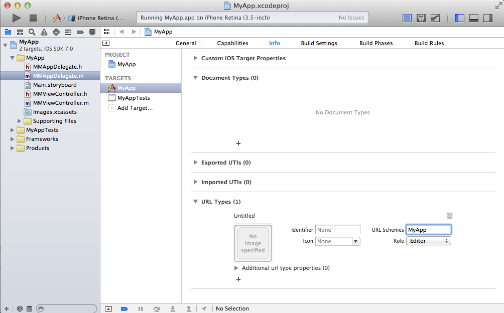
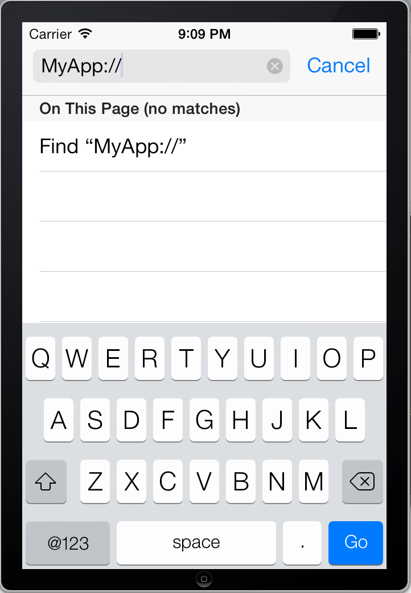

### 使用URL Scheme判断IOS设备是否安装了某个App

#### URL Scheme介绍

苹果应用开发中涉及到一个**URL Scheme**的概念，每个**URL Scheme**都对应一个协议，使用**URL Scheme**能够更好的将本地IOS应用或Web应用与IOS的系统应用进行整合，从而为用户提供更好的交互便捷。如通过**URL Scheme**我们可以在自己的应用程序中很方便的打开苹果的地图应用，邮件应用，或者在iPhone中直接在应用内部的链接中进行拨号操作。例如，Native 应用可以调用UIApplication的[openURL](1)方法来打开邮件应用(对应**mailto:**协议)：

	[[UIApplication sharedApplication] openURL:[NSURL URLWithString:@"mailto:frank@wwdcdemo.example.com"]];

或者，在Web应用中通过链接打开邮件应用，如

	<a href="mailto:frank@wwdcdemo.example.com">John Frank</a>

关于Apple内置的**URL Scheme**，参见[Apple URL Scheme Reference](2)。

#### 判断IOS设备是否安装了某个App

以上介绍的是Apple内置的**URL Scheme**，Apple同样支持**自定义的URL Scheme**，每个应用程序本身在自己的配置中都能指定自己**唯一的URL Scheme**，这样在Safari的地址中输入我们**自定义的URL Scheme**并回车确定就会打开我们的应用，同时假如我们知道一个其它应用的**URL Scheme**，我们可以使用UIApplication的[canOpenURL:](3)方法来判断当前设备上是否已经安装了该应用程序。如新建测试应用**MyApp**，在**tagert**下**Info**面板中最后一项**URL Types选项**中点击添加一个**URL Types**，可以看到**URL Schemes**输入框，此处可以输入指定当前应用自己的URL Scheme，此处我们指定为**MyApp**，如图：

之后，运行测试工程，在正常启动完成后点击模拟器的Home键，并打开Safari，在其地址栏中输入**MyApp://**回车，可以切换到MyApp应用,如图：

同理假如我们将**MyApp**的URL Scheme暴露出去，第三方的应用程序拿到我们的URL Scheme后就可以通过[canOpenURL:](3)方法判断设备中是否已经安装了我们的**MyApp**应用，如以下代码段可以插入到第三方程序中。

	BOOL installed = [[UIApplication sharedApplication] canOpenURL:[NSURL URLWithString:@"MyApp://"]];
    if(installed){
        NSLog(@"已经安装了MyApp");
    }else{
        NSLog(@"还未安装了MyApp");
    }
第三方的开发平台（如QQ，微信等）注册的IOS应用都会被要求添加一个URL Scheme信息，指的就是我们以上介绍的URL Scheme，这样可以用来和第三方的应用完成通信。

#### 参考

+ [canOpenURL:](3)
+ [Apple URL Scheme Reference](2)
+ [CFBundleURLTypes](https://developer.apple.com/library/ios/documentation/General/Reference/InfoPlistKeyReference/Articles/CoreFoundationKeys.html#//apple_ref/doc/uid/TP40009249-102207-TPXREF115)
+ [openURL](1)

[1]: https://developer.apple.com/library/ios/documentation/UIKit/Reference/UIApplication_Class/Reference/Reference.html#//apple_ref/occ/instm/UIApplication/openURL:
[2]: https://developer.apple.com/library/ios/featuredarticles/iPhoneURLScheme_Reference/Introduction/Introduction.html
[3]: https://developer.apple.com/library/ios/documentation/UIKit/Reference/UIApplication_Class/Reference/Reference.html#//apple_ref/occ/instm/UIApplication/canOpenURL: