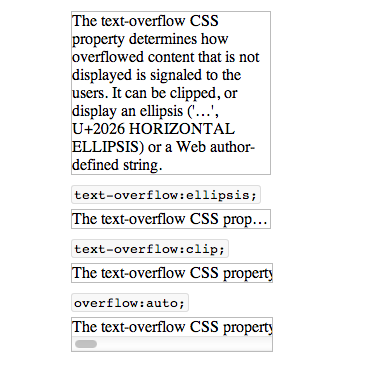

### 使用text-overflow处理文本截断

#### `text-overflow`说明

Web页面在**定宽**的容器中有时需要显示单行的文本（例如标题），同时需要在文本过长时能够将超出的部分进行省略或剪切，在CSS中可以使用`text-overflow`属性来达到此效果。

CSS的`text-overflow`属性决定了溢出的文本内容显示方式，可以被剪切，或以省略号的形式(...)代表。`text-overflow`属性只能应用于**块级元素**，没有继承性。可以取以下几个值：

+ _clip_，代表溢出的文本将会被剪切。
+ _ellipsis_，代表溢出的文本将以省略号(...)代替。

需要说明的是为了达到剪切或省略表示的效果，除了在元素上添加`text-overflow`样式外，还要同时满足以下两个条件：

+ 元素的`overflow`属性必须不能设置为`visible`值(`overflow:visible`下，文本只会溢出元素块的内容区)，最好是设置为`overflow:hidden`。
+ 为了阻止文本自动换行，以达到单行文本的效果，元素的`white-space`属性需要设置为`nowrap`。

因此样式`.text-truncation`,会以省略号代表多余截掉的文本

	.text-truncation {
		overflow: hidden;
		white-space: nowrap;
		text-overflow: ellipsis;
	}

样式`.text-clip`,会将多余文本直接剪切
	
	.text-clip {
		overflow: hidden;
		white-space: nowrap;
		text-overflow: clip;
	}

#### 示例

以示例说明，CSS样式如下

	p{
		width:200px;
		border:1px solid #bbbbbb;
	}

	.text-auto{

	}

	.text-truncation {
		overflow: hidden;
		white-space: nowrap;
		text-overflow: ellipsis;
	}
	
	.text-clip {
		overflow: hidden;
		white-space: nowrap;
		text-overflow: clip;
	}

	.text-scroll{
		overflow: auto;
		white-space: nowrap;
		text-overflow: clip;
	}

HTML代码片段如下：

	
The text-overflow CSS property determines how overflowed content that is not displayed is signaled to the users. It can be clipped, or display an ellipsis ('…', U+2026 HORIZONTAL ELLIPSIS) or a Web author-defined string.

	
The text-overflow CSS property determines how overflowed content that is not displayed is signaled to the users. It can be clipped, or display an ellipsis ('…', U+2026 HORIZONTAL ELLIPSIS) or a Web author-defined string.

	
The text-overflow CSS property determines how overflowed content that is not displayed is signaled to the users. It can be clipped, or display an ellipsis ('…', U+2026 HORIZONTAL ELLIPSIS) or a Web author-defined string.

	
The text-overflow CSS property determines how overflowed content that is not displayed is signaled to the users. It can be clipped, or display an ellipsis ('…', U+2026 HORIZONTAL ELLIPSIS) or a Web author-defined string.

	
效果如图:

#### 兼容性问题

基本上所有的浏览器都已经实现该属性,参见 [Web Platform : text-overflow][ref-6] 说明。但Opera 9和10 需要添加前缀`-o-`,完整的属性名称为`-o-text-overflow`。以`.text-clip`样式为例，完整的写法为

	.text-clip {
		overflow: hidden;
		white-space: nowrap;
		text-overflow: clip;
		-o-text-overflow: clip;
	}

> 如果所应用元素为内联元素，需要添加**display:block;**样式使其变为块级元素。如：
> 
> 		.text-clip {
> 			disaplay:block;
>			overflow: hidden;
>			white-space: nowrap;
>			text-overflow: clip;
>			-o-text-overflow: clip;
>		}
>
#### 参考

+ [Quirks-mode : text-overflow][ref-1]
+ [MDN : text-overflow][ref-2]
+ [Can i use : text-overflow][ref-3]
+ [CSS3 text-overflow Property][ref-4]
+ [CSS-Tricks : text-overflow][ref-5]
+ [Web Platform : text-overflow][ref-6]

[ref-1]: http://www.quirksmode.org/css/user-interface/textoverflow.html
[ref-2]: https://developer.mozilla.org/en-US/docs/Web/CSS/text-overflow
[ref-3]: http://caniuse.com/text-overflow
[ref-4]: http://www.w3schools.com/cssref/css3_pr_text-overflow.asp
[ref-5]: http://css-tricks.com/almanac/properties/t/text-overflow/
[ref-6]: http://docs.webplatform.org/wiki/css/properties/text-overflow