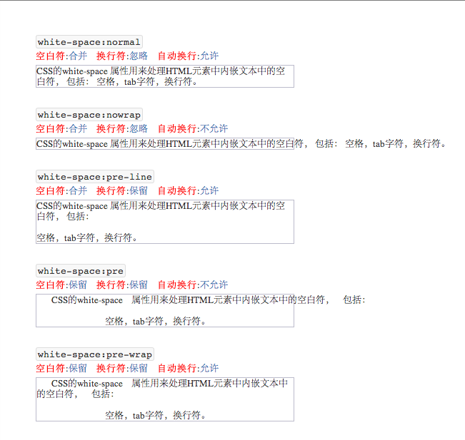

### 使用white-space样式处理文本中的空白字符

CSS的`white-space`属性的作用是控制元素内部文本中所包含空白符号（空格，换行符）的处理方式以及文本的换行方式。适用于任何元素(all Elements),具有可继承性。
可选值包括：

+ `white-space: normal`
+ `white-space: nowrap`
+ `white-space: pre`
+ `white-space: pre-wrap`
+ `white-space: pre-line`

+ `white-space: inherit`

以下表格说明了不同的`white-space`赋值所对应的文本处理方式说明：

<table style="text-align:left">
 <thead>
  <tr>
   <th style="width:100px">&nbsp;</th>
   <th style="width:100px">换行符</th>
   <th style="width:100px">空格和tab</th>
   <th style="width:100px">自动换行</th>
  </tr>
 </thead>
 <tbody>
  <tr>
   <th><code>normal</code></th>
   <td>忽略</td>
   <td>合并</td>
   <td>允许</td>
  </tr>
  <tr>
   <th><code>nowrap</code></th>
   <td>忽略</td>
   <td>合并</td>
   <td>不允许</td>
  </tr>
  <tr>
   <th><code>pre</code></th>
   <td>保留</td>
   <td>保留</td>
   <td>不允许</td>
  </tr>
  <tr>
   <th><code>pre-wrap</code></th>
   <td>保留</td>
   <td>保留</td>
   <td>允许</td>
  </tr>
  <tr>
   <th><code>pre-line</code></th>
   <td>保留</td>
   <td>合并</td>
   <td>允许</td>
  </tr>
 </tbody>
</table>

以示例说明，假如有以下HTML文本片段嵌入页面

	
      CSS的white-space    属性用来处理HTML元素中内嵌文本中的空白符，    包括：

				空格，tab字符，换行符。

其中`p`标签的样式我们设定为

	p{
		width:360px;
		border:1px solid #bcbbcb;
		margin:5px 0px;
	}

赋值以上代码片段，并依次为每个片段添加以下样式

	.ws-normal{
		white-space: normal;
	}
	.ws-nowrap{
		white-space: nowrap ;
	}
	.ws-pre{
		white-space: pre ;
	}
	.ws-pre-wrap{
		white-space: pre-wrap ;
	}
	.ws-pre-line{
		white-space: pre-line;
	}

如

	
      CSS的white-space    属性用来处理HTML元素中内嵌文本中的空白符，    包括：

				空格，tab字符，换行符。

 
	
      CSS的white-space    属性用来处理HTML元素中内嵌文本中的空白符，    包括：

				空格，tab字符，换行符。
	
	
      CSS的white-space    属性用来处理HTML元素中内嵌文本中的空白符，    包括：

				空格，tab字符，换行符。

	
       CSS的white-space    属性用来处理HTML元素中内嵌文本中的空白符，    包括：

				空格，tab字符，换行符。

	
       CSS的white-space    属性用来处理HTML元素中内嵌文本中的空白符，    包括：

				空格，tab字符，换行符。
	

在浏览器中查看代码结果，如下：

>为了说明结果，以上截图的示例代码做了点简单的样式。

#### 参考
[MDN CSS white-space](https://developer.mozilla.org/en-US/docs/Web/CSS/white-space)

