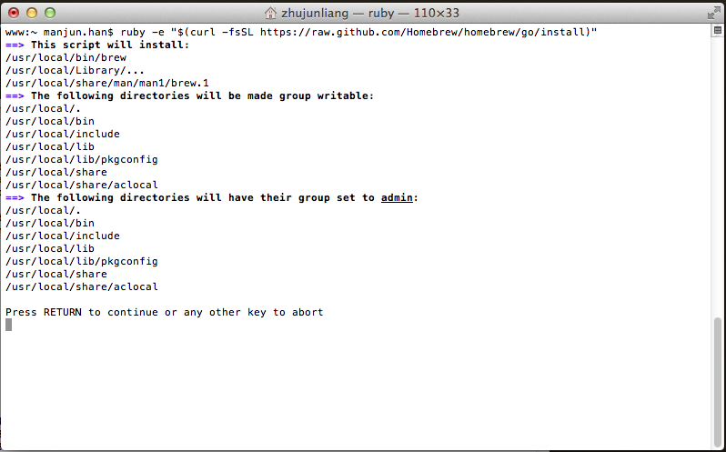
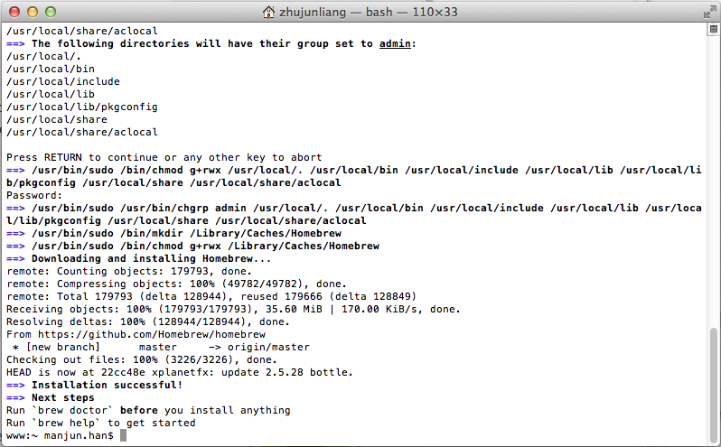
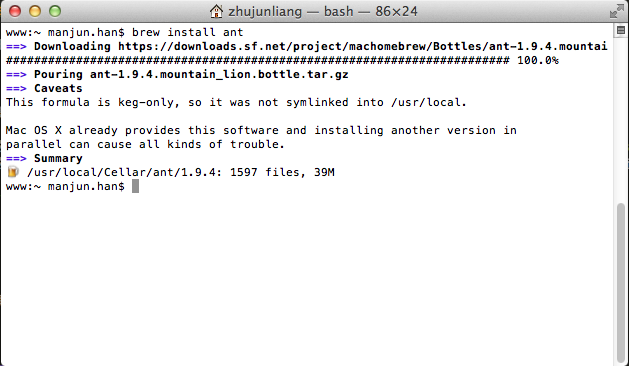

### Mac OS下安装Homebrew

####什么是Homebrew

关于Homebrew，其官网主页简单的定义为：

**The missing package manager for OS X.**

Homebrew其实就是Mac OS X下的一款开源的**软件包管理器**，用来安装和管理Mac OS X中未提供的需要我们自己手工安装的软件或工具。

关于 **软件包管理系统** Wiki上给出的定义是:

>软件包管理系统是在电脑中自动安装、配制、卸载和升级软件包的工具组合，在各种系统软件和应用软件的安装管理中均有广泛应用。

那么，这也可以作为Homebrew的一个更为完整的说明。Homebrew作用与Debian的dpkg和Red Hat的RPM是类似的。

#### 安装Homebrew

安装Homebrew的需要Mac OS 10.5及以上版本的系统。并且需要提供在Mac OS中安装ruby,Mac OS10.5版本之后默认已经安装了 _ruby_，打开终端可以输入以下命令查看系统中是否已经安装 _ruby_ ：

	$ ruby -v

如我的Mac OS版本为10.8.5，运行以上命名在终端会输出以下内容

	ruby 1.8.7 (2012-02-08 patchlevel 358) [universal-darwin12.0]

在确认我们的系统安装了 _ruby_ 之后，安装Homebrew的过程将非常简单，根据官网提示，在终端输入以下命令，然后根据提示就可以完成Homebrew的安装：

	ruby -e "$(curl -fsSL https://raw.github.com/Homebrew/homebrew/go/install)"

以下是我的安装过程的截图

这样在经过几个简单的步骤后Homebrew就安装成功了。安装成功后，可以使用`brew`命令才使用Homebrew提供的管理功能，如查看Homebrew的版本:

	www:~ manjun.han$ brew --version
	0.9.5
	www:~ manjun.han$ 

查看Homebrew的安装路径，默认为`/usr/local`

	www:~ manjun.han$ brew --prefix
	/usr/local
	www:~ manjun.han$ 

或者是查看Homebrew的构建环境

	www:~ manjun.han$ brew --env
	HOMEBREW_CC: clang
	HOMEBREW_CXX: clang++
	MAKEFLAGS: -j4
	CMAKE_PREFIX_PATH: /usr/local
	CMAKE_INCLUDE_PATH: /usr/include/libxml2:/System/Library/Frameworks/OpenGL.framework/Versions/Current/Headers
	CMAKE_LIBRARY_PATH: /System/Library/Frameworks/OpenGL.framework/Versions/Current/Libraries
	PKG_CONFIG_LIBDIR: /usr/lib/pkgconfig:/usr/local/Library/ENV/pkgconfig/10.8
	ACLOCAL_PATH: /usr/local/share/aclocal
	PATH: /usr/local/Library/ENV/4.3:/usr/bin:/bin:/usr/sbin:/sbin
	www:~ manjun.han$ 

关于`brew`命令的更多详细说明，请使用`man brew`查看。

####简单的使用

关于使用Homebrew，我们最先用到的功能就是用它来帮助安装所需的软件或工具，这是最基本的需求，免去了我们对工具的下载，编译，或构建等过程。

在Homebrew中，每个安装的软件或工具被命名为一个**方案**(formula——其实就是那些被管理的package)，可以使用`brew install formula-name`命令来安装我们需要的同时Homebrew又支持的软件或工具，其中命令行中的`formula-name`为待安装的方formula名称，我们以ant为例来查看下该命令的使用过程。

打开终端，输入`brew install ant`,以下是我的安装过程截图

从log输出可以看到安装工具的 _版本号(1.9.4)_，_安装大小(39M)_ ，以及_安装目录(/usr/local/Cellar/ant/1.9.4)_,并且如果之前该软件有未经Homebrew而安装到你的机器上时，在你使用Homebrew再次安装相同的软件时，它会给出提示。

这里每个formula都会被安装到自己私有目录中去，之后文件会被链接到`/usr/local`目录下，所有的formula都会被安装到`/usr/local/Cellar`目录下面，`Cellar`就是所有formula的 **仓库**。可以通过命令`brew --cellar`查看`Cellar`的安装路径，如

	manjunhan:~ manjun.han$ brew --cellar
	/usr/local/Cellar
	manjunhan:~ manjun.han$ 

以及命令`brew --cellar formula-name`，查看formula的安装路径：

	manjunhan:~ manjun.han$ brew --cellar ant
	/usr/local/Cellar/ant
	manjunhan:~ manjun.han$ 

以上只是个人关于Homebrew的一些概念的理解和最基本的用例展示，难免有误。关于Homebrew支持的formula列表，可以[在此查看][ref-7],也可以通过一个第三方的[开源工具][ref-8]进行搜索，或者是通过在终端输入`brew search`来查看Homebrew当前支持的所有formula的名字。更多高级功能需要参见Homebrew在github[项目wiki][ref-9]上的描述

####参考

+ [Homebrew Github][ref-2]
+ [Homebrew Homepage][ref-3]
+ [软件包管理系统][ref-1]
+ [Creating Universal Extensions for Perl, Python and Ruby][ref-4]
+ [Ruby and Python Programming Topics for Mac][ref-5]
+ [Mac Technology Overview][ref-6]
+ [比较Fink, macports 和 homebrew][ref-10]

[ref-1]: http://zh.wikipedia.org/wiki/%E8%BD%AF%E4%BB%B6%E5%8C%85%E7%AE%A1%E7%90%86%E7%B3%BB%E7%BB%9F
[ref-2]: https://github.com/Homebrew/homebrew
[ref-3]: http://brew.sh/
[ref-4]: https://developer.apple.com/library/mac/releasenotes/OpenSource/PerlExtensionsRelNotes/
[ref-5]: https://developer.apple.com/legacy/library/documentation/Cocoa/Conceptual/RubyPythonCocoa/Introduction/Introduction.html
[ref-6]: https://developer.apple.com/library/mac/documentation/MacOSX/Conceptual/OSX_Technology_Overview/SoftwareProducts/SoftwareProducts.html
[ref-7]: https://github.com/Homebrew/homebrew/tree/master/Library/Formula/
[ref-8]: http://braumeister.org/
[ref-9]: https://github.com/Homebrew/homebrew/wiki/Installation
[ref-10]: http://tetsu.iteye.com/blog/1507524