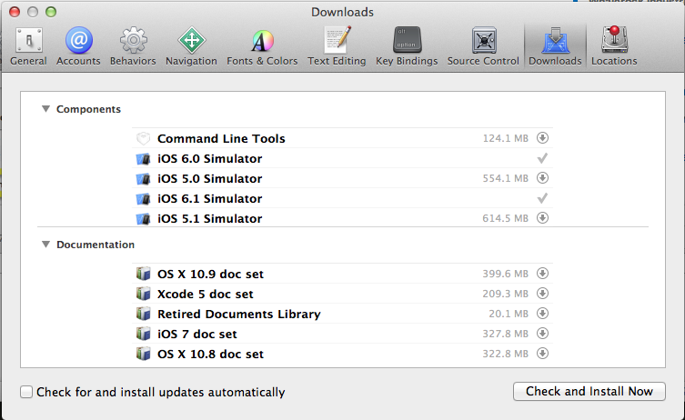
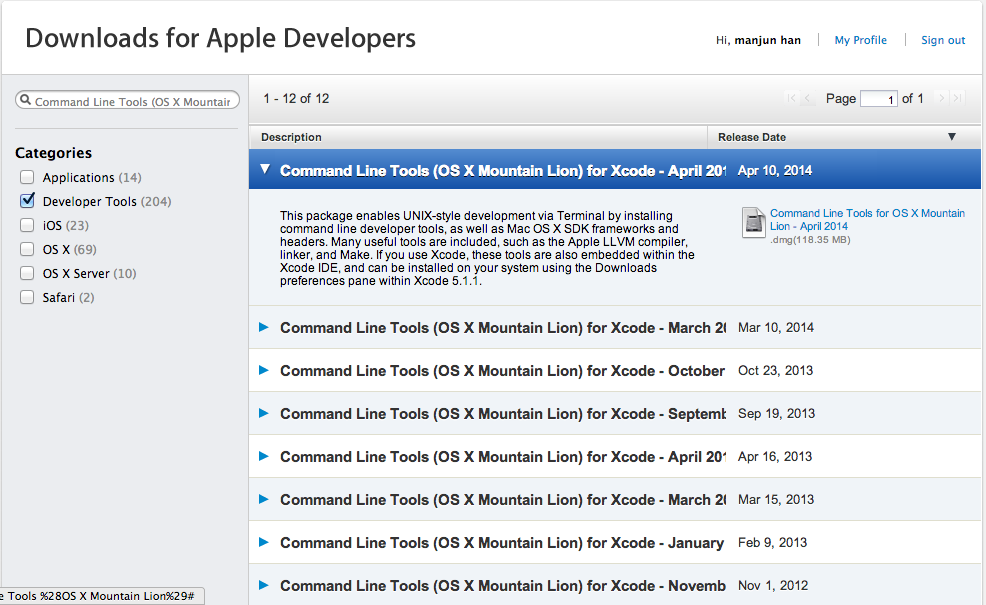
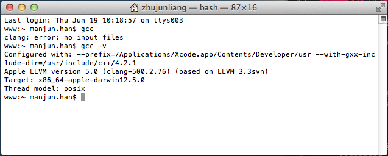

### Mac OS下安装memcached

memcache是一个C程序，依赖于最新版本的GCC编译器和一个名为[libevent][ref-1]的第三方库。memcache支持两种安装方式，

+ 基于Package方式，可以通过系统的package manager来安装。
+ 基于源码构建方式。

本文简单描述在本机Mac OS(10.8.5)下以源码方式安装memcache的步骤。

>libevent是一个异步事件处理函数库，用来处理网络IO、定时器、信号三种事件类型的事件回调处理。

####下载并安装GCC

默认情况下Mac并没有安装GCC编译器，需要我们自己手工安装。这里有两种方式。

+ 如果本机安装过Apple的Xcode集成开发环境，可以打开Xcode,在其菜单栏选择 _Preference..._ ，之后在弹出的窗口中选择 _Downloads_ 面板，在 _Components_ 一栏中下载 _Commoand Line Tools_ 
	
	

+ 如果本机事先没有安装Xcode的话，也可以选择到Apple的开发者站点上去单独[下载][ref-4]**Command Line Tools**的dmg安装包，选择合适的版本下载之后直接运行安装就可以了。当然前提是你有申请Apple的开发者账号。
	
	

安装完成后，打开终端来输入`gcc -v`来验证是否安装成功。安装成功后如图显示
    

####下载安装libevent

在的官网上下载libevent，我下载的是 _libevent-2.0.21-stable.tar.gz_ ,之后切换到 _libevent-2.0.21-stable.tar.gz_ 的目录，依次执行以下命令：

	$ tar -zvxf libevent-2.0.21-stable.tar.gz
	$ cd libevent-2.0.21-stable
	$ ./configure --prefix=/usr/local
	$ make
	$ sudo make install

正常的话，如果安装过程中的log输出没有提示报错的话，那么libevent就已经安装完毕。可以用以下命令查看libevent安装后的结果

	$ ls /usr/local/lib | grep libevent

我这里输出显示

	libevent-2.0.5.dylib
	libevent.a
	libevent.dylib
	libevent.la
	libevent_core-2.0.5.dylib
	libevent_core.a
	libevent_core.dylib
	libevent_core.la
	libevent_extra-2.0.5.dylib
	libevent_extra.a
	libevent_extra.dylib
	libevent_extra.la
	libevent_openssl-2.0.5.dylib
	libevent_openssl.a
	libevent_openssl.dylib
	libevent_openssl.la
	libevent_pthreads-2.0.5.dylib
	libevent_pthreads.a
	libevent_pthreads.dylib
	libevent_pthreads.la

#### 安装memcached

首先到memcached的官网[下载][ref-5]最新的memcache，当前最新版本是 _memcached-1.4.20.tar.gz_ 。之后在终端中切换到 _memcached-1.4.20.tar.gz_ 文件的目录，依次在终端中输入以下命令:

	$ tar memcached-1.4.20.tar.gz
	$ cd memcached-1.4.20.
	$ ./configure
	$ make 
	$ sudo make install

所有命令运行完成之后，memcache服务器现在已经成功安装到了你的机器上，默认的安装路径在`/usr/local/bin`。

安装完成之后，需要验证是否安装成功。使用以下命令来查看`memcached`命令行说明

	$ man memcached

如果有显示`memcached`命令行说明的话，那表明已经安装成功了。

#### 启动memcached服务器

默认情况下，memcached服务器启动后会监听TCP的11211端口，和UDP的11211端口，可以用下面的命令按照默认的端口号设置启动memcached服务器

	$ memcached -d

 _-d_ 参数指示以守护进程(daemon)的方式运行memcached服务器，之后可以查看memcached的启动进程

	$ ps -a | grep memcached

我本机的输出为

	manjunhan:~ manjun.han$ ps|grep memcached
	51685 ttys006    0:00.00 grep memcached
	manjunhan:~ manjun.han$
 

服务器启动之后，可以使用`telnet`连接到服务器进行并输入memcached的命令与memcached服务器进行通信,如

	manjunhan:~ manjun.han$ telnet localhost 11211
	Trying ::1...
	Connected to localhost.
	Escape character is '^]'.

使用`set`命令添加一个缓存条目,如添加一个名为`uid,`值为`1`的条目

	set uid 0 0 1
	1
	daemon

使用`get`命令获取`uid`的值

	get uid
	VALUE uid 0 1
	1
	END
使用`stats`命令查看memcache服务器的运行状况

	stats
	STAT pid 47659
	STAT uptime 99699
	STAT time 1403169221
	STAT version 1.4.13
	STAT libevent 2.0.17-stable
	STAT pointer_size 64
	STAT rusage_user 0.600472
	STAT rusage_system 0.886140
	STAT curr_connections 10
	STAT total_connections 25
	STAT connection_structures 20
	STAT reserved_fds 20
	STAT cmd_get 19
	STAT cmd_set 20
	STAT cmd_flush 1
	STAT cmd_touch 0
	STAT get_hits 11
	STAT get_misses 8
	STAT delete_misses 0
	STAT delete_hits 2
	STAT incr_misses 0
	STAT incr_hits 0
	STAT decr_misses 0
	STAT decr_hits 0
	STAT cas_misses 1
	STAT cas_hits 0
	STAT cas_badval 2
	STAT touch_hits 0
	STAT touch_misses 0
	STAT auth_cmds 0
	STAT auth_errors 0
	STAT bytes_read 1087
	STAT bytes_written 2076
	STAT limit_maxbytes 67108864
	STAT accepting_conns 1
	STAT listen_disabled_num 0
	STAT threads 4
	STAT conn_yields 0
	STAT hash_power_level 16
	STAT hash_bytes 524288
	STAT hash_is_expanding 0
	STAT expired_unfetched 1
	STAT evicted_unfetched 0
	STAT bytes 341
	STAT curr_items 5
	STAT total_items 12
	STAT evictions 0
	STAT reclaimed 1
	END

输入`quit`结束并退出telnet连接会话

此外，可以使用`killall`命令停止memcached服务器：

	$ killall memcached

####参考

+ [libevent][ref-1]
+ [libevent wiki][ref-2]
+ [How to use/install gcc on Mac OS X 10.8 / Xcode 4.4][ref-3]
+ [memcached download][ref-5]
+ [memcached Protocol Commands][ref-6]

[ref-1]: http://www.monkey.org/~provos/libevent/
[ref-2]: http://zh.wikipedia.org/wiki/Libevent
[ref-3]: http://stackoverflow.com/questions/9353444/how-to-use-install-gcc-on-mac-os-x-10-8-xcode-4-4
[ref-4]: https://developer.apple.com/downloads/index.action?=Command%20Line%20Tools%20%28OS%20X%20Mountain%20Lion%29
[ref-5]: http://memcached.org/downloads
[ref-6]: https://code.google.com/p/memcached/wiki/NewCommands