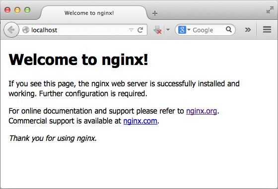

### Mac OS下安装ngiux

本文采用从源代码构建方式演示在Mac系统上安装ngiux的最基本的过程。

####安装环境

本机Mac系统版本为Mac OS X 10.9.3，选择安装稳定版的(Stable Version)ngiux-1.6.0。

>本机已经通过Xcode在系统上安装了GCC编译器,如果你的Mac系统上尚未安装GCC的话，首先需要将GCC安装到自己的机器上。

#### 安装过程

##### 1.下载ngiux

在ngiux官网下载页面上[下载ngiux-1.6.0稳定版](http://nginx.org/en/download.html)。

##### 2.还原压缩文件

下载完成之后将压缩包解压缩还原，首先打开Mac的终端，使用`cd`命令切换到ngiux下载文件的目录中，之后可以使用以下命令

	$ tar -zvxf nginx-1.6.0.tar.gz

解压缩文件完成后，如果未指定文件的解压目录，则会在同级目录下生成新的源码目录**nginx-1.6.0**

##### 3.编译安装	

在终端中使用`cd`命令切换到ngiux源码目录中，依次运行以下命令
	
	$ cd nginx-1.6.0
	$ ./configure

`./configure`首次执行完成后,会出现以下错误提示

>./configure: error: the HTTP rewrite module requires the PCRE library.
You can either disable the module by using --without-http_rewrite_module
option, or install the PCRE library into the system, or build the PCRE library
statically from the source with nginx by using --with-pcre=<path> option.

大意是，ngiux的HTTP rewrite模块依赖一个名为PCRE第三方库，可以选择使用`-without-http_rewrite_module`选项禁止HTTP rewite模块；或者在当前机器上先安装PCRE库，之后在重新运行该命令，继续安装过程。
我选择先安装PCRE库，因为之前我的本机安装了Homebrew管理工具，所以我使用Homebrew来安装PCRE库（否则需要[下载PCRE][ref-1]库的源码，然后编译安装,这个比较麻烦）。

在终端中，使用Homebrew安装PCRE过程如下：

	192:nginx-1.6.0 manjun.han$ brew search pcre
	pcre	pcre++
	192:nginx-1.6.0 manjun.han$ brew install pcre
	==> Downloading https://downloads.sf.net/project/machomebrew/Bottles/pcre-8.35.mavericks.bottle.tar.gz
	######################################################################## 100.0%
	==> Pouring pcre-8.35.mavericks.bottle.tar.gz
	🍺  /usr/local/Cellar/pcre/8.35: 146 files, 5.8M
	192:nginx-1.6.0 manjun.han$ 

PCRE安装完成后，在终端**重新切换**到在ngiux的目录中，重新运行`./configure`命令，本次命令顺利执行完毕，继续运行以下命令

	$ make

之后继续执行以下命令

	$ `sudo make install`

`sudo make install`命令结束，ngiux安装完成后终端输出ngiux的配置信息

	Configuration summary
	  + using system PCRE library
	  + OpenSSL library is not used
	  + md5: using system crypto library
	  + sha1: using system crypto library
	  + using system zlib library

	  nginx path prefix: "/usr/local/nginx"
	  nginx binary file: "/usr/local/nginx/sbin/nginx"
	  nginx configuration prefix: "/usr/local/nginx/conf"
	  nginx configuration file: "/usr/local/nginx/conf/nginx.conf"
	  nginx pid file: "/usr/local/nginx/logs/nginx.pid"
	  nginx error log file: "/usr/local/nginx/logs/error.log"
	  nginx http access log file: "/usr/local/nginx/logs/access.log"
	  nginx http client request body temporary files: "client_body_temp"
	  nginx http proxy temporary files: "proxy_temp"
	  nginx http fastcgi temporary files: "fastcgi_temp"
	  nginx http uwsgi temporary files: "uwsgi_temp"
	  nginx http scgi temporary files: "scgi_temp"

以上三个命令成功运行完成后，ngiux已经成功安装到Mac机上。

#### 启动并验证ngiux服务器

由安装过程的最后一步提示信息可知ngiux服务器的安装目录在`/usr/local/nginx/sbin/nginx`,需要在命令行中启动ngiux，切换到ngiux的目录

	$ cd /usr/local/nginx/sbin/

启动nugix

	$ sudo ./nginx

打开浏览器，在地址栏中输入`localhost`,显示ngiux的欢迎页，则说明ngiux已经成功安装完毕。

>ngiux默认运行在80端口下，由于80端口容易产生冲突，安装过程中需注意。

#### 参考

+ [nginx install][ref-3]
+ [Building nginx from Sources][ref-2]
+ [ngiux CommandLine][ref-5]
+ [PCRE][ref-1]
+ [Nginx安装配置与服务搭建][ref-4]

[ref-1]: http://www.pcre.org/
[ref-2]: http://nginx.org/en/docs/configure.html
[ref-3]: http://wiki.nginx.org/Install
[ref-4]: http://os.51cto.com/art/201111/304611.htm
[ref-5]: http://wiki.nginx.org/NginxCommandLine