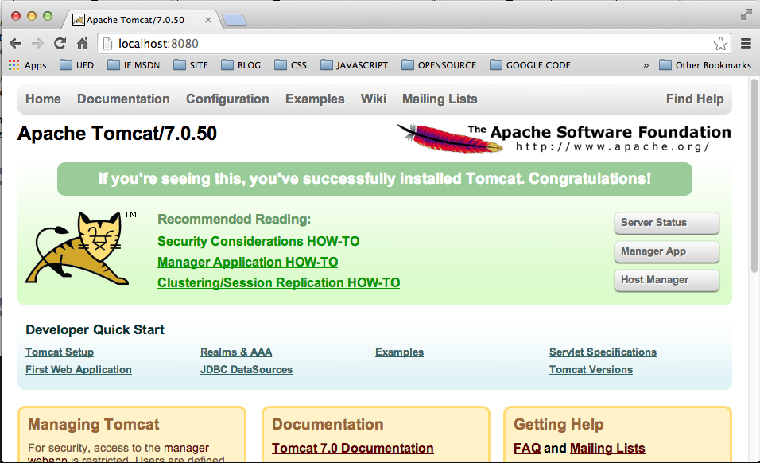

#### 更改Tomcat虚拟主机的默认Web Application

#####Tomcat默认打开的Web Application说明

在Tomcat的配置中，**Context**元素代表了服务器上部署的一个Web Application，所有的Web Application都要部署在所属的虚拟主机（由**Host**元素指定）对应的文件目录下面。默认的Tomcat配置下，打开`conf/server.xml`配置文件，默认虚拟主机配置如下：

	<Host name="localhost"  appBase="webapps" unpackWARs="true" autoDeploy="true">
        
        <!-- SingleSignOn valve, share authentication between web applications
             Documentation at: /docs/config/valve.html -->
        <!--
        <Valve className="org.apache.catalina.authenticator.SingleSignOn" />
        -->

        <!-- Access log processes all example.
             Documentation at: /docs/config/valve.html
             Note: The pattern used is equivalent to using pattern="common" -->
        <Valve className="org.apache.catalina.valves.AccessLogValve" directory="logs"
               prefix="localhost_access_log." suffix=".txt"
               pattern="%h %l %u %t &quot;%r&quot; %s %b" />
          
      </Host>
        
以Tomcat的安装目录(_$CATALINA\_BASE_)目录为基准目录的`webapps`文件夹下包含了虚拟主机`locahost`的所有Web Appliactions,默认安装有以下几个application

 + **Root**
 + **docs**
 + **examples**
 + **host-manager**
 + **manager**

启动Tomcat之后，输入`http://location:8080`,默认加载的是`webapps`文件下的`Root`应用，显示的也就是Tomcat的信息页面，一般用来测试Tomcat是否安装成功。如我本机安装的7.0.50版本的Tomcat的默认打开目录：

##### Tomcat中context path的匹配过程

每个虚拟主机下面可以同时部署N多个Context，要求是每个Context都必须有唯一的context name，无特殊情况下context name和context path是一样的。当**Host**元素的 `autoDeploy`和`deployOnStartup`选项设置为`true`时，Tomcat在启动时会以部署在`webapps`下的web application的根目录名称来自动生成**同名的**context name 和 context path。例如，我们要部署名为appA，appB的web application到Tomcat中，最简单的方式是在默认配置下直接将appA，appB的工程目录和文件文件分别放置到webapps目录下面，如：

	webapps
		--> appA
			--> WEB-INF
				--> web.xml
			--> app-files			
			--> login
				-->index.jsp
			--> index.jsp
			--> *.html
			--> *.jsp

		--> appB
			--> WEB-INF
				--> web.xml
			--> app-files			
			--> login
				-->index.jsp
			--> index.jsp
			--> *.html
			--> *.jsp
			

这里context path，context name，base file name的关系如

<table border="1" style="border:1px solid #ccc">
	<tr>
		<th>Context name</th>
		<th>Context path</th>
		<th>Base file name</th>
	</tr>
	<tr>
		<td>/appA</td>
		<td>/appA</td>
		<td>appA</td>
	</tr>
	<tr>
		<td>/appB</td>
		<td>/appB</td>
		<td>appB</td>
	</tr>
</table>

以上的关系表我们可以将其简单的理解为Tomcat的context path映射表，如果收到一个请求`http://localhost:8080/appA/login/index.jsp`时，Tomcat会截取url中的的uri的前缀部分(去除URL端口号之前的部分和文件名称部分之后剩下的部分)，也就是`/appA/login`部分来依次与虚拟主机下所有的context path进行匹配，未找到的话，会从后面逐级递减，也就是继续取出`/appA`部分重复与所有context path比较，直到找到相等的context path(`/appA`)对应的Web Application，并将请求交给它处理。如果所有遍历完成之后都为找到匹配的context path，那么Tomcat会返回404错误，例如我们在浏览器中访问`http://localhost:8080/appC/login/index.jsp`。

前面我们已经知道，如果访问`http://localhost:8080`,Tomcat会将请求映射到默认`ROOT`应用来处理，这个又是怎么做到的呢？其实，默认情况下，**HOST**元素规定其包含的**Context**中必须有一个默认的Context，满足context path为空字符串，用来处理url中未指定Context path的请求。这个默认的Contex的context path，context name，base file name的关系如

<table border="1" style="border:1px solid #ccc">
	<tr>
		<th>Context name</th>
		<th>Context path</th>
		<th>Base file name</th>
	</tr>
	<tr>
		<td>空字符串</td>
		<td>空字符串</td>
		<td>ROOT</td>
	</tr>
</table>

那么其实完整的Contex的context path，context name，base file name的关系应该是

<table border="1" style="border:1px solid #ccc">
	<tr>
		<th>Context name</th>
		<th>Context path</th>
		<th>Base file name</th>
	</tr>
	<tr>
		<td>/appA</td>
		<td>/appA</td>
		<td>appA</td>
	</tr>
	<tr>
		<td>/appB</td>
		<td>/appB</td>
		<td>appB</td>
	</tr>
	<tr>
		<td>空字符串</td>
		<td>空字符串</td>
		<td>ROOT</td>
	</tr>
</table>

所以为添加context path的请求都交由`ROOT`应用处理。

> 注：本节只是从概念上简单分析了Tomcat选择context path的逻辑过程，实际的处理过程要复杂的多，详细解释应以Tomcat的官方Doc为准。
> 

#####更改Tomcat虚拟主机的默认Context

实际应用中，我们需要在输入`http://localhost:8080`时，显示的是我们指定的Web Application,而不是默认的`ROOT`应用，也就是将我们指定的应用映射为服务器的root URI("/"),以下有几种方式来达到这种效果：

+ 方式一 : 删除默认的`ROOT`应用，将你的web application命名为`ROOT`并部署上去。
+ 方式二 : 将你的应用**部署在`webapps`之外**的目录中，在`$CATALINA_BASE/conf/[enginename]/[hostname]/`目录下新建`ROOT.xml`的文件，并将写入以下内容
		
		<?xml version='1.0' encoding='utf-8'?>	
 		<Context docBase="/Applications/apache-tomcat-7.0.50/appA" path=""/>
`docBase`指定的是你应用的磁盘路径。

+ 方式三 : 打开`conf/server.xml`,在对应的`Host`中添加

		<Host name="localhost"  appBase="webapps" unpackWARs="true" autoDeploy="true">
			<Context docBase="/Applications/apache-tomcat-7.0.50/appA" path=""/>
		</Host>

**需要强调的是**`path`必须是空字符串，`docBase`指定的是你应用的磁盘路径，可以是绝对路径，也可以是相对于`webapps`的路径，依工程的部署情况而定。

>当**Context**元素的`docBase`路径是相对于**Host**元素的`appBase`路径的时候，一定要注意将**Host**元素的`autoDeploy`属性设置为`false`，以避免这个指定的web application在服务器启动时被加载两次。（一次发生server.xml中的Context配置而被部署（deployOnStartup=true），第二次发生设置autoDeploy=true而发生的自动部署。

**方式一**中，更好的做法是为`ROOT`应用更换新的名称，这样可以保留`ROOT`应用主页上提供的所有链接内容。

Tomcat的文档中不推荐在`conf/server.xml`中去添加**Context**元素，也就是**方式三**中的配置，因为这污染了该配置文件，并且`conf/server.xml`中配置的变更只有在重启Tomcat服务器后才能生效。

##### 参考

+ [Tomcat7.0 The Context Container][ref-1]
+ [Tomcat 6: How to change the ROOT application][ref-2]
+ [Tomcat 6.0 The Context Container][ref-3]
+ [Change default ROOT folder in TOMCAT][ref-4]

[ref-1]: http://tomcat.apache.org/tomcat-7.0-doc/config/context.html
[ref-2]: http://stackoverflow.com/questions/715506/tomcat-6-how-to-change-the-root-application
[ref-3]: http://tomcat.apache.org/tomcat-6.0-doc/config/context.html
[ref-4]: http://staraphd.blogspot.com/2009/10/change-default-root-folder-in-tomcat.html