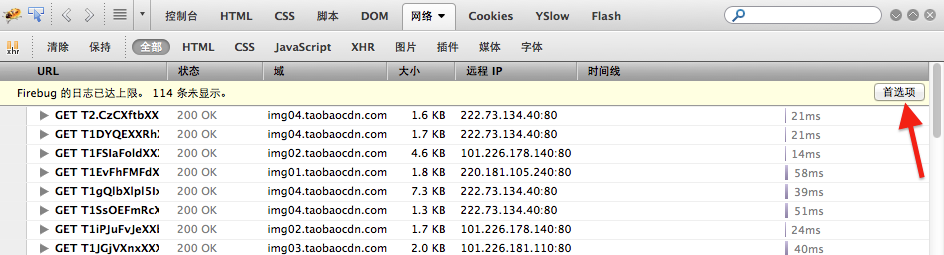
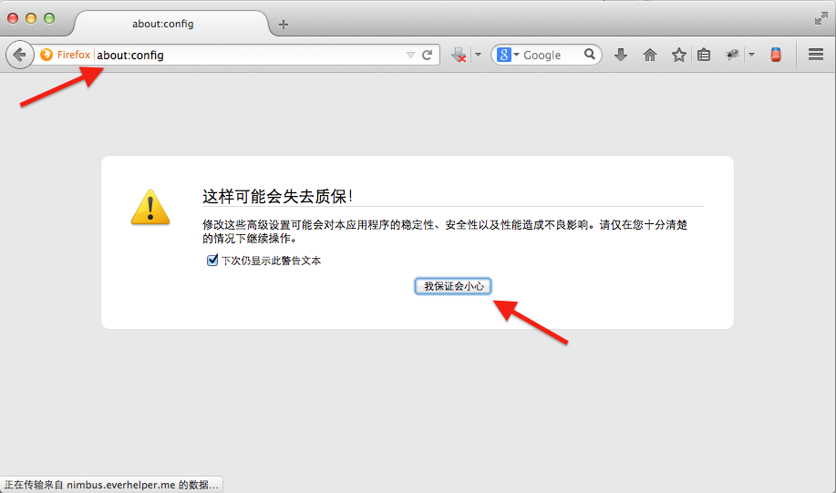
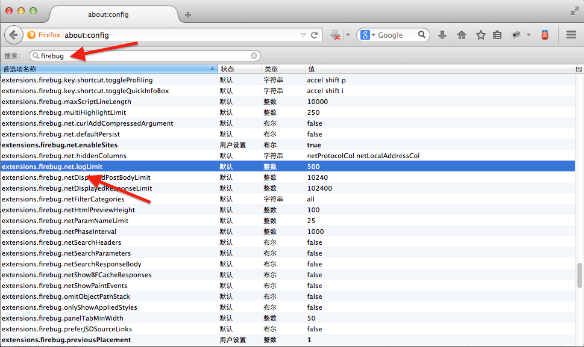
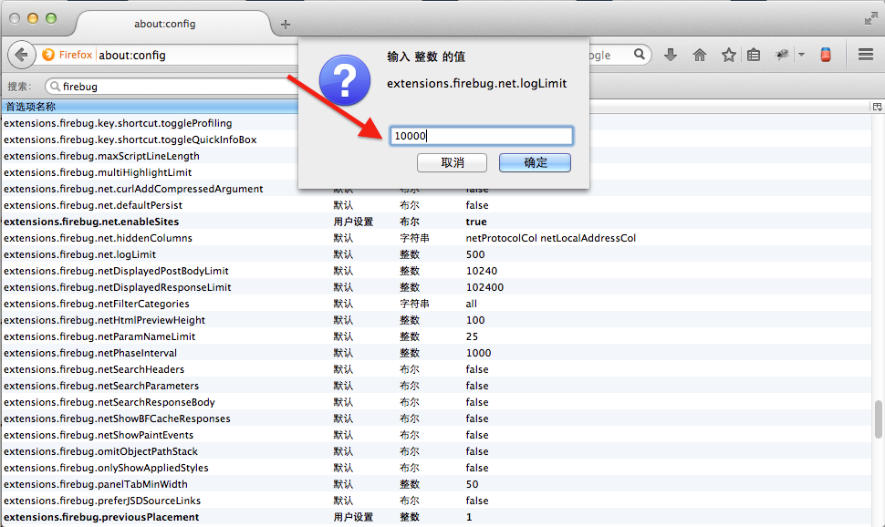
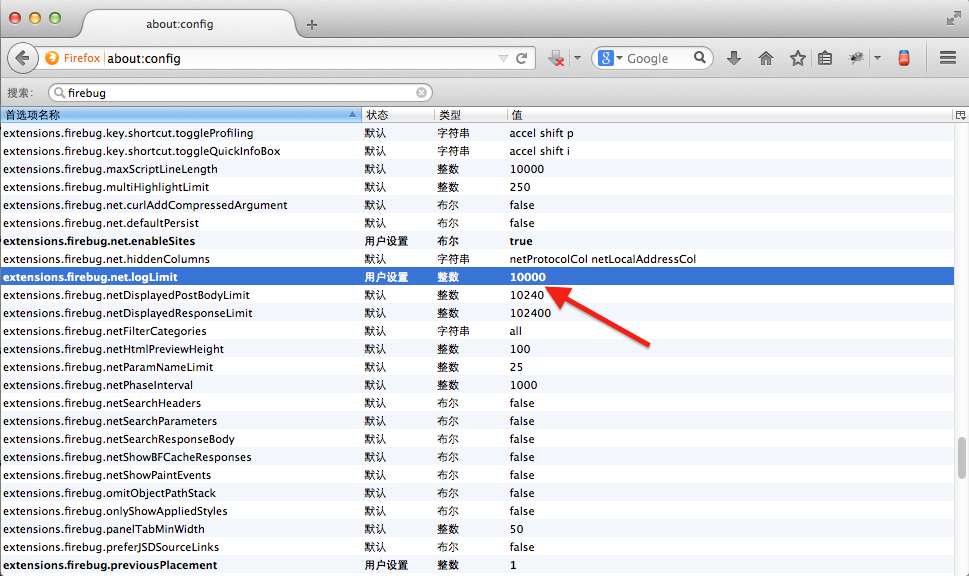

### 设置Firebug网络日志显示个数的上限

使用Firebug的网络面板，我们可以查看页面与服务器交互的HTTP详情，每个HTTP请求在都会以日志的格式现在在网络面板中。这些请求可以是加载文件的请求，如页面内嵌的外部CSS样式,外部JavaScript文件，图片，媒体，字体，和诸如flash插件，以及ajax请求。对于一个信息量较大页面来说，一个页面可能了N多个请求，默认情况下Firebug网络面板的日志显示格式是有上限的，查过上限的部分将不予显示。但有时我们调试查看的请求就包含在了这部分未显示的日志中，导致我们没办法调试和查看该条日志的记录。其实，日志显示的上限是以变量的形式设置的，可以设置一个较大的个数来显示所有日志。

以天猫首页为例，使用Firebug查看该页面的所有请求，可以看到日志很轻易的就达到了上限，因为该页面包含了许多图片资源和ajax请求，如

其实，在超过日志上限的提示工具条中，可以看到在右侧有个**首选项**的按钮，点击这个按钮便可以设置控制网络日志个数的变量进行设置，第一次点击该按钮会弹出提示页面，该页面便是火狐的**about:config**页面，里面包含了关于火狐浏览器的高级设置。

点击**我保证会小心**的按钮，继续下一步。在显示的页面中的搜索框中输入**firebug**关键字并找到`extentions.firebug.net.logLimit`,如

望文生义一下，可以判断该变量就是用来控制网络面板日志的上限的，默认为500条，超出500条的剩余请求的日志将不显示，双击该选项，在弹出的设置框中，我们可以为该变量设置一个较大的值，我这里设置为10000，

设置完成点击确定

之后回去刷新页面，可以看到该页面上的所有HTTP请求的日志都显示在网络面板上了。