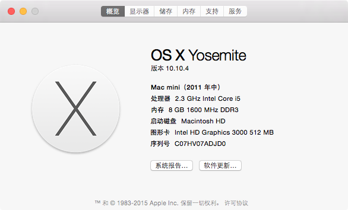
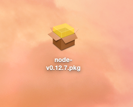
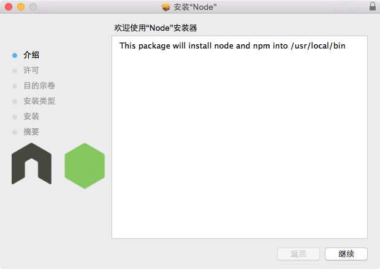
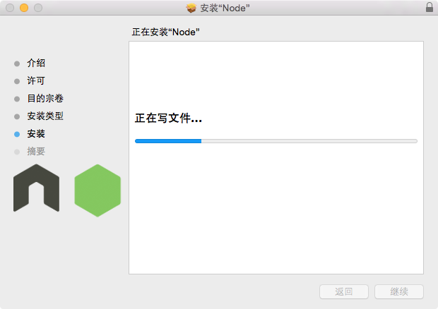
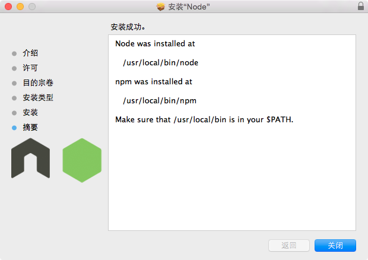
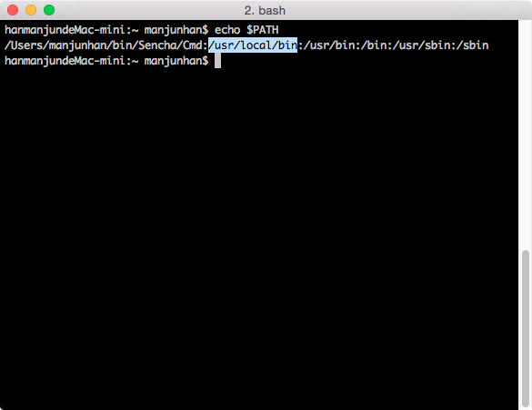
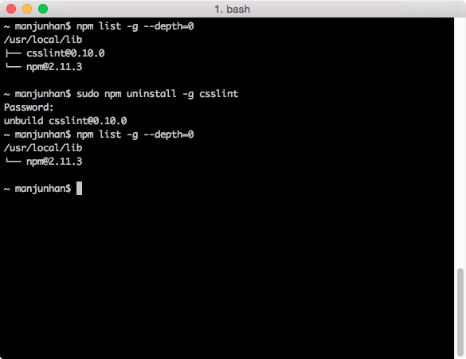

### mac_os下pkg方式安装和卸载nodejs

Node.js是基于Chrome V8的javascript运行时，特点：单线程，异步驱动，非阻塞I/O模型，跨平台。Node.js允许我们使用javascript语言编写服务器端程序。以下是在Mac OS下以安装包的形式安装node的过程。

###安装nodejs

1. [下载](https://nodejs.org/en/download/)Mac OS下nodejs的pkg安装包,安装版本为`0.12.7`,本机Mac 版本为`OS X Yosemite 10.10.4`
	
	
	
	
	
2. 双击安装包，一步步安装，在需要授权时，请输入root的密码

	
	
	
		
	
	
	
	Mac下nodejs的安装路径为`/usr/local/bin/node`，默认情况下nodejs的包管理器npm也一并被安装，路径在` /usr/local/bin/npm`，按照提示，`/usr/local/bin`路径需要在当前系统环境变量`$PATH`下，否则nodejs将无法运行。
	
3. 检验安装结果：
	打开终端，并输入`node -v`,查看nodejs的版本
	
	
	
	查看`$PATH`,确认`/usr/local/bin`已经设置，在终端下输入`echo $PATH`
	
	
	
	
###卸载nodejs

卸载nodejs需要将所有安装文件和目录从系统中删除即可，如果之前已经用npm在机器上安装了一些全局包（global packages,也可以叫作global modules）的话，在卸载node之前需要使用npm来删除这些包，因为某些npm的package会以命令行的方式使用(CTL-Command line Tool)并且通常是以全局模式安装并链接到`/usr/local/bin`目录下,直接删除node的文件和目录之后，还需要手工删除`/usr/local/bin`下的这些npm package的链接文件，这通常比较麻烦。以`csslint`为例，

安装`csslint`

	$ npm install -g csslint

之后会在	`/usr/local/bin`下生成`csslint`链接文件，这样在终端，我们可以直接输入`csslint`命令来验证css文件的语法。在删除node前，或者更具体的是在删除npm之前我们需要首先删除`csslint`

	$ npm uninstall -g csslint
	
这样对应的链接文件`/usr/local/bin/csslint`也会被删除。

可以通过以下命令来查看当前安装的所有npm全局包

	$ npm list -g --depth=0
	
		

依次执行以下命令
	
	lsbom -f -l -s -pf /var/db/receipts/org.nodejs.pkg.bom | while read i; do \
    sudo rm /usr/local/${i} \
	done \
	
	sudo rm -rf /usr/local/lib/node 
    sudo rm -rf /usr/local/lib/node_modules 
	sudo rm -rf /var/db/receipts/org.nodejs.*
	sudo rm -rf /usr/local/share/man/man1/node.1
	sudo rm -rf /usr/local/lib/dtrace/node.d
	sudo rm -rf ~/.npm
	
通过以上命令行，可以清除nodejs以及npm。

###参考

+ [Node.js][1]
+ [How do I completely uninstall Node.js, and reinstall from beginning (Mac OS X)][2]
+ [How do I uninstall nodejs installed from pkg (Mac OS X)?][3]
+ [Gist: Uninstall nodejs from OSX Yosemite][4]
+ [Gist: Mac OS X uninstall script for packaged install of node.js][5]

[1]: https://nodejs.org/en/
[2]: http://stackoverflow.com/questions/11177954/how-do-i-completely-uninstall-node-js-and-reinstall-from-beginning-mac-os-x
[3]: http://stackoverflow.com/questions/9044788/how-do-i-uninstall-nodejs-installed-from-pkg-mac-os-x
[4]: https://gist.github.com/TonyMtz/d75101d9bdf764c890ef
[5]: https://gist.github.com/nicerobot/2697848