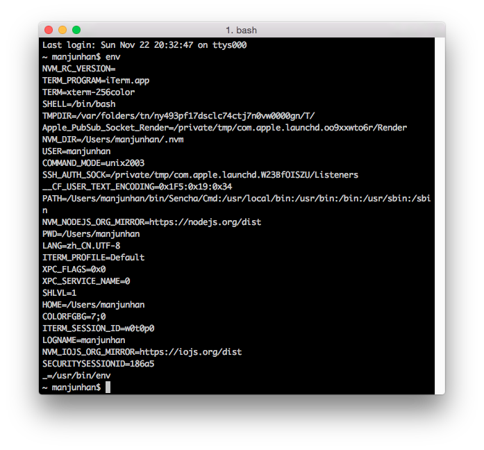
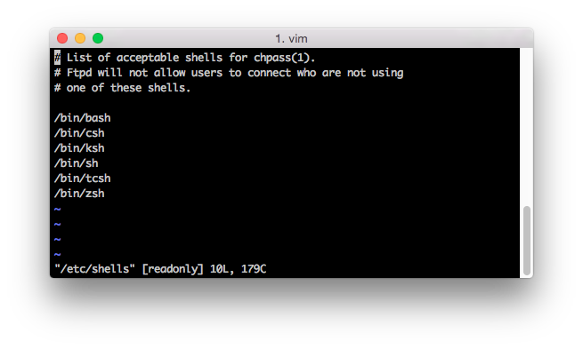
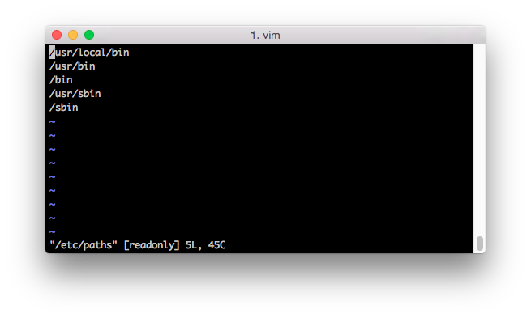
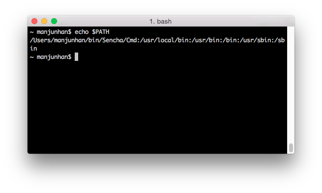
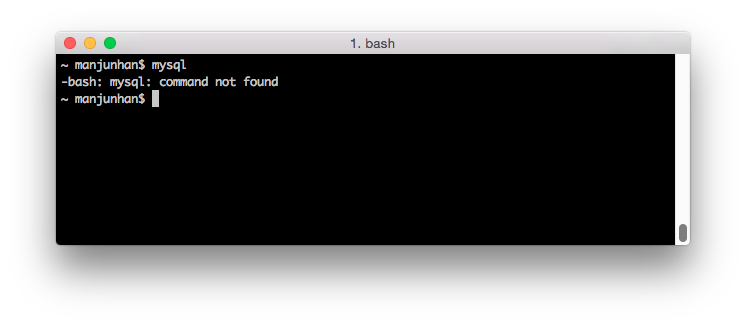
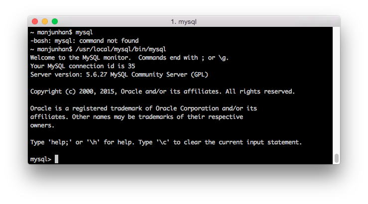
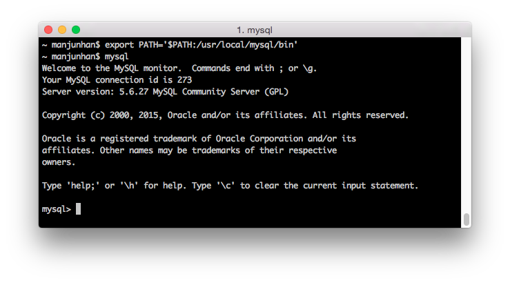

###Mac OS X下环境变量的查看与设置

在Linux/Unix系统中，环境变量是配置系统的一种重要方式，基于Unix的Mac OS X当然也不例外。许多环境变量用来保存系统相关的重要信息，例如可执行程序的路径，重要的头文件信息，文件搜索的路径等等。

###环境变量的查看

环境变量是以一组key/value形式存在的，可以使用`env`命令查看当前shell环境下所有环境变量与值，打开终端并输入`env`命令

其中主要的几个变量的含义是：

+ `HOME`,代表当前用户的主目录，即使用`cd ~`命令后打开的目录。
+ `SHELL`,指明当前系统所使用的哪种shell，MAC OS X下默认的是`/bin/bash`
   可以打开`/etc/shells`文件来查看当前系统所支持的所有shell的名称与路径，如`vim /etc/shells`
	

+ `PATH`,文件搜索的路径，目录与目录之间用`:`分割，文件的搜索顺序是以`PATH`所指定的目录顺序为依据。`PATH`变量初始包含的路径来源于`/etc/paths`文件，可以使用`vim /etc/paths`查看

也可以使用`echo`命令查看某一变量的值

**变量名前必须添加`$`**

###变量的创建与设置

变量可以在终端下以`name=value`的形式创建或修改，同时要符合一定的命名规范和约定

+ 名称和值以`=`分割
+ `=`两边不能直接连接空格符
+ 变量名只能是英文，数字，且开头不能是数字
+ 变量值中包含空格的话，需要用`""`或`''`将所有内容包含进来
+ 可以使用`\`将特殊符号转换为一半字符，如空格,$,空格等
+ 对变量进行扩展时，可以使用`$name`的形式进行累加，如`$PATH="$PATH:/home/app/"`
+ 若变量要在其他子程序使用，要使用`export`命令导出成为环境变量，`export PATH`
+ 约定，大写字符组成的变量为系统变量，小写字母组成的变量为普通变量
+ 删除变量可以使用`unset 变量名`的形式

###环境变量的设置

以安装MySQL为例，在Mac OS X下成功安装Mysql数据库后，我们接下来要使用Mysql自带的各种内建工具，如mysql，mysqladmin，对它进行操作，如连接Mysql数据库，打开终端并输入命令`mysql`,会出现如下结果

提示我们`mysql`命令未找到。默认情况下mysql会安装在目录`/usr/local`下，`/usr/local/mysql/bin`目录下包含了所有Mysql工具，这其中就包括`mysql`,所以我们可以添加具体路径来执行`mysql`命令

因为指定了具体的路径，所以这次`mysql`连接Mysql服务器成功，但试想如果每次要连接Mysql都要指定路径的话，我们需要定位很长的路径名称才能成功，这比较繁琐。

我们都知道环境变量`$PATH`用来定义系统命令或文件的默认搜索目录名称及顺序，终端下所有命令对应的执行文件都是依据`$PATH`中指定的目录来搜素并最终运行的，因此可以将`/usr/local/mysql/bin`目录添加到`$PATH`下，使用`export`命令即可`$ export PATH=$PATH:/usr/local/mysql/bin`

但在终端下使用`export`更改的变量都是临时的，与当前终端会话是绑定的，一旦窗口关闭，或者在我们下次重启系统后，`export`的设置就失效了，因此我们需要将`export PATH=$PATH:/usr/local/mysql/bin`写到系统的环境变量的配置文件中。在使用`env`命令输入的所有环境变量其实都是从配置文件中读取的，根据系统当前使用的shell类型的不同，环境变量的配置文件的名称和位置也会有区别，可以使用`echo $SHELL`来查看系统当前使用的shell类型，默认为_bash_。

_bash_下会读取以下几个文件

+ `/etc/profile`,这是系统的整体配置文件，一般避免对齐进行修改
+ `~/.bash_profile`,`~/.bash_login`,`~/.profile`属于用户级别的个人配置文件，如果要修改的话，可以编辑这几个文件。

以上配置文件是按顺序读取的，优先读取系统级配置文件`/etc/profile`,之后是个人配置文件，顺序分别为`~/.bash_profile`>`~/.bash_login`>`~/.profile`,个人配置文件只会读取一个，如果系统找到了`~/.bash_profile`文件，就不会继续读取之后两个文件，依次类推。因此我们只要将`export PATH=$PATH:/usr/local/mysql/bin`写入在任何一个个人配置文件即可，以`~/.bash_profile`为例，使用`$ vim ~/.bash_profile`打开并写入以下配置即可

	
	#
	# export mysql 
	#
	export PATH="$PATH:/usr/local/mysql/bin"
	
> 如果~/.bash_profile不存在，可以使用`$ touch ~./bash_profile`创建此文件

之后保存退出，注意的是，配置完成后需要重启终端，或者使用`source ~/.bash_profile`命令重新加载配置文件即可。之后无论是关闭终端或者重启系统，我们都可以直接在终端命令行下使用`mysql`命令以及其它所有包含在`/usr/local/mysql/bin`目录下命令行工具了。

> 也可以将`/usr/local/mysql/bin`直接写在`/etc/profile`文件中。

###参考

+ [Where to Set Environment Variables in Mac OS X][1]
+ [How to Add a New Path to PATH at Command Line the Right Way][2]
+ [Check the PATH of your Mac with echo $PATH][3]
+ [What Shell Am I Using? Here’s How To Find Out][4]
+ [鸟哥的Linux私房菜第十一章、认识与学习 BASH][5]
+ [Setting environment variables in OS X?][6]
+ [Set environment variables on Mac OS X Lion][7]
+ [General Notes on Installing MySQL on OS X][8]
+ [Environment Variables][9]
+ [UNIX export command][10]
+ [Use export Command in Linux / Unix][11]
+ [HowTo: Set an Environment Variable in Mac OS X - Terminal Only][12]

[1]: http://osxdaily.com/2015/07/28/set-enviornment-variables-mac-os-x/
[2]: http://osxdaily.com/2014/08/14/add-new-path-to-path-command-line/
[3]: http://osxdaily.com/2010/08/31/check-the-path-of-your-mac-with-echo-path/
[4]: http://osxdaily.com/2009/09/25/what-shell-am-i-using/
[5]: http://vbird.dic.ksu.edu.tw/linux_basic/0320bash_4.php
[6]: http://stackoverflow.com/questions/135688/setting-environment-variables-in-os-x?lq=1
[7]: http://stackoverflow.com/questions/7501678/set-environment-variables-on-mac-os-x-lion
[8]: http://dev.mysql.com/doc/refman/5.6/en/osx-installation-notes.html
[9]: https://developer.apple.com/library/mac/documentation/MacOSX/Conceptual/BPRuntimeConfig/Articles/EnvironmentVars.html#//apple_ref/doc/uid/20002093-BCIJIJBH
[10]: http://stackoverflow.com/questions/7328223/unix-export-command
[11]: http://www.cyberciti.biz/faq/linux-unix-shell-export-command/
[12]: http://www.dowdandassociates.com/blog/content/howto-set-an-environment-variable-in-mac-os-x-terminal-only/