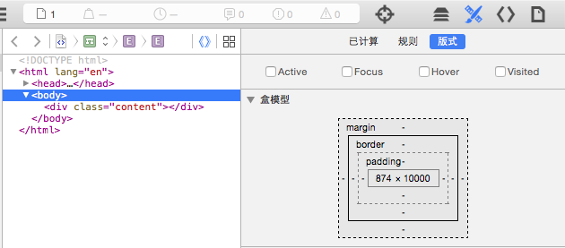
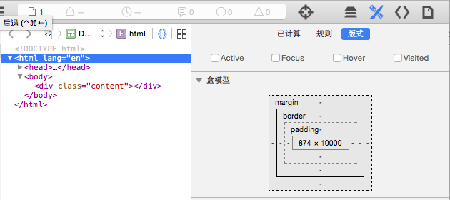
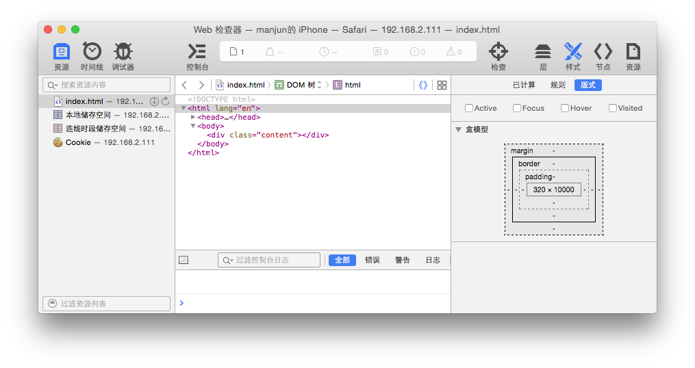
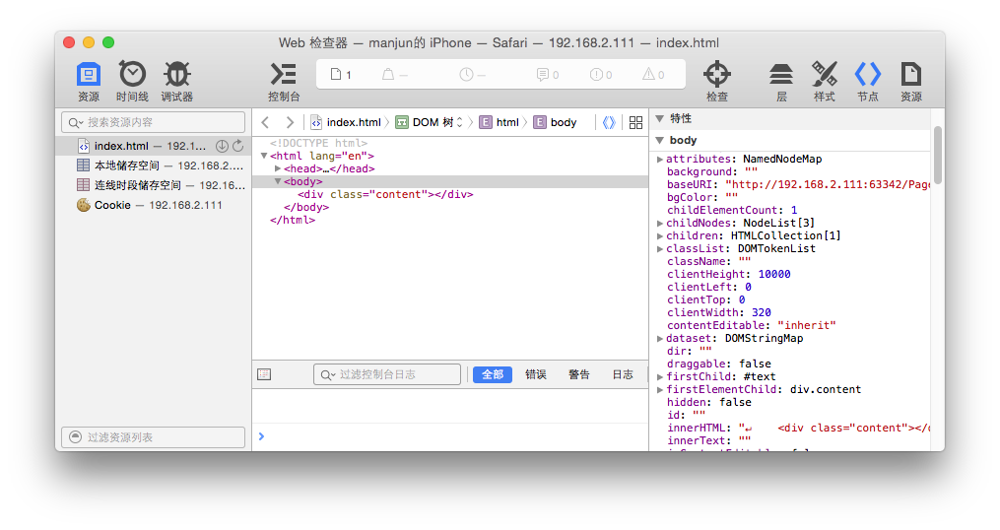
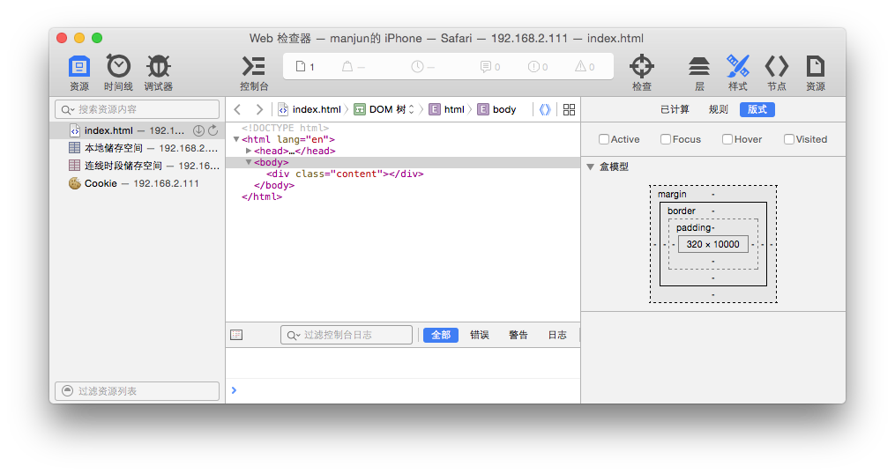
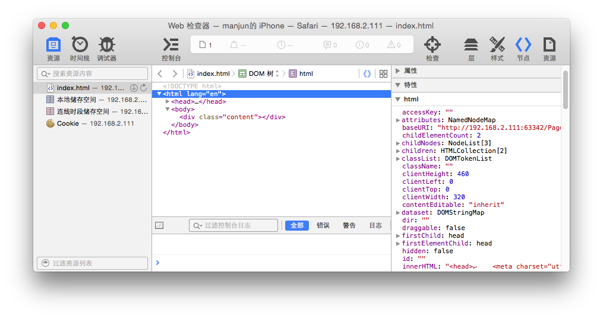
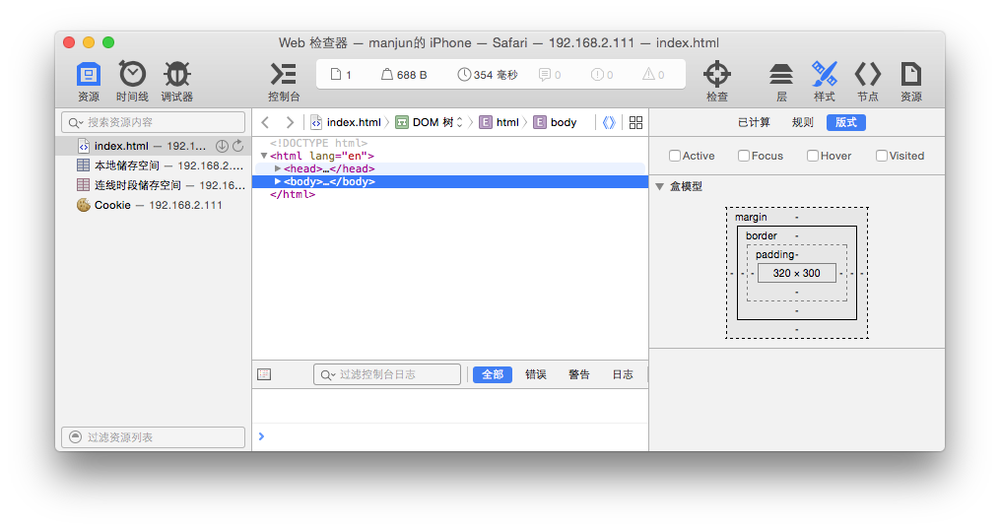

iOS Safari上禁止页面滚动

###overflow属性
在CSS中，`overflow`属性可以用来控制当内容超出块级父容器时的效果。
可以截断内容：
	
	overflow:hidden;
	
可以显示内容：
	
	overflow:visible;
	
也可以渲染滚动条，滚动显示需要看到的内容：

	overflow:scroll;
	
或者由浏览器自己决定

	overflow:auto ;
	
在桌面浏览器中禁用`body`滚动可以直接添加`overflow:hidden`即可，以以下测试页面为例

	<!DOCTYPE html>
	<html lang="en">
	<head>
    	<meta charset="utf-8">
	    <meta http-equiv="X-UA-Compatible" content="IE=edge">
    	<meta name="viewport" content="width=device-width, initial-scale=1.0, maximum-scale=1.0, user-scalable=no">
	    <title>Page scroll test</title>
    	
	</head>
	<body>
    	

	</body>
	</html>	
	
	
但在iOS safari浏览器（iOS8.3测试）中该方法无法达到预期效果，当`content`的内容高度超出`body`高度时，依然显示滚动条。

###差异比较

细看`overflow`属性的说明，它的使用其实是要满足一定的条件的：

1. 只适用于HTML的_非替换block元素_和_非替换inline-block元素_
2. 使用`overflow`属性的元素必须要有一个固定的高度(指定`height`或`max-height`属性)，或者设置`white-space:nowrap`

根据以上限定条件直观理解也是可以明白的，是否有内容溢出不但要看内容的实际尺寸，也要看父容器的尺寸，这样才有可比较性和相对性。

以以上测试代码为例，在桌面的safari下根据运行结果，虽然没有为`body`设置固定的高度，但实际的运行效果是`body`的高度为`content`的高度，如：

按照直观的感觉，既然`body`的高度与`content`的高度相等，内容的显示与否应该由`body`的父容器决定，也就是由`html`元素决定,继续查看`html`的盒模型，发现`html`的高度与`body`和`content`也是一致的

其实在CSS中有合适模型CSS Box model的概念,用来描述每个元素在文档树中的布局，包括大小height，内边距padding，外边距margin，边框border,每个DOM对象中的`clientHeight`只读属性代表了元素的内高度inner height 的像素绝对值，`clientHeight= height + padding`,如果元素有滚动的话 `clientHeight = height+padding-scrollBarWidth`,继续查看`html`和`body`的`clientHeight`属性值会发现，`body`的`clientHeight=height`,`html`的`clientHeight`却等于页面适口的高度也就是`window.innerHeight`。也就是实际html的clientHeight控制页面是否滚动，这符合直观的理解，因为内容再高最终的显示与否仍取决于适口高度。

其实因为我们并未显示通过css的`height`来为`html`和`body`分别指定一个具体的高度，所以它们的高度会被子元素的高度撑起，根据`overflow`属性的说明，我们必须指定`height`才能使其生效，但实际的显示效果是，我们未在`body`指定height，内容也被hidden掉了。如果设置body的`overflow:scroll`,那么页面会出现滚动。根据overflow的具体定义，测试的结果与之前的不一致，因为body的clientHeight与height与content的height是相等的，这与之前的理解的应该由html控制页面滚动显示不一致，但实际的效果确实是在body上我们可以直接使用overflow来控制页面的滚动与否。不知道这是否是浏览器的特殊处理？？

所以在pc端可以使用html，body两者中任意一个元素利用`overflow`属性来控制页面的整体滚动与否.

iOS端

在iPhone上打开同一个测试页面，直接上图

但这次效果是body的`overflow:hidden`并没有达到效果，页面在手机上可以滚动，即使是`html`的`clientHeight`等于`window.innerHeight`，页面依据出现滚动，如果严格按照`overflow`的使用条件来说，iOS safari的表现从落上来说似乎是正常的。但我们想要的效果是禁用iOS safari的页面滚动，既然当前代码没有起作用，那么需要继续尝试做进一步修改，设置

	body{
		height:100%;
		overflow:hidden;
	}

测试失败，貌似因为`100%`的相对于html的高度，因未给html显示指定高度，所以body的高度仍然是content的高度。

设置

	body{
		height:300px;
		overflow:hidden;
	}	
测试失败，body的高度,html的高度都为300px,但页面依然滚动，

这个逻辑上解释不通，不知道是不是浏览器的bug？？？如果操作body不可以，那么换html呢？

删除body的样式，改为设置html的，分别测试

	html{
		height:100%;
		overflow:hidden;
	}
或	

	html{
		height:300px;
		overflow:hidden;
	}	
最终的结果页面依然滚动。

终于在同时设置html和body的属性时，得到了预期禁止页面滚动的效果

	html,
	body{
        height:100%;
        overflow: hidden;
    }

从逻辑上以上代码和最终的效果已经不是十分相匹配，因为在我们设置了body的高度为300px并且设置`overflow:hidden`，正确的逻辑是页面在此时就该没有滚动出现;如果对比桌面浏览器来说，姑且可以认为这是iOS safari的bug了。

###参考
+ [Overflow:hidden not working on mobile browser][1]
+ [Does overflow:hidden applied to <body> work on iPhone Safari?][2]
+ [Introduction to the CSS box model][3]
+ [CSS box model][4]
+ [MDN CSS overflow][5]

[1]: http://stackoverflow.com/questions/18268300/overflowhidden-not-working-on-mobile-browser
[2]: http://stackoverflow.com/questions/3047337/does-overflowhidden-applied-to-body-work-on-iphone-safari
[3]: https://developer.mozilla.org/en-US/docs/Web/CSS/CSS_Box_Model/Introduction_to_the_CSS_box_model
[4]: http://www.w3.org/TR/CSS21/box.html
[5]: https://developer.mozilla.org/en-US/docs/Web/CSS/overflow