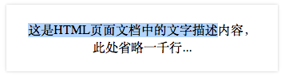
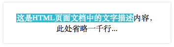

###改变文档高亮部分的样式

在一个页面中，用户在可以用鼠标来选择页面中的某个部分，通常情况下是选择文字，被选中的部分会以高亮状态来表示选中。例如文档中包含以下文档片段

	
这是HTML页面文档中的文字描述内容，此处省略一千行...

以下是Chrome下部分文字的选中状态，高亮部分是被选择的文本。

CSS中可以使用`::selection`__伪元素__来设置选中部分的样式，如

	 ::selection{
	    background-color: #00BBD5;
    	color: #FFF;
	}

对应的效果如下,

当然在页面中添加以上CSS后，该页面的所有文本的高亮状态都会改变，也可以指定文档部分区域使用该样式，如

	.m-box::selection{
	    background-color: #00BBD5;
    	color: #FFF;
	}

这是一个在CSS3中虽被提及却最终被废弃的选择器，但CSS4中又重新加入了该[选择器](3)。

###兼容性

并不是所有的浏览器都实现了该选择器，IE6,IE7,IE8是不支持该选择器，但[IE9+][2]则实现了该选择器；火狐需要添加`-moz-`前缀。Chrome,Safari,Opera都支持该选择器，所以兼容性的写法如下

	/* 设置全局文本选择样式 */
	 ::selection{
	    background-color: #00BBD5;
    	color: #FFF;
	}
	::-moz-selection{
	    background-color: #00BBD5;
    	color: #FFF;
	}
	/* 设置.m-box下文本选择样式 */
	.m-box::selection{
	    background-color: #00BBD5;
    	color: #FFF;
	}
	.m-box::-moz-selection{
	    background-color: #00BBD5;
    	color: #FFF;
	}

>对于Webkit内核下的`::-webkit-selection`的写法暂时未找到明确的初出。
	
###有限的样式

不是所有的CSS样式都能在`::selection`选择器下使用，以下属性可以在该选择器下使用

+ color
+ background-color
+ cursor
+ outline
+ text-decoration 
+ text-emphasis-color
+ text-shadow

此外需要注意的是`background-image`属性不能用于该选择器;只有Chrome,Safari和Firefox17+支持`text-shadow`样式。

###参考

+ [MDN `::selection`][1]
+ [MSDN `::selection` pseudo-element][2]
+ [W3C `::selection`][3]
+ [selection styles][4]
+ [Has the ::-webkit-selection selector ever been supported?][5]
+ [Overriding the Default Text Selection Colour][6]

[1]: https://developer.mozilla.org/en-US/docs/Web/CSS/::selection
[2]: https://msdn.microsoft.com/zh-cn/library/ie/jj127349
[3]: http://dev.w3.org/csswg/css-pseudo-4/#selectordef-selection
[4]: http://quirksmode.org/css/selectors/selection.html
[5]: http://stackoverflow.com/questions/7545550/has-the-webkit-selection-selector-ever-been-supported
[6]: http://toddmotto.com/overriding-the-default-text-selection-colour/
