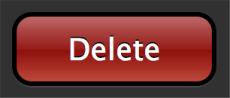
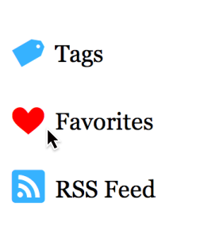

####使用矢量图替代光栅图

在为你所有的图片制作高分辨率图片之前，你应该考虑将他们做成矢量格式。基于矢量图片包含数学指令而不是基于光栅图片的RGBA像素值，所以它们在保质的前提下可缩放至任意分辨率。实现基于矢量的图片的解决方案益处良多：

+ 你可以在无需图片编辑器的情况下修改外观。
+ 你可以为图片属性添加动画，如它的颜色，或根据CSS的伪状态(pseudo-state)或javascript时间来变换其属性。
+ 使用纯CSS，你可以避免发送额外的HTTP请求
+ 基于矢量的图片一直是清晰的，即使是用户将其进行缩放。

考虑用以下方法来重构你的图片。

####考虑用纯CSS代替图片

仅通过CSS，你就能够获得一些复杂的视觉效果，如渐变，阴影，圆角边框，模糊，透明度等等，如**图2-1**所示。使用CSS不仅在所有的显示器上看起来良好，而且这也减少了发送至服务器的非必要的HTTP连接数，减少了用户下载资源的数量。你也可以设置CSS属性的动画，并且设置它们来响应用户的交互，如鼠标移上去的动作。

你自己要学会CSS来决定是否某些图片可以被CSS代替。

**图2-1**一个视觉较为复杂的删除按钮，仅用CSS组合而成。

**图2-1**所示删除按钮的CSS规则如**清单2-1**

**清单2-1**不使用图片，用CSS生成一个精细的按钮。

	.deleteButton {
	    background: -webkit-linear-gradient(top, #be6868 0%,  #941b17 50%,
                                             #880d07 50%, #be483c 100%);
    	border: 3px solid #000;
	    color: #fff;
    	cursor: pointer;
	    font-size: 15pt;
    	padding: 10px 34px;
	    text-shadow: 0 -1px 0 #000; /* recessed text */
	    -webkit-border-radius: 13px; /* rounded corners */
    	-webkit-box-shadow: 0 1px 0 #454545; /* subtle border bevel */
	}
	
	
>**注意：**许多CSS3属性都包含`-webkit-`前缀。若支持其它浏览器要按需添加它们自己的前缀。查询Safari浏览器可用的CSS属性，参见[Safari CSS Reference](https://developer.apple.com/library/safari/documentation/AppleApplications/Reference/SafariCSSRef/Introduction.html#//apple_ref/doc/uid/TP40002050).

####考虑用SVG代替图片

CSS能够制作出惊人的视觉效果，但是创建高级视觉效果所需的CSS规则和HTML元素的数量可能会快速增长，导致维护困难和代码膨胀。不像CSS那样，SVG允许你指明图片的绘画指令，对于插画和图片来说简直是棒极了。你可以绘制不同颜色的线条，曲线，图形，如**图2-2**所示。SVG代码可以包含在一个文件中，所以所有你的绘画指令都会在一个地方，SVG也可以内嵌在你的HTML代码中。

**图2-2**可伸缩矢量图形在任意尺寸下都显示清晰。

**清单2-2**显示了用来绘制**图2-2**所示叉号的SVG代码。如你所见，SVG使得你可以根据你站点的需要缩放你的图片。

**清单2-2**使用SVG绘制的红叉号

	<!DOCTYPE svg PUBLIC "-//W3C//DTD SVG 1.0//EN" "http://www.w3.org/TR/SVG/DTD/svg10.dtd">
	<svg viewBox="0 0 100 100" width="100%" height="100%" xmlns="http://www.w3.org/2000/svg" 	xmlns:xlink="http://www.w3.org/1999/xlink">
    	<circle fill="darkred" stroke="red" cx="50" cy="50" r="40" stroke-width="4" />
	    <g stroke="white" fill="none">
    	    <line x1="30" y1="30" x2="70" y2="70" stroke-width="6" stroke-linecap="round" />
        	<line x1="30" y1="70" x2="70" y2="30" stroke-width="6" stroke-linecap="round" />
	    </g>
	</svg>	
	
你可以将**清单2-2**的代码拷贝到一个以`.svg`为扩展名的文件中，并在``元素的`src`属性中引用该文件。或者，为了减少HTTP连接数量，你可以将`<svg>`标签直接拷贝到你的HTML中。要改变图像的缩放比，只要修改``或`<svg>`元素的`width`和`height`属性值即可。

更多关于SVG的信息，参见W3C的[SVG specification](http://www.w3.org/TR/SVG/)。

####考虑使用字体代替图片

如果你用图片来展示文字，你应该重新评估下使用图片资源的必要性。文本不应该用图片展示，因为搜索引擎爬虫以及屏幕阅读器可能会丢掉你页面上下文的语义。使用图片资源代替文本更加不灵活，而且难于维护，因为更改图片比更改原始文本更困难。最重要的是，传输一张图片所需要的字节数比传输文本所需要的字节数要大的多。

> **提示：**确保你的字体许可证允许你在你的站点上展示该字体。
	
#####对于文本

你可能已经决定使用图片代替文本，因为你想要文本以特定字体显示。一个更好的解决方案是使用CSS的`@font-face`构建，这允许你加载和显示来自你站点的字体，而不管用户安装了什么字体。

为了添加字体，需要在你的CSS文件的**最开始**位置引用它：

	@font-face {
    	font-family: 'FontName';
	    src: url(path/to/font.woff);
	}
	
> **注意**Safari支持TrueType (.ttf), OpenType (.otf), 和 WOFF (.woff)字体格式。WOFF是一种压缩的字体格式，为在Web上使用而设计，并且文件比TrueType 或 OpenType 都要小。

你必选在你的CSS文件起始位置声明你的字体，以便让属性来使用，因为CSS是自顶向下解析的。如果你想要包含多个字体，为每种字体都声明一个`@font-face`块即可。之后你可以在你的CSS中引用它们，就像使用常规Web字体一样：

	p {
	    font-family: 'FontName', 'Helvetica', sans-serif;
	}	
	
####关于icon fonts

icon fonts是一种特殊的字体或符号，取代了标准的字母数字字符。使用诸如[Heydings](http://www.heydonworks.com/article/a-free-icon-web-font)一样的icon fonts，会降低对图片资源的需求。你可以创造自己的icon fonts，或者搜索在Web上已有的。一些字体是付费的，另一些是免费的。一些字体主题是一致的，如代表社交媒体的的图标，包括Facebook和Twitter。

使用`@font-face`加载一种字体，你拥有的是一个可缩放的，可定制样式的图标集，Safari会将它们视作字体对待，如**图 2-3**和**清单2-3**。

**图2-3**一个会在鼠标移上去的时候改变颜色的icon font

**清单2-3**在文本起始处插入icon font的CSS属性

	@font-face {
    	font-family: 'Heydings';
	    src: url(fonts/heydings_icons.ttf);
	}
	.icon-font {
    	font-family: 'Georgia', serif;
	    font-size: 15pt;
	}
	.icon-font:before {
    	color: #36b2ff;
	    content: attr(data-icon); /* pulls value from the data-icon HTML attribute */
    	font-family: 'Heydings';
	    font-size: 24pt;
    	padding-right: 6px;
	    position: relative;
    	top: 4px;
	}
	.icon-font:hover:before {
    	color: #f00;
	}

通过使用`:before`伪类，CSS告诉Safari在文本的开始出放置图标。你同样可以省略包含在HTML元素内的文字，仅显示图标本身。

要选择使用一个图标，将对应字符设置在`data-icon`属性上即可。

	
Tags

	
Favorites

	
RSS Feed

	
`data-icon`属性值引用了对应字体的图形。本例中，**图2-3**所示的标签，心形，和RSS图标，分别被字符`t`,`h`和`R`代表的字体所展示。可以在字体字典中(Font Book)中找到哪个字符代表哪个图标。

为了获取额外的优化，你可以在如[IcoMoon's HTML5 App](http://keyamoon.com/icomoon/app/)这样的字体构建工具(Font builder)上处理你的字体。通过只输出你所需要字体的方式，字体构建工具会减小字体文件的体积，并且能够将单多个单独的字体文件合并到一个字体文件中。

	
	
	
	
	
	
	
	
	
	
	
	
	
	
	
	
	
	
	
	
	
	
	
	
	