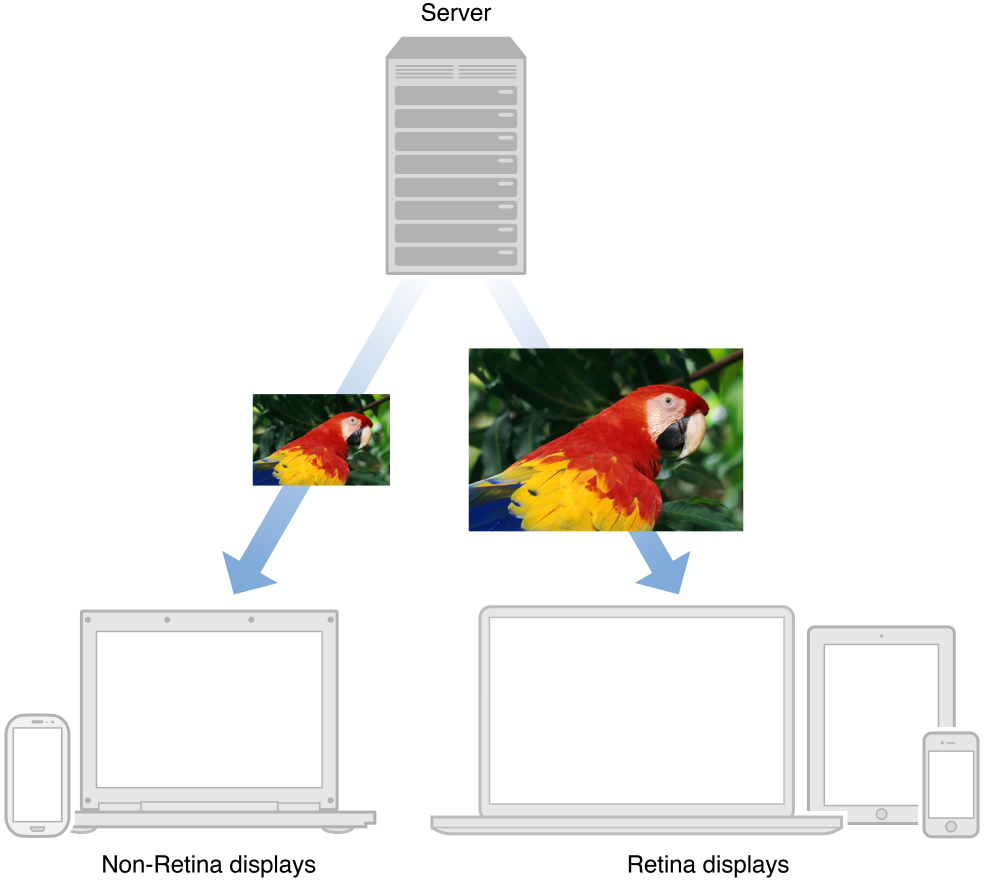

###简介

###关于在网络上正确的传输图片

可能你已经注意到，站点上的图片元素在Retina显示器上没有其它元素那样清晰。站点上的文本似乎看起来很清爽，但是图片确未如你所愿那样的清晰。因为Retina显示器上的一个点是有非Retina显示器上4个像素大小组合而成的，Safari浏览器会自动将HTML元素的宽高放大二倍。文本和表单元素保持高清状态，但是图片会显得模糊，因为它们缺乏足够的图像数据。

为了在Retina显示器上消除模糊图片，你需要为站点的每张图片都提供一个高分辨率版本。Safari能够判断用户屏幕的像素密度，并且选择最适合的图片来让用户现在。用户会因此受益，你的站点在Safari浏览器上看起来会很棒，不论是在他们Mac电脑上还是在他们的IOS设备上，但最重要的是这种方式减少了网络带宽的浪费，因为Safari会基于显示器来选择加载合适大小的图片，如图-1所示。概念上来说，这种做法与在Cocoa应用中提供高分辨率资源的做法是一样的：拥有Retina显示的设备会加载高分辨率图片，与此同时，那些拥有标准显示的设备会加载正常分辨率的图片。

因为高分辨率图片的文件更大，你需要关心的是用户加载每个页面所需要下载的资源数量。你的用户可能是在3G网络环境下访问你的站点，资源的下载速度有限。你应该尝试减少HTTP请求的数量，因为请求越少，用户等待内容完成下载的时间就越短。一些小技巧可以用来减少不必要的会影响服务器性能的HTTP链接，如用矢量图代替光栅图，将多个图片资源组合到一张图片上。

遵循这些实践方法，你的站点内容会在所有设备和电脑上看起来清晰明快，同时也降低了你站点整体的网络延迟。

###概要

作为一个Web开发者，你得目标是配置你的站点并以最高效率的方式来传输内容。传输搞分辨率的图片当前也在属于该目标之一。通过最小化在网络上传输图片的数量，按需提供构建每个页面的图片，你可以在保持站点健壮性的前提下，完全支持高分辨率显示器。

####为Retina显示优化图片传输

Retina显示器上的文本和表单元素是已经被优化过的了。然而，提供高分辨率版本的图片则是你的责任，否则图片在Retina显示器上看起来会模糊不堪。

**相关章节**: Serving Images Efficiently to Displays of Varying Pixel Density

####使用矢量图替换光栅图

重新想想你站点上的图片文件真的需要是图片文件吗。一些办法，如CSS，SVG以及icon fonts也可以用来替换图片文件，同时保持在所有分辨率的任意缩放比下清晰显示。你的站点将得益于更少的HTTP链接，以及更少的字节数。

**相关章节**: Substituting Raster Images for Vector Alternatives

####使用精灵加速页面加载

许多Web开发者使用一个最佳实践是合并脚本和样式表。同样的，你也可以在适当的地方合并图片。当你合并图片后，所需要下载的文件会减少，这使得你的站点加载更快。

**相关章节**: Reducing HTTP Requests with Sprite Sheets

###前提

本文档假定读者知道HTML和CSS。

###另见

+ [Safari HTML5 Canvas Guide](https://developer.apple.com/library/safari/documentation/AudioVideo/Conceptual/HTML-canvas-guide/Introduction/Introduction.html#//apple_ref/doc/uid/TP40010542) provides details regarding how to make HTML5 canvases compatible with Retina displays.

+ [Safari Web Content Guide](https://developer.apple.com/library/safari/documentation/AppleApplications/Reference/SafariWebContent/Introduction/Introduction.html#//apple_ref/doc/uid/TP40002051) discusses web development specific to iOS devices.

+ [Safari CSS Visual Effects Guide](https://developer.apple.com/library/safari/documentation/InternetWeb/Conceptual/SafariVisualEffectsProgGuide/Introduction.html#//apple_ref/doc/uid/TP40008032) showcases examples of visual effects achieved with CSS.

+ [Safari CSS Reference](https://developer.apple.com/library/safari/documentation/AppleApplications/Reference/SafariCSSRef/Introduction.html#//apple_ref/doc/uid/TP40002050) lists CSS properties and values available to Safari.

+ [High Resolution Guidelines](http://developer.apple.com/library/mac/documentation/GraphicsAnimation/Conceptual/HighResolutionOSX/Introduction/Introduction.html) for OS X explains how to draw to Retina displays in OS X apps.

[1]: splash_2x.png 基于显示器的像素密度，服务器会传输正确分辨率的图片。
[2]: 