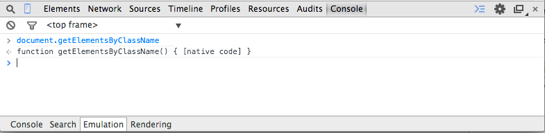
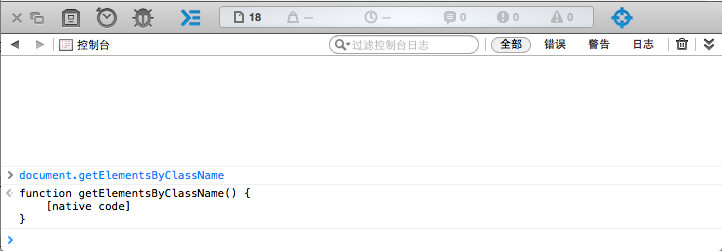
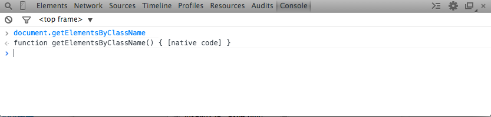
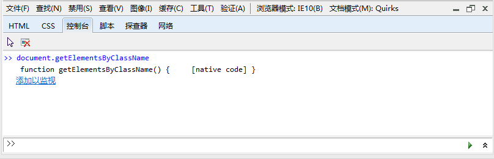
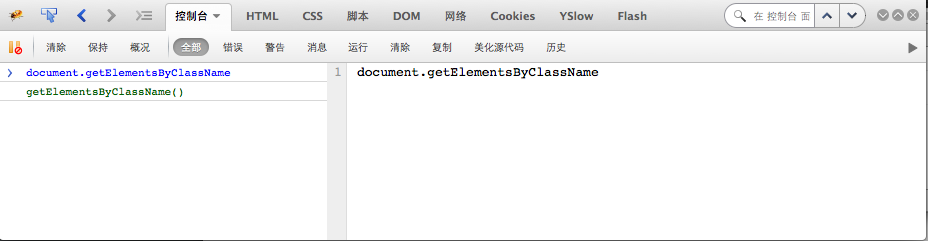
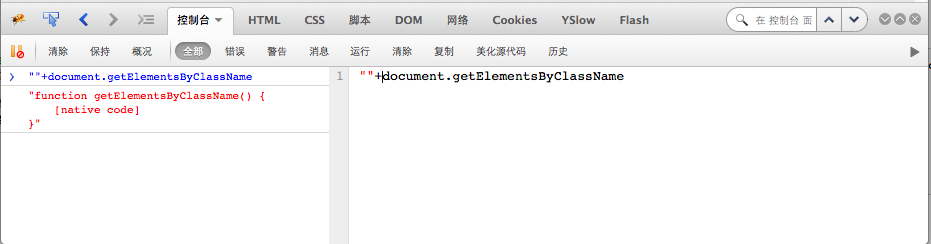

###jQuery中检测DOM原生方法是否存在的方式

浏览器种类的不同，相同浏览器的版本不同,决定了我们在使用某项Web功能都需要考虑浏览器的兼容性问题，其中浏览器**特性检测**算是被广泛使用的用来解决浏览器兼容性问题的方法。**特性检测**的目的不是识别我们当前使用的浏览器的类型或者是浏览器的版本，而是意在识别浏览器是否支持或者说是某个功能。根据浏览器对该功能的实现情况，我们可以在代码中正确的做出流程切分，对于不支持某个功能的浏览器我们可以进行优雅的降级处理，从而避免我们做的某个功能出现只能运行在某个浏览器或某个浏览器的特定版本上。

jQuery作为最流行的js框架，其最大的特征之一是:Cross Browser,很好解决了诸多在Web开发中面临的浏览器兼容性问题，让Web开发这将更多的精力放在所要实现业务逻辑上。

####DOM navive方法检测

在解决兼容性问题上，jQuery充分的利用了**特性检测**。**特性检测**的内容包含了诸多方面，其中一项是用来检测浏览器是否支持某个原生的DOM API。它用了一个很简短正则表达式即解决了该问题，该表达式定义为：

	rnative = /^[^{]+\{\s*\[native \w/,
	
以上是用来检测浏览器是否支持某个DOM native方法的正则表达式，可以看看jQuery是利用该正则表达式都做个那些**特性检测**。

1. 检测`getElementsByClassName`方法

		// Support: IE<9
		support.getElementsByClassName = rnative.test( doc.getElementsByClassName );

2. 检测`querySelector API`
	
		if ( (support.qsa = rnative.test( doc.querySelectorAll )) ) {
	
			}
		
3. 	检测`matchesSelector`方法

		if ( (support.matchesSelector = rnative.test( (matches = docElem.matches ||
			docElem.webkitMatchesSelector ||
			docElem.mozMatchesSelector ||
			docElem.oMatchesSelector ||
			docElem.msMatchesSelector) )) ) {
			// to do	
		}
4. 检测`compareDocumentPosition`方法
	
		hasCompare = rnative.test( docElem.compareDocumentPosition );
	
5. 检测`contains`方法

		rnative.test( docElem.contains )
		
以上检测代码来自于`jQuery-1.11.2`对于DOM native方法的特性检测。

####Web控制台和toString方法

那么该正则表达式是如何起作用的呢？打开任意浏览器的控制台，在控制台中输入`document.getElementsByClassName`，然后回车执行，各浏览器的返回情况如图

**chrome:**

**safari**

**opera**

**IE**

**firefox**

可以看到除了火狐外，所有浏览器控制台输出的是一个字符串：

	function getElementsByClassName() { [native code] }

因为默认情况下直接在命令行输入代码执行等价于执行`console.log(document.getElementsByClassName)`，`console.log(arg)`类似于C语言的`printf`语句，用来打印字符串，对于`console.log(arg)`来说，如果传入的参数不是字符串类型，而是对象类型，那么默认会调用对象的`toString`方法。

`toString()`方法是`Object`原型对象上的方法，用来返回一个描述对象的字符串。因此所有对象都有`toString()`方法，在需要将对象转换为字符串值的时候，或者在一个代码执行中需要对象以文本表示时，会自动调用对象的`toString()`方法，如把字符串和一个对象连接输出

	var str = ""+{} ;
	console.log(str); // ouput --> [object Object]

每个对象都可以覆盖此方法并返回一个字符串。在js下函数或者方法也是对象，也就是说默认情况下对于DOM native方法，它们的`toString()`方法返回的是一致的字符串，也就是我们之前看到的输出。

貌似狐火有些特殊，但在我们执行`""+document.getElementsByClassName`，输出的是

可以看到也是类似的字符串

	function getElementsByClassName() {
    	[native code]
	}
只不过多了换行，其实直接执行`document.getElementsByClassName`,火狐输出的是`document.getElementsByClassName`方法的一个的占位符。

###RegexObj.test(str)
回到之前的正则表达式上来，js中对于一个正则表达式的`test`方法接受一个字符串参数，返回一个布尔值，检测该字符串是否与正则表达式匹配。所以执行对于`rnative.test( doc.getElementsByClassName );`等价于`rnative.test( doc.getElementsByClassName.toString());`。

分解`rnative`的至多个子表达式：

+ `^[^{]+\`匹配除了`{`外的任何字符一到多次；
+ `\{\s*`匹配以`\{\s*`字符开始，以及任意空白符零次或多次;
+ `\[native \w`匹配以`[native `开始的，后跟包括下划线的任何单词字符。

所有字表达式连起来的最终匹配结果正好满足对类似`function getElementsByClassName() { [native code] }`字符串的检测。

完。

####参考

+ [MDN Console](https://developer.mozilla.org/zh-CN/docs/Web/API/Console)
+ [Object.prototype.toString()](https://developer.mozilla.org/en-US/docs/Web/JavaScript/Reference/Global_Objects/Object/toString)
+ [RegExp.prototype.test](https://developer.mozilla.org/en-US/docs/Web/JavaScript/Reference/Global_Objects/RegExp/test)
+ [Browser Support](http://jquery.com/browser-support/)
+ [Browser and feature detection: Make your website look great everywhere](https://msdn.microsoft.com/zh-cn/hh561717.aspx)
+ [Browser and feature detection: Make your website look great everywhere中文](https://msdn.microsoft.com/zh-cn/hh475813)

