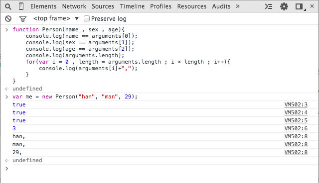

###JavaScript中的Array-like对象类型

不管编程语言是什么，在代码时最常用的数据结构就是数组Array，用来操作有序列表，Javascript语言也不例外，javascript语言中内置提供了[Array][ref-8]数组类型，并提供了诸多方法来操作数组元素。其实在Javascript中还有一种称之为**Arry-like对象**(类数组对象)，也是我们在代码中经常使用到的。

#### 特点

Array-like对象其实只是一种普通的对象类型，但又和Array类型对象拥有某些相似的地方，那就是

+ 都是用来集合类型，用来保存一组元素，**基本上**(不是所有)都会拥有长度`length`属性，标识元素个数
+ 都支持通过**数字下标索引**的方式来访问元素，如 `var element = arrayLikeObject[0];`
+ 都可以用for循环/while循环来顺序遍历元素

		var element = null ;
		for(var i = 0 , length = arrayLikeObject ; i < length ; i++){
			element =arrayLikeObject[i];
			// 操作element, to do
		}

不同的是，Array对象有诸多原生内置的方法来对元素进行操作，如`push`,`forEach`,`reverse`,`slice`,`split`,等等。但，Array-like对象并没有向那么多的方法来直接对其元素进行操作。

####Array-like类型

以上说明了Array-like对象的特点，在Javascript中有几种类型创建的对象就是Array-like对象。

1. `String`
	
	[String][ref-7]类型对象用来存储字符序列，如
	
		var str = "abcd" ; 
		console.log(str.length);// output: 4
		var firstChar = str[0]; 
		console.log(firstChar);// output : a
		// output : a,b,c,d
		for(var i = 0 , length = str.length ; i < length ; i++){
		    console.log(str[i]+",");
		}

2. `arguments`

	对于[arguments][ref-3]对象，相信是所有熟悉Javascript语言的人都知道的对象，它栖身于Javascript函数中，代表了函数调用	时传入的所有参数的集合。`arguments[0]`代表了第一个参数，`arguments[1]`,代表了第二个参数，依次类推。
	
		function Person(name , sex , age){
			console.log(name == arguments[0]);
			console.log(sex == arguments[1]);
			console.log(age == arguments[2]);
			console.log(arguments.length);		
			for(var i = 0 , length = arguments.length ; i < length ; i++){
			    console.log(arguments[i]+",");				}
		}
		var p = new Person("han", "man", 29);
		
	在Chrome控制台下执行结果如:
	
	
	
3. `NodeList`

	[NodeList][ref-2]属于DOM接口，保存了一组DOM节点的集合，通过`node.childNodes`属性以及通过`document.querySelectortAll`方法返回的对象都是`NodeList`类型，示例如
	
		// 以下是一组列表
		<ul class="nav">
			<li>项目-1</li>						
			<li>项目-2</li>
			<li>项目-3</li>			
			<li>项目-3</li>
		</ul>
	
		// 遍历nav的所有li元素并添加红色背景
		var nodeList = document.querySelector(".nav li");
		var li = null;
		for(var i = 0 , length = nodeList.length ; i < length ; i++){
			li = nodeList[i];
			li.style.backgroundColor = "red";
			console.log(li.innerText);
		}
		console.log("length : "+nodeList.length);// output: 4

	`NodeList`类型还拥有`item(index)`方法，可以传入节点索引来访问节点对象，作用等同于`nodeList[index]`。

4. `HTMLCollection`

	[HTMLCollection][ref-1]类型与[NodeList][ref-2]类型类似，不同的是`HTMLCollection`保存的是元素(Element)集合，`NodeList`保存的节点(Node)集合,示例如
	
		// 以下是html文本
		
代码的可维护性包括:可理解性,直观性,可扩展性,独立性

		// 将需要重点突出的点字体加粗
	
		var des = document.getElementById("des");
		var featureCollection = des.children;
		var span = nill;
		for(var i = 0 , length = featureCollection.length ; i < length ; i++){
			span = featureCollection[i];
			span.style.fontWeight = "bold";
		}
		console.log("length : "+featureCollection.length);// output: 4

	`HTMLCollection`除了提供`item(index)`外还提供了`namedItem(name)`方法可以通过元素的`id`属性访问元素。

####转换为Array

在编码实践中，将Array-like对象转换为真正的Array对象，然后使用Array对象提供的原生方法来处理每个元素是十分常见的操作，这省却了再重复编写相同的算法来单独处理Array-like对象的麻烦，好在javascript语言为Array-like对象添加一些语法糖来很方便的完成这种转换。基于Javascript原型继承的特点，结合使用[Array.prototype.slice()][ref-10]对象和[ Function.prototype.call()][ref-9]可以如下实现：

	function arrayLikeToArray(arraylike){
		var array = [] ;
		if(!"length" in arraylike())){
			return array;
		}
		try{
			array = Array.prototype.slice.call(arraylike,0);
		}(e){
			for(var i = 0 , l = arraylike.length ; i < l ; i++){
				array.push(arraylike[i]);
			}
		}
		return array ;
	}
因此可以转换字符串为字符数组，如

	var str = "abcd";
	var arr = arrayLikeToArray(str);// ['a','b','c,'d']
	
转换`arguments`包含的所有参数对象为数组	

	function fn(){
		var paraArr = arrayLikeToArray(arguments);
		// to do
	}
	
转换`HTMLCollection`或`NodeList`类型DOM对象结合为数组

	var nodes = arrayLikeToArray(document.querySelector(".nav li"));
	// to do for nodes
	
	var els = arrayLikeToArray(document.getElementById("des"));
	// to do for els

[Ecmascript6][ref-18]的Array类型提供内置的[`Array.form()`][ref-19]方法，来将Array-like对象转换为Array对象，上述方法可以进一步完善

	function arrayLikeToArray(arraylike){
		var array = [] ;
		if(!"length" in arraylike())){
			return array;
		}
		if(Array.from){
			return Array.from(arraylike);
		}
		try{
			array = Array.prototype.slice.call(arraylike,0);
		}(e){
			for(var i = 0 , l = arraylike.length ; i < l ; i++){
				array.push(arraylike[i]);
			}
		}
		return array ;
	}

完！

####参考

+ [MDN Array][ref-8]
+ [HTMLCollection][ref-1]
+ [NodeList][ref-2]
+ [arguments][ref-3]
+ [Creating array-like objects in JavaScript][ref-4]
+ [Arrays, and Array-Like objects][ref-5]
+ [Array-like Objects in JavaScript][ref-6]
+ [String][ref-7]
+ [JavaScript Array-like Objects][ref-11]
+ [Array Like Objects in Javascript][ref-12]
+ [Length of a JavaScript object (that is, associative array)][ref-13]
+ [What is the difference between children and childNodes in JavaScript?][ref-14]
+ [Advanced Javascript: Objects, Arrays, and Array-Like objects][ref-15]
+ [JavaScript quirk 8: array-like objects][ref-16]
+ [Converting objects to arrays using Array.prototype.slice.call()][ref-17]
+ [Converting array-like objects into arrays using Array.from() method (ECMAScript 6)][ref-20]

[ref-1]: https://developer.mozilla.org/en-US/docs/Web/API/HTMLOptionsCollection
[ref-2]: https://developer.mozilla.org/en-US/docs/Web/API/NodeList
[ref-3]: https://developer.mozilla.org/en-US/docs/Web/JavaScript/Reference/Functions_and_function_scope/arguments
[ref-4]: http://stackoverflow.com/questions/11886578/creating-array-like-objects-in-javascript
[ref-5]: http://nfriedly.com/techblog/2009/06/advanced-javascript-objects-arrays-and-array-like-objects/
[ref-6]: https://shifteleven.com/articles/2007/06/28/array-like-objects-in-javascript/
[ref-7]: https://developer.mozilla.org/en-US/docs/Web/JavaScript/Reference/Global_Objects/String
[ref-8]: https://developer.mozilla.org/en-US/docs/Web/JavaScript/Reference/Global_Objects/Array
[ref-9]: https://developer.mozilla.org/en-US/docs/Web/JavaScript/Reference/Global_Objects/Function/call
[ref-10]: https://developer.mozilla.org/en-US/docs/Web/JavaScript/Reference/Global_Objects/Array/slice
[ref-11]: http://www.hacksparrow.com/javascript-array-like-objects.html
[ref-12]: http://stackoverflow.com/questions/6599071/array-like-objects-in-javascript
[ref-13]: http://stackoverflow.com/questions/5223/length-of-a-javascript-object-that-is-associative-array?rq=1
[ref-14]: http://stackoverflow.com/questions/7935689/what-is-the-difference-between-children-and-childnodes-in-javascript
[ref-15]: http://nfriedly.com/techblog/2009/06/advanced-javascript-objects-arrays-and-array-like-objects/
[ref-16]: http://www.2ality.com/2013/05/quirk-array-like-objects.html
[ref-17]: http://www.javascriptkit.com/javatutors/arrayprototypeslice.shtml
[ref-18]: http://kangax.github.io/compat-table/es6/
[ref-19]: http://people.mozilla.org/~jorendorff/es6-draft.html#sec-array.from
[ref-20]: http://www.javascriptkit.com/javatutors/arrayprototypeslice2.shtml