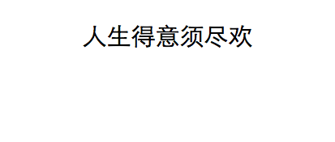
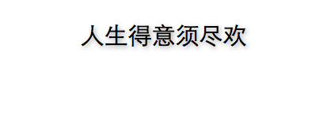
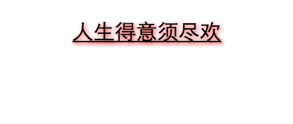
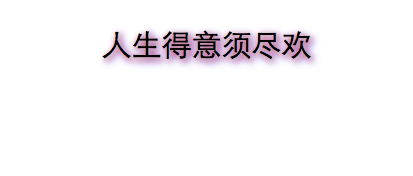

###CSS文本阴影

CSS3中通过[`text-shadow`][ref-1]属性可以为页面文字添加阴影效果，来丰富界面展示效果。`text-shadow`适用于页面所有元素，也适用于`::first-letter`和`::first-line`伪元素；可继承；可动画。

###基本使用

如有以下文本

	
人生得意须尽欢

	
默认显示为

	
为该文字片段添加一个浅灰色阴影,代码如
		
	.lightgray-shadow{
		text-shadow: 2px 2px 5px #ccc;
	}
	
	
人生得意须尽欢

效果为

文字看起来多了一些层次感。

结合示例，`text-shadow`的基本语法结构如下

	text-shaodw: offset-x offset-y blur color ;
	
其中`offset-x`，`offset-y`指明了阴影分别在水平和竖直方向上的偏移；`blur`和`color`分别指明了阴影的模糊度和阴影颜色。

`text-shadow`阴影同样可以添加到文本的`text-decoration`上，如

	p{
		text-decoration:underline;
	}
	.red-shadow{
		text-shadow: 2px 2px 5px red;
	}
	
人生得意须尽欢

效果为

可见底部的下划线也添加上了阴影。

####多层次阴影

除了最常用的基本用法，`text-shadow`还可以接受一个逗号分隔的模糊值列表来指定文本的多层次阴影。

	p{
		text-decoration:underline;
	}
	.multi-shadow{
		text-shadow: 2px 2px 3px #ccc , 2px 2px 6px red , 3px 3px 8px blue ;
	}
	
人生得意须尽欢

效果为

	

指定多个`text-shadow`值时	，它们会依次从前往后排列，靠前的优先显示在前面覆盖后面的值，就像堆栈结构，第一个`text-shadow`值显示在最上方，依次类推。

####阴影动画

`text-shadow`也可以添加动画效果，如当鼠标移到文本上方时以动画的形式显示展示阴影：

	p{
		-webkit-transition:text-shadow 0.3s;
		-moz-transition:text-shadow 0.3s;
		-ms-transition:text-shadow 0.3s;
		transition:text-shadow 0.3s;
	}
	p:hover{
		text-shadow: 2px 2px 5px #ccc;
	}
	
	
人生得意须尽欢

	

####兼容性

基本上稍高版本的浏览器都支持该属性，并可以省略前缀。但IE在 IE10+ 才实现该属性。参见：[CanIUse text-shadow][ref-2]
	
> 注意: `text-shadow`不会占据HTML的文档布局流。

	

####参考

+ [Quirk Mode:Text](http://quirksmode.org/css/text/)
+ [CanIUse text-shadow][ref-2]
+ [MDN text-shaodw][ref-1]
+ [W3C Text Shadows: the ‘text-shadow’ property](http://www.w3.org/TR/2012/WD-css-text-decor-3-20121113/#text-shadow-property)
+ [Animation Property](http://dev.w3.org/csswg/css-transitions/#animatable-css)

[ref-1]: https://developer.mozilla.org/en-US/docs/Web/CSS/text-shadow
[ref-2]: http://caniuse.com/#search=text-shadow

