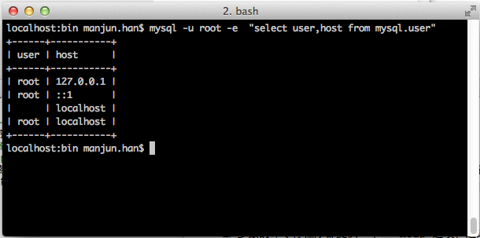
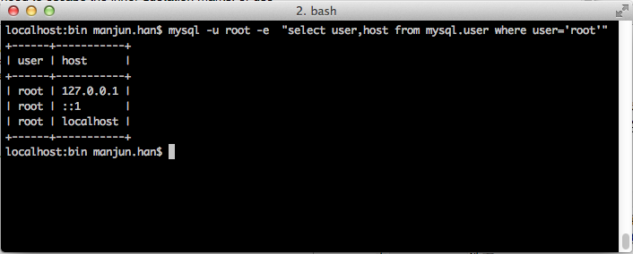
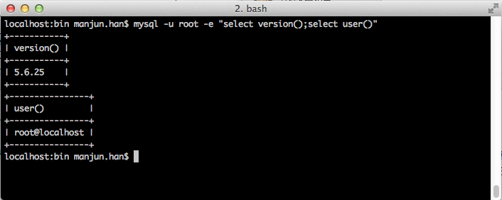

###MySQL数据库命令行选项的使用规则

安装完成的mysql数据库中包含了许多不同的客户端程序，用来操作，管理，维护mysql数据库。所有客户端程序都可以在命令行中使用，需要指定命令行选项options，它们都共享同样的命令行规则：

1. 选项options紧跟在命令行名称之后。
2. 多数的命令行程序都提供一个`--help`选项，通过该选项可以了解当前客户端程序的描述。
3. 一个选项参数以单个破折号`-`或双破折号`--`开始，这取决于选项名称的长短。许多选项都有一长一短两种格式，例如`-?`和`--help`分别是打印客户端辅助信息的选项。
4. 选项名称大小写敏感，`-v`和`-V`都合法，但意义不同，一个代表`--verbose`选项,另一个代表`--version`选项。
5. 一些选项名后面跟着的是选项值，如，`-h locahost`或者`--host=localhost`指定了客户端程序要连接服务器的地址。
6. 对于长格式的选项名，后面跟着的值需要以`=`与其做分割，对于短格式选项名，后面的值可以以`空格`分割，有的也紧随选项名，图`-hlocalhost`与`-h localhost`是等价的。但在指定连接Mysql服务器密码时，需要注意可以指定`--password=pass_value`或`--password`，使用第二种格式时，客户端接下来会提示你输入密码，这些密码输入值在客户端是隐藏的。密码也可以以短格式指定，如`-ppass_value`或`-p`,如果开始给定了密码，那么密码必须紧挨着`-p`,`-p`和`pass_value`之间不能出现任何空格，举例说来，

		shell> mysql -ptest
表明的是以密码`test`连接mysql，儿
	
		sheel> mysql -p test
表明的是提示输入密码，并连接test数据库，		

7. 选项名中的`-`和`_`可以互换，如`--skip-grant-tables`与`--skip_grant_tables`是等价的。(开始的`--`不能换成`__`)
8. 对于值为数值类型的选项来说，选项值可以使用后缀__K__,__M__,__G__（字符大小写都可以），来添加一个乘法因子1024,10242,10243，如以下命令

		shell> mysqladmin --count=1k --sleep=10 ping
		
	会告知mysqladmin去ping服务器1024次，每次间隔10秒钟。

9. 命令行中的包含空格的选项值需要用引号引起来，如mysql的`--execute`或`-e`选项可以用来向服务器发送SQL语句，使用这个选项时，SQL语句必须用引号引起来，如

		shell> mysql -u root -e  "select user,host from mysql.user"

	会查询mysql数据库当前的账户

	
	
	如果选项值中要用到引号值，则需要对内部用到的引号转义，或者用不同类型的引号,如
	
		shell> mysql -u root -e  "select user,host from mysql.user where user='root'"
		
			
		
	选项值中多个SQL语句可以用`;`分开
	
		shell> mysql -u root -e "select version();select user()"
	
	
		
###参考

+ [mysqladmin — Client for Administering a MySQL Server][1]
+ [Using Options on the Command Line][2]

[1]: http://dev.mysql.com/doc/refman/5.6/en/mysqladmin.html
[2]: http://dev.mysql.com/doc/refman/5.6/en/command-line-options.html

		