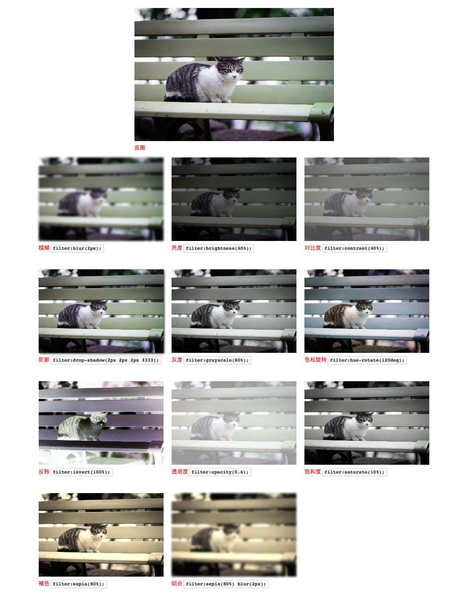

###CSS Filter

###简介
滤镜效果提供一种处理元素的方法，在元素z在渲染文档之前可以为其添加一些特殊的视觉效果，例如改变元素的模糊，透明度，颜色等等。滤镜是一种作用于元素之上的图像操作，是一种基于图片的效果(image-based effect),以零个或多个图片作为输入，辅之添加一些效果参数，将处理后的图片作为输出，输出的图片可以替代元素渲染在文档之上。滤镜效果早先是用于使用在SVG上，但CSS filter提供了预定义的多种效果函数为元素添加滤镜效果。

###说明和应用

css中使用filter语法格式，如下
	
	element{
		filter:filterFunctionName(value);
	}
	
其中`filterFunctionName`是滤镜函数名称，`value`是对应值。以一张图片为例，如

	

来说明CSS filter定义的函数名称及效果

**模糊**:`blur(radius)`
	
	.blur{
		-moz-filter:blur(2px);
        -webkit-filter:blur(2px);
		 filter:blur(2px);
	}
	
		
	
**亮度**	:`brightness(amount)`(0 - 100%)

	.brightness{
        -moz-filter:brightness(40%);
        -webkit-filter:brightness(40%);
        filter:brightness(40%);
    }
  		
  	
**对比度**:`contrast(amount)`(0 - 100%)
  	
    .contrast{
        -moz-filter:contrast(40%);
        -webkit-filter:contrast(40%);
        filter:contrast(40%);
    }
  		
  	
**阴影**:`drop-shadow(h-off v-off blur color)`
  	    
    .drop-shadow{
        -moz-filter:drop-shadow(2px 2px 2px #333);
        -webkit-filter:drop-shadow(2px 2px 2px #333);
        filter:drop-shadow(2px 2px 2px #333);
    }
    	
    
**灰度**:`grayscale(amount)` (0 - 100%)

    .grayscale{
        -moz-filter:grayscale(80%);
        -webkit-filter:grayscale(80%);
        filter:grayscale(80%);
    }
    
    
**色相旋转**:`hue-rotate(angle)`(0deg - 360deg)
 
    .hue-rotate{
        -moz-filter:hue-rotate(80deg);
        -webkit-filter:hue-rotate(80deg);
        filter:hue-rotate(120deg);
    }
    
    
**反转**:`invert(amount)`(0 - 100%) 
  
    .invert{
        -moz-filter:invert(100%);
        -webkit-filter:invert(100%);
        filter:invert(100%);
    }
    
    
**不透明度**:`opacity(amount)`(0 - 100%)
    
    .opacity{
        -moz-filter:opacity(0.4);
        -webkit-filter:opacity(0.4);
        filter:opacity(0.4);
    }
    
    
**饱和度**:`saturate(amount)`(0 - 100%)      

    .saturate{
        -moz-filter:saturate(10%);
        -webkit-filter:saturate(10%);
        filter:saturate(10%);
    }
	    
	
**褐色**	:`sepia(amount)`(0 - 100%)

    .sepia{
        -moz-filter:sepia(80%);
        -webkit-filter:sepia(80%);
        filter:sepia(80%);
    }
        
**组合多个filter**

	 .mixed{
        -moz-filter:sepia(80%) blur(2px);
        -webkit-filter:sepia(80%) blur(2px);
        filter:sepia(80%) blur(2px);
    }
            
    
一张图以示说效果明
    
    

>因为CSS filter未被所有浏览器所支持，需要添加前缀，兼容性参见[CanIUse filter][7]

###动画

CSS filter是一个可动画的属性，如

	@keyframes blur-anim{
        from{
            -moz-filter:blur(0);
            -webkit-filter:blur(0);
            filter:blur(0);

        }
        to{
            -moz-filter:blur(2px);
            -webkit-filter:blur(2px);
            filter:blur(2px);
        }
    }

    @-webkit-keyframes blur-anim{
        from{
            -moz-filter:blur(0);
            -webkit-filter:blur(0);
            filter:blur(0px);
        }
        to{
            -moz-filter:blur(2px);
            -webkit-filter:blur(2px);
            filter:blur(2px);
        }
    }
    @-moz-keyframes blur-anim{
        from{
            -moz-filter:blur(0);
            -webkit-filter:blur(0);
            filter:blur(0px);
        }
        to{
            -moz-filter:blur(2px);
            -webkit-filter:blur(2px);
            filter:blur(2px);
        }
    }

    img.blur-animate{
        -webkit-animation:blur-anim .3s ;
        -webkit-animation-direction: alternate;
        -webkit-animation-iteration-count: infinite;
        -moz-animation:blur-anim .3s ;
        -moz-animation-direction: alternate;
        -moz-animation-iteration-count: infinite;
        animation:blur-anim .3s ;
        animation-direction: alternate;
        animation-iteration-count: infinite;
    }

	

###注意

+ filter属性适用于多数元素，包括`vedio`元素
+ css filter区别于IE中已经废弃的filter属性

###参考

+ [Filter Effects Module Level 1][1]
+ [Understanding CSS Filter Effects][2]
+ [CSS Filter Effect Demo][3]
+ [Using CSS Filters][4]
+ [MDN filter][5]
+ [Safari Filter Functions][6]
+ [CanIUse filter][7]

[1]: http://dev.w3.org/fxtf/filters/
[2]: http://www.html5rocks.com/en/tutorials/filters/understanding-css/
[3]: http://html5-demos.appspot.com/static/css/filters/index.html
[4]: https://developer.apple.com/library/safari/documentation/InternetWeb/Conceptual/SafariVisualEffectsProgGuide/UsingCSSFilters/UsingCSSFilters.html
[5]: https://developer.mozilla.org/zh-CN/docs/Web/CSS/filter#Browser_compatibility
[6]: https://developer.apple.com/library/safari/documentation/AppleApplications/Reference/SafariCSSRef/Articles/Functions.html#//apple_ref/doc/uid/TP40007955-SW36
[7]: http://caniuse.com/#search=filter