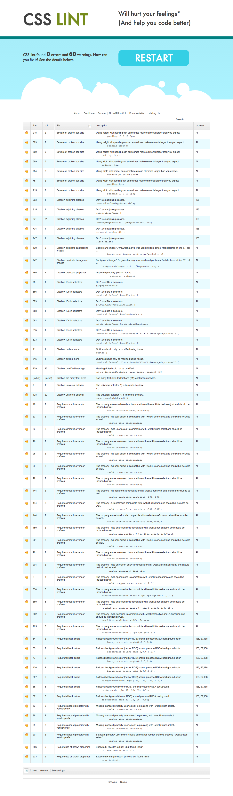
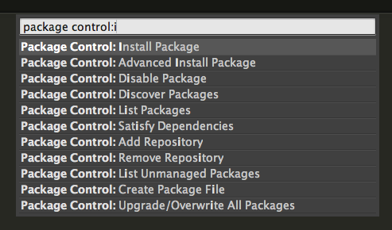
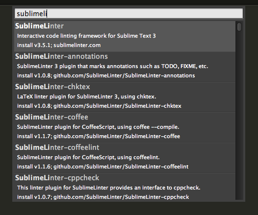
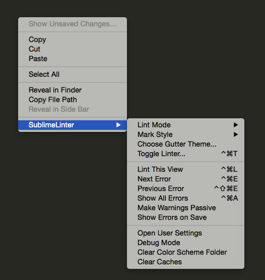
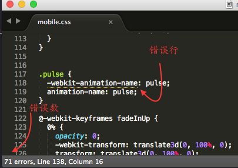
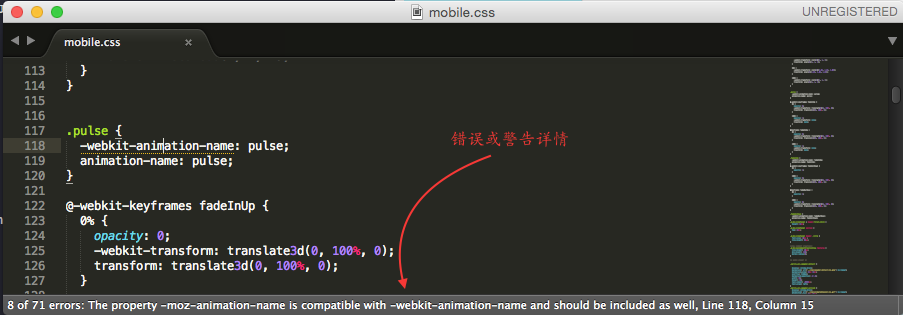
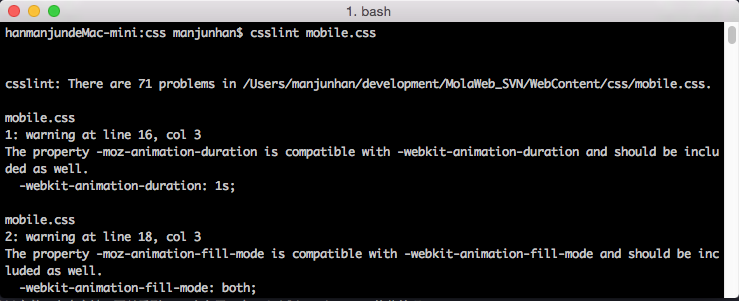

I###使用CSSLint

###CSSLint简介

CSSLint是一个开源的CSS代码质量分析工具，发布于2011年(现在才开始有机会使用)。CSSLint会对输入的CSS文件执行代码静态分析，并找到错误的代码行，或给出进一步的CSS优化建议。它基于基本的CSS语法检测，同时会基于预定义的规则，找出存在问题或低效的CSS模式。CSSLint有多种使用方式，包括使用其在线检测工具，使用IDE插件，或者基于命令行进行检测。

###在线工具

可以使用在线工具进行CSS检测，只要打开[CSSLintint][1]的首页，将CSS代码直接拷贝到输入框，!

点击**LINT**按钮即可直接分析，并查看结果，之后做出进一步的修改

###Sublime Text下使用CSSLint

可以在一些IDE中集成CSSLint，这样令使用CSSLint更加方便。已经有众多[IDE](3)支持集成CSSLint,这其中就包括Sublime Text，关于Sublime Text的知名度，这自不必提，其丰富的插件功能，极大提升了编码开发效率，这里以Sublime Text3为例，看看如何集成CSSLint。

在Sublime Text3下，可以安装[SublimeLinter-csslint](4)插件来使用CSSLint，但[SublimeLinter-csslint](4)其实只是为lint插件[SublimeLinter](5)提供了一个CSSLint的界面，在安装[SublimeLinter-csslint](4)之前需要先安装[SublimeLinter](5)。众所周知[Package Control](6)为Sublime Text提供了插件管理功能，可以使用[Package Control](6)来安装[SublimeLinter](5)和[SublimeLinter-csslint](4)。

> 关于[Package Control](6)的安装参见其[Install Document](7)，以及其[Useage说明][8]不再敖述。

Mac OSX下打开Sublime Text3，执行快捷键`cmd+shift+p`，输入并回车切换至__Package Control: Install Package__选项，

等之后打开的package list，继续输入并回车切换至__SublimeLinter__这样便开始安装__SublimeLinter__插件。

继续重复同样的操作步骤，继续安装__SublimeLinter-csslint__插件。

两个插件安装成功后，找到并打开任意一个CSS文件，点击右键，可以看到menu上多了一个__SublimeLinter__的菜单项，

继续浏览菜单项，可以知道Linter的执行时机，错误标记样式。点击__Lint This View__可以马上对当前文件执行Linter操作。Linter执行完毕后在Sublime Text的左下角的任务栏可以查看当前文件的错误数,同时也可以看到错误行会以下划线做标记。

光标定位到错误行时，任务栏会显示当前错误所属类型，并给出修改建议

###基于NodeJS安装使用CSSLint

CSSLint能够运行在命令行模式下，这样便于将CSSLint整合到你定制的构建系统中（如使用Ant），可以支持自动化任务。CSSLint支持两种命令行，一个是NodeJS，一个是Rhino。在NodeJS环境下使用CSSLint可以如下步骤：

1. 安装[NodeJS][9]，之后安装NodeJS的包管理器[npm](npmjs.com)(NodeJS的安装包已经安装了npm，所以可以直接使用，参见[How to install npm][10])
2. 使用npm安装CSSLint，`npm install -g csslint`
3. 使用CSSLint ，格式如`csslint [options] [file|dir]*`，示例：`csslint file1.css file2.css`或`csslint dir_of_css/`

以之前的mobile.css为例，打开客户端，切换至mobile.css所在的文件目录，运行`csslint mobile.css`，可以看到lint结果

###关于CSSLint的规则

CSSLint的检测是基于一些最佳实践规则，同时规则也是可扩展的，关于CSSLint的规则的划分和说明，可以参考其[GitHub Wiki](14)
###参考

+ [CSSLint online][1]
+ [CSSLint Github][2]
+ [Installing Node.js and updating npm][11]
+ [CSSLint Command-line Interface][12]
+ [Introducing CSS Lint][13]
+ [Write high quality JavaScript and CSS with SublimeLinter][14]

[1]: http://csslint.net/
[2]: https://github.com/CSSLint/csslint
[3]: https://github.com/CSSLint/csslint/wiki/IDE-integration
[4]: https://github.com/SublimeLinter/SublimeLinter-csslint#sublimelinter-csslint
[5]: http://sublimelinter.readthedocs.org/en/latest/
[6]: https://packagecontrol.io/
[7]: https://packagecontrol.io/installation
[8]: https://packagecontrol.io/docs/usage
[9]: https://nodejs.org/download/
[10]: http://blog.npmjs.org/post/85484771375/how-to-install-npm
[11]: https://docs.npmjs.com/getting-started/installing-node
[12]:https://github.com/CSSLint/csslint/wiki/Command-line-interface
[13]: http://www.nczonline.net/blog/2011/06/15/introducing-css-lint-2/
[14]: https://github.com/CSSLint/csslint/wiki/Rules
[14]: http://www.pixelstech.net/article/1371270269-Write-high-quality-JavaScript-and-CSS-with-SublimeLinter