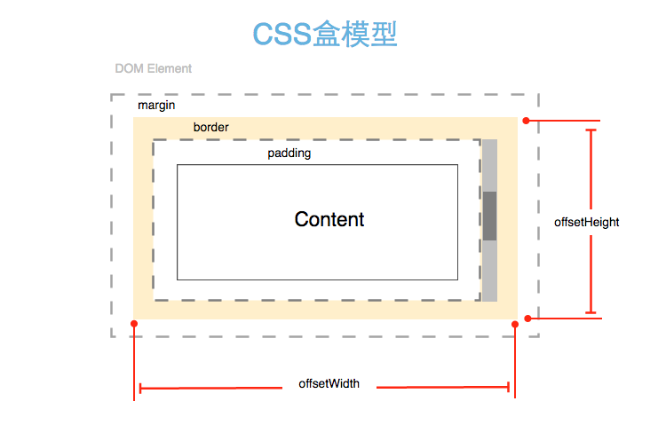
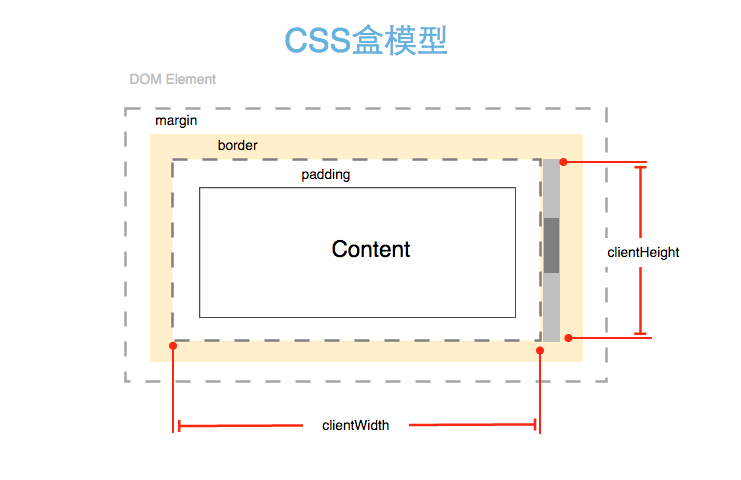

###获取浏览器滚动条的宽度

动态布局的场景中，使用绝对布局来定位元素是一种常见的布局手段，为了实现精确到像素级别的定位，有时我们经常需要处理DOM元素因内容溢出而导致发生滚动的情况，
其实这时一般我们要处理和计算的是因滚动而出现的滚动条的宽度。这是为了实现精确布局所要面对的一种情况，以下是计算浏览器滚动条宽度涉及到的方法和概念。

###  盒式模型

浏览器为了描述页面上的每个元素，引入了盒式模型的概念，在HTML文档中，每个元素都被描述为一个矩形盒子，意在以此来定义元素的属性，如尺寸，背景，边框等，
之后浏览器根据这些属性信息可以正确的在浏览器中把元素渲染出来。

对于描述元素空间占用的信息，盒式模型引入了几个边界，包括:内容边界(content edge),内边界(padding edge),边框边界(border edge),外边界(margin edge)

> DOM元素盒式模型的概念参见[盒模型][6]

### offertWidth[height] && clientWidth[Height] 

对于样式来说，可以用盒模型进行定义和描述，从编码角度来说，DOM文档对象模型中也定义了相对应的属性，来获取元素的尺寸信息，
其中包括offsetWidth[height]和clientWidth[height]属性，关于这两个属性的作用，可以直接用图说明：

+ offsetWidth[Height]

	

	以offsetWidth属性为例，offsetWidth = contentWidth + paddingWidth + borderWidth + [scrollBarWidth]

	如果出现内容滚动的话，offsetWidth还要添加scrollBar的宽度

+ clientWidth[clientHeight]

	
	
	以clientWidth属性为例，clientWidth = contentWidth + paddingWidth,

###计算scrollBar的宽度

由以上图示所示，可以基本得到计算浏览器滚动条的方法，如果我们将元素的边框border设置为零，那么其实scrollBar的宽度为

	// el.borderWidth = 0 ;
	var scrollBarWidth = el.offsetWidth - elclientWidth ;
	
直接上代码，不依赖任何框架的实现

	var scrollBarWidth = (function scrollBarWidth (){
		var d = document;
		var b = d.body ;
		var div =  d.createElement('div');
		div.style.width = '50px' ;
		div.style.height = '50px' ;
		div.style.overflowY = 'scroll',
		div.style.position = 'absolute';
		div.style.top = '-10000px';
	
		var innerDiv = d.createElement('div');
		div.appendChild(innerDiv);
		b.appendChild(div);
		var scrollBarWidth = div.offsetWidth - div.clientWidth ;
		b.removeChild(div);
		return scrollBarWidth;
	})();
	
基于jQuery会更简单些

	var scrollBarWidth = (function scrollbarSize () {
    	var $wrapper = $("
").css({width:50, height:50, overflowY:"scroll", position:"absolute", top:-10000});
	    var $inner = $("
").css({width:"100%", height:"100%"});
    	$wrapper.append($inner).appendTo("body");
	    var w1 = $wrapper.innerWidth();
    	var w2 = $inner.innerWidth();
	    $wrapper.remove();
    	return  w1 - w2;
	})();

此外也可以引申出如何判断当前文档中已存在的元素是否处于滚动状态

	/**
	 *  @param {DOM Element} el  待检测元素
	 *  @param {Boolean} horizonal 是否检测元素水平滚动
	 *  @return {Boolean}
	 */
	function elScrolling(el , horizonal){
		// 水平滚动
        if(horizonal){
            return el.offsetHeight > el.clientHeight ;
        }else{
            return el.offsetWidth > el.clientWidth ;
        }
    }

###参考

+ [Determining the dimensions of elements][1]
+ [Get the browser viewport dimensions with JavaScript][2]
+ [div scrollbar width][3]
+ [Detect Scrollbar Width with JavaScript][4]
+ [Calculating The Browser Scrollbar Width][5]

[1]: https://developer.mozilla.org/en-US/docs/Web/API/CSS_Object_Model/Determining_the_dimensions_of_elements
[2]: http://stackoverflow.com/questions/1248081/get-the-browser-viewport-dimensions-with-javascript/8876069#8876069
[3]: http://stackoverflow.com/questions/7501761/div-scrollbar-width
[4]: http://davidwalsh.name/detect-scrollbar-width
[5]: http://jdsharp.us/jQuery/minute/calculate-scrollbar-width.php
[6]: https://developer.mozilla.org/zh-CN/docs/Web/CSS/box_model